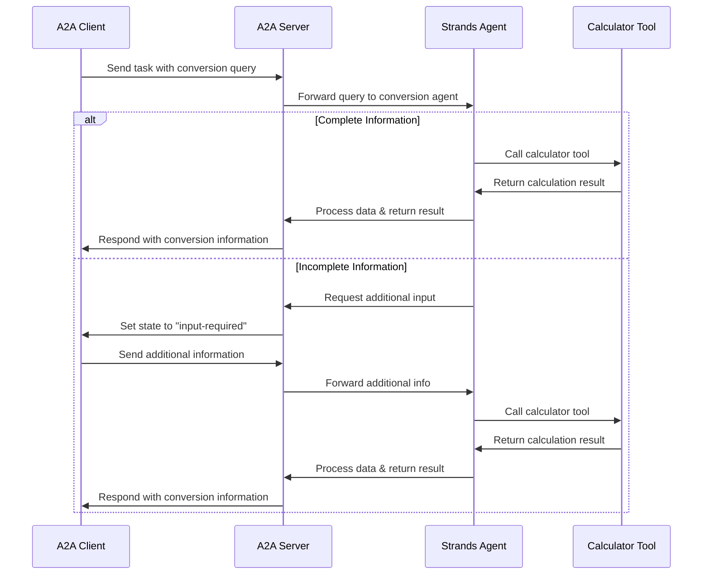

# Mathematical Conversion Agent (A2A)

An Agent-to-Agent (A2A) implementation using Strands Agent for mathematical conversions and calculations.

## Architecture

This system consists of:
- **A2A Client**: Handles user interactions and communication with the agent server
- **A2A Server**: Manages requests and forwards them to the Strands Agent
- **Strands Agent**: Processes conversion queries using AWS Bedrock
- **Calculator Tool**: Performs mathematical calculations and unit conversions

## Flow Diagram



## Prerequisites

### AWS Configuration
Since this agent uses Strands with AWS Bedrock, you need to configure AWS authentication:

**Option 1: AWS Config File**
```bash
# Configure AWS credentials
aws configure
```

**Option 2: Environment Variables**
```bash
export AWS_ACCESS_KEY_ID=your_access_key
export AWS_SECRET_ACCESS_KEY=your_secret_key
export AWS_DEFAULT_REGION=your_region
```

**Option 3: Pass credentials directly to Bedrock client**
The credentials will be passed through to the Strands agent for Bedrock authentication.

## Setup & Running

1. **Start the Agent Server**
```bash
uv run agent_server.py
```

2. **Start the Client Handler**
```bash
uv run client_handler.py
```

When you start the client, you'll see initialization output like:
```
INFO:__main__:Attempting to fetch public agent card from: http://localhost:10000/.well-known/agent.json
INFO:httpx:HTTP Request: GET http://localhost:10000/.well-known/agent.json "HTTP/1.1 200 OK"
INFO:a2a.client.client:Successfully fetched agent card data from http://localhost:10000/.well-known/agent.json:
{
  "capabilities": {
    "pushNotifications": true,
    "streaming": false
  },
  "defaultInputModes": ["text", "text/plain"],
  "defaultOutputModes": ["text", "text/plain"],
  "description": "Helps with mathematical conversions and calculations",
  "name": "Mathematical Conversion Agent",
  "skills": [
    {
      "description": "Helps with mathematical conversions and calculations",
      "examples": [
        "Convert 100 feet to meters",
        "What is 32 Fahrenheit in Celsius?"
      ],
      "id": "mathematical_conversions",
      "name": "Mathematical Conversions Tool",
      "tags": ["mathematical conversions", "calculations", "unit conversion"]
    }
  ],
  "url": "http://localhost:10000/",
  "version": "1.0.0"
}
INFO:__main__:Successfully fetched public agent card
INFO:__main__:A2AClient initialized and ready for interactive use.
```

## Usage

Once both servers are running, you can interact with the agent:

```
🤖 A2A Interactive Client
Commands:
  - Type your message and press Enter
  - 'stream: <message>' for streaming response
  - 'quit' or 'exit' to stop
  - 'help' for this message
--------------------------------------------------
💬 You: Hi how many ounces are in a pound. Can you convert that to milligrams?
🔄 Sending message...
```

The agent will respond with mathematical conversions:

```
INFO:httpx:HTTP Request: POST http://localhost:10000/ "HTTP/1.1 200 OK"
🤖 Agent: {
  "id": "a9d9cb60-38fb-430e-889d-0d347efd435e",
  "jsonrpc": "2.0",
  "result": {
    "kind": "message",
    "messageId": "379a6ec2-974c-4f90-aa16-d2798a084365",
    "parts": [
      {
        "kind": "text",
        "text": "There are 16 ounces in 1 pound.\n\n1 pound = 453,592.37 milligrams (approximately 453,592 mg)\n\nFor reference:\n- 1 pound = 16 ounces\n- 1 pound = 453.59237 grams\n- 1 pound = 453,592.37 milligrams"
      }
    ],
    "role": "agent"
  }
}
```

## Example Conversions

The agent can handle various mathematical conversions:
- **Weight**: Convert between pounds, ounces, grams, milligrams
- **Length**: Convert between feet, meters, inches, centimeters
- **Temperature**: Convert between Fahrenheit, Celsius, Kelvin
- **Volume**: Convert between gallons, liters, cups, milliliters
- **And more**: Any mathematical conversion or calculation