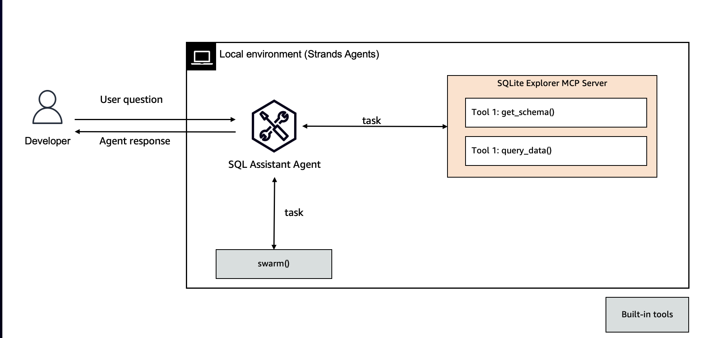

# SQL Assistant

Welcome to SQL Assistant - Your Intelligent Query Companion

Transform natural language into powerful SQL queries with ease. SQL Assistant understands your intent and helps you generate accurate, efficient database queries without memorizing complex syntax. Whether you're a seasoned developer or just starting with databases, our AI-powered assistant helps bridge the gap between human language and SQL.



## Prerequisites

1. Install [uv](https://docs.astral.sh/uv/getting-started/installation/).

2. Start SQLlit MCP server over SSE transport. Make sure to keep the server running.

    ```bash
    uv run sqllite_mcp/main.py
    ```

3. Run SQL Assistant using `uv run main.py`

## Sample Prompts

- How many average vacations are left amoung all employees?
- Can you list all employee information?
- How many vaccations all employess have left?
