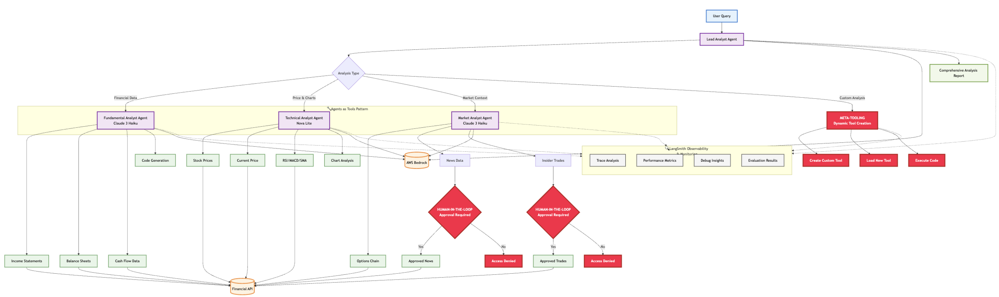
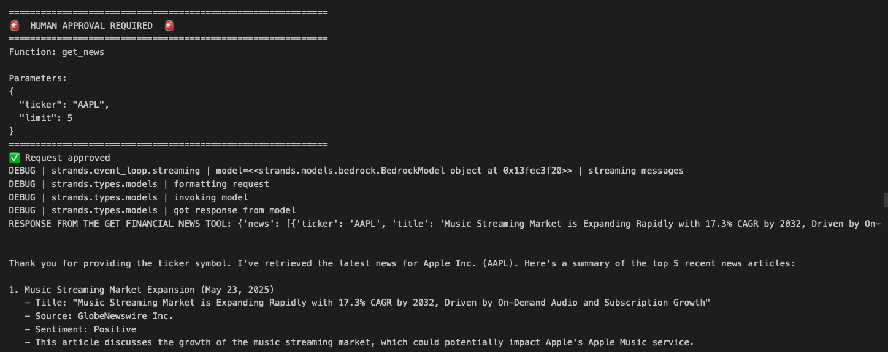
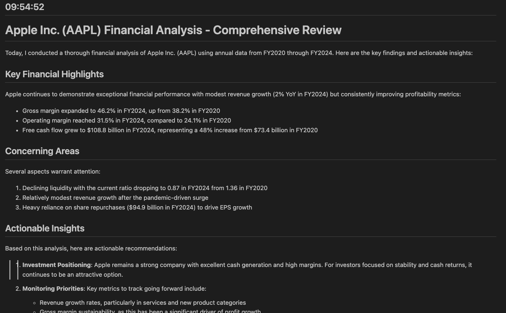
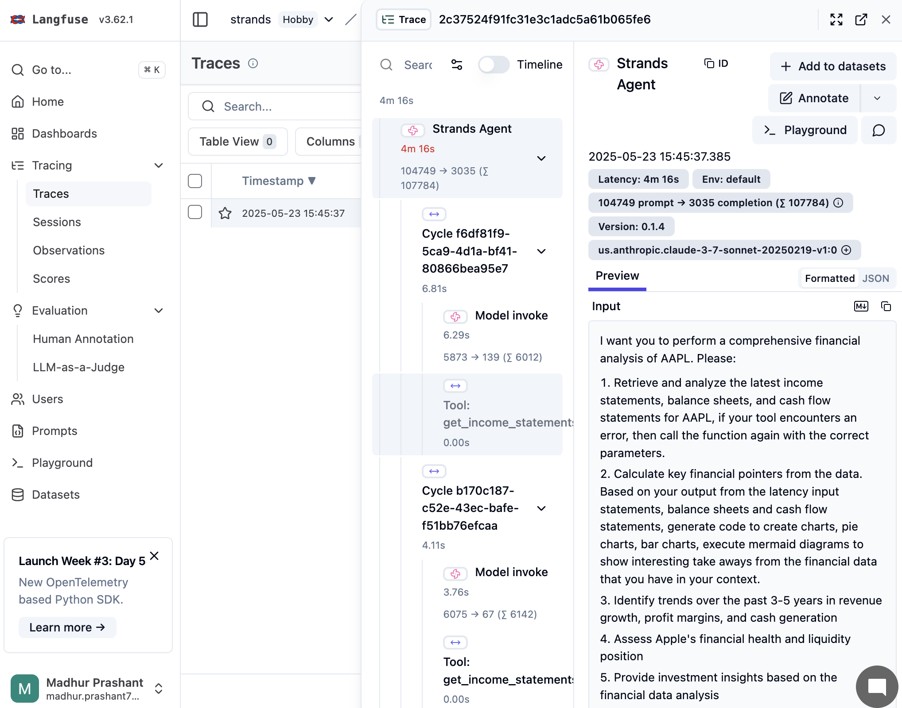
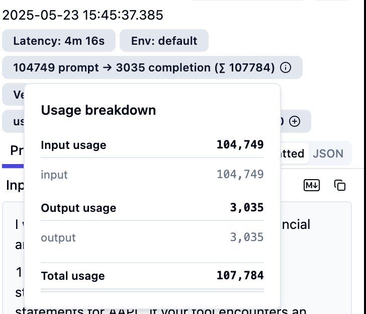

# Build a meta-tool calling multi-agentic system using Strands SDK

This comprehensive example demonstrates a sophisticated Multi-Agent Collaboration (MAC) system designed for hedge fund analysis using the Strands Agents SDK. The system implements a hierarchical architecture with specialized financial analysis agents that work together to provide comprehensive investment insights.

View the architecture diagram below that shows how you can build a mutli-agentic system using an **[agent-as-tools](https://strandsagents.com/0.1.x/user-guide/concepts/multi-agent/agents-as-tools/)** pattern, with **meta-tooling**, **human-in-the-loop**, observability, detailed traces and logging enabled for a financial system:

🚨**THIS AGENTIC SYSTEM USES **[CLAUDE 4 SONNET](https://www.anthropic.com/news/claude-4), released on 05/22**



### Lead Analyst Agent (Uses Claude 4 Sonnet under the hood)

1. **Role**: Meta-coordinator that uses specialized agents as tools
2. **Capabilities**: Synthesizes insights from all sub-agents
3. **Features**: Dynamic tool creation for custom analysis requirements

### Specialized Sub-Agents

1. **Fundamental Analyst Agent**
    - **Model**: Claude 3 Haiku
    - **Purpose**: Performs fundamental financial statement analysis
    - **Capabilities**:
        1. Income statement analysis
        2. Balance sheet examination
        3. Cash flow statement evaluation
        4. Financial ratio calculations
        5. Valuation metrics assessment


2. **Technical Analyst Agent**
    - **Model**: Amazon Nova Lite
    - **Purpose**: Conducts technical analysis of stock price movements
    - **Capabilities**:
        1. Historical price data retrieval
        2. Technical indicator calculations (`RSI`, `MACD`, `SMA`, `EMA`)
        3. Chart pattern analysis
        4. Trading signal generation


3. **Market Analyst Agent**
    - **Model**: Claude 3 Haiku
    - **Purpose**: Provides market context and sentiment analysis
    - **Capabilities**:
        1. Options chain analysis
        2. Insider trading information
        3. Market news aggregation
        4. Sentiment analysis

## Key Features

1. **Financial Data Integration**:

The system integrates with comprehensive financial data APIs to access:
- Real-time and historical stock prices
- Financial statements (income, balance sheet, cash flow)
- Options chain data
- Insider trading transactions
- Market news and sentiment data

2. **Multi-Model Support for multiple agents as tools and code generation**

Utilizes multiple foundation models through AWS Bedrock:

- ***Amazon Nova Lite*** for routing and technical analysis
- ***Claude 3 Haiku*** for fundamental and market analysis
- ***Configurable model parameters for each agent***
- This **repository uses Claude 4 Sonnet** as the underlying model for the lead analyst agent. This agent makes decision for which agent to be used as a tool, if meta tooling is required, etc.

### Advanced Tool Ecosystem
There are custom tools that are used across different agents in this ecosystem:

1. `get_income_statements`: Retrieves company income statement data
2. `get_balance_sheets`: Fetches balance sheet information
3. `get_cash_flow_statements`: Obtains cash flow data
4. `get_stock_prices`: Historical price data with date range filtering
5. `get_current_stock_price`: Real-time price information
6. `get_technical_indicators`: Calculates RSI, MACD, SMA, EMA indicators
7. `get_options_chain`: Options contract data with filtering capabilities
8. `get_insider_trades`: Insider trading transaction information
9. `get_news`: Financial news and market sentiment data

### Code Generation and Execution

1. `generate_and_execute_code`: Dynamic Python code generation and safe execution
    - Uses LiteLLM with AWS Bedrock for code generation
    - Implements security measures and timeout controls
    - Supports data visualization and custom analysis

### Pre-built Utility Tools

This Agentic system uses pre-built tools offered by Strands agent tools along with the custom tools created. The pre-built tools that are used are as follows across the four different agents:

1. `calculator`: Mathematical operations
2. `file_read`: File parsing capabilities
3. `mem0_memory`: Memory management for context retention
4. `python_repl`: Python code execution environment
5. `current_time`: Date and time utilities
6. `journal`: Structured task and log management

### Human-in-the-Loop Workflow
Implements human approval mechanisms for sensitive operations. If there is a tool that is getting sensitive news for example, the tool execution will halt and ask the human for approval for calling the tool. There are several design patterns for adding a human in the loop, but this is one of them being ***reviewing tool calls***. You can also use the `HITL` workflow to edit the tool call context, ask for approval and more.

1. Insider trading data requests require explicit approval
2. News data access with human oversight
3. Interactive approval prompts in Jupyter notebook environment

### Meta-Tooling Capabilities

The Lead Analyst Agent features advanced meta-tooling abilities:

1. **Dynamic Tool Creation**: Generates custom tools on-demand
2. **Tool Loading**: Integrates newly created tools into the system
3. **Shell Access**: Command execution for testing and validation
4. **Editor Integration**: Code modification and tool development

## Getting Started

Follow the steps below to get started with running this in your environment:

### Environment Configuration

1. Make sure you are in your AWS environment. To set up your AWS environment, view the steps [here](https://aws.amazon.com/getting-started/guides/setup-environment/). Create `.env` file with required API keys and credentials. Copy the `.env.template` to `.env` and edit it:

```bash
# Copy the template into your .env file and edit the content below
cp .env.template .env
```

```bash
TAVILY_API_KEY=<your-tavily-api-key>
FINANCIAL_DATASET_API=<your-financial-dataset-api-key>
```

To get your API key for Tavily, view [here](https://tavily.com/). To get your API key for `financialdatasets.ai`, view [here](https://www.financialdatasets.ai/).

2. Install `uv` and Python dependencies:

```bash
curl -LsSf https://astral.sh/uv/install.sh | sh
export PATH="$HOME/.local/bin:$PATH"
```

3. Restore Python virtual environment from the `pyproject.toml` file.

```bash
uv venv && source .venv/bin/activate && uv pip sync pyproject.toml
```

4. Create a `conda` kernel. This is needed to run the notebook on your EC2 instance:

```bash
uv add zmq
python -m ipykernel install --user --name=.venv --display-name="Python (uv env)"
```

5. Open the JupyterLab notebook to run and select the `Python (uv env)` if not selected automatically (if it is not, refresh the page or close the notebook and open it again and you should see it selected or be able to select it from the drop down).

## Configurations

All information to run this sample is fetched from a configuration file. This configuration file contains information about the model id information, inference parameters and other information for each agent in this multi agent system. View the file [here](config.yaml).

```yaml
general:
  name: "Financial-multi-agentic-system"      
  description: "This agentic system shows multi-agent collaboration different financial agents"

# This contains the model information for various agents
# in our multi agentic system
model_information:
  finance_agent_model_info: 
    model_id: us.amazon.nova-micro-v1:0
    inference_parameters:
      temperature: 0.1
  technical_agent_model_info: 
    model_id: us.anthropic.claude-3-5-sonnet-20240620-v1:0
    inference_parameters:
      temperature: 0.1
      max_tokens: 512
.
.
.
```

## Steps to run the solution

Next, to run the solution, open the [`multi-agentic-system-strands.ipynb`](multi-agentic-system-strands.ipynb), select the `Python (uv env)` environment and run all the cells to see the outputs.

## Results

View some of the results below:

1. **Human in the loop example**: View how the tool execution pauses and asks for the human in the loop input before resuming:



2. **On the fly research journal creation**: One of the agents has the capability to use built in tools and custom tools, and write a journal on the fly. View an example off a Journal created here:



## Observability

View the traces in `Langfuse` dashboard below:






