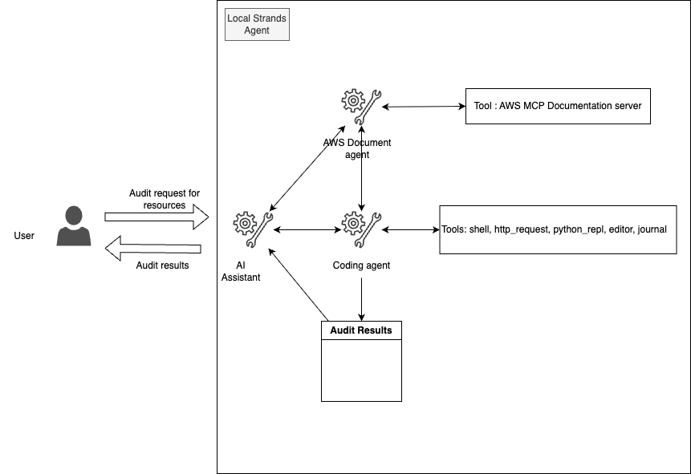

#  AWS Audit Assistant: Automated Resource Compliance Checker

⚠️⚠️ PLEASE READ :  The script agent creates and executes the script that may perform changes to your environment, always execute it from a sandbox with readonly permissions. Under sandbox folder a terraform script is provided that creates an ec2 instances and attaches readonly IAM role to it, use it to audit the resources.
⚠️⚠️

Imagine having a smart, always-on audit partner to check your AWS resources against best practices. I’m not just a tool—I’m your AI-powered guide, ensuring your cloud setup meets top security and efficiency standards.



The agent leverages advanced AI models to analyze your AWS resources, compare them against documented best practices, and provide comprehensive audit reports.

|Feature             |Description                                        |
|--------------------|---------------------------------------------------|
|Agent Structure     | Multi-agent architecture                          |
|Native Tools        | boto3, file_read, shell, python_repl              |
|Custom Agents       |Documentation Retriever, Boto3 Code Assistant, Resource Auditor|
|Model Provider      |Amazon Bedrock (Claude 3.5 Sonnet)                 |

## 💻 Getting Started

1. Install [uv](https://docs.astral.sh/uv/getting-started/installation/).

2. Install dependencies: `uv pip install -r requirements.txt`

3. Run `uv run ai_assistant.py`

## 🤖 How It Works

Simply specify the AWS resource you want to audit, and the AWS Audit Assistant springs into action:

```sample inputs
> Check if my S3 bucket <bucket name> is set up according to best practices
> Audit my EC2 instances <instance id > in region < region name > for security compliance
> Verify if my IAM policies follow the principle of least privilege
> Evaluate my RDS database configuration against AWS recommendations
```
