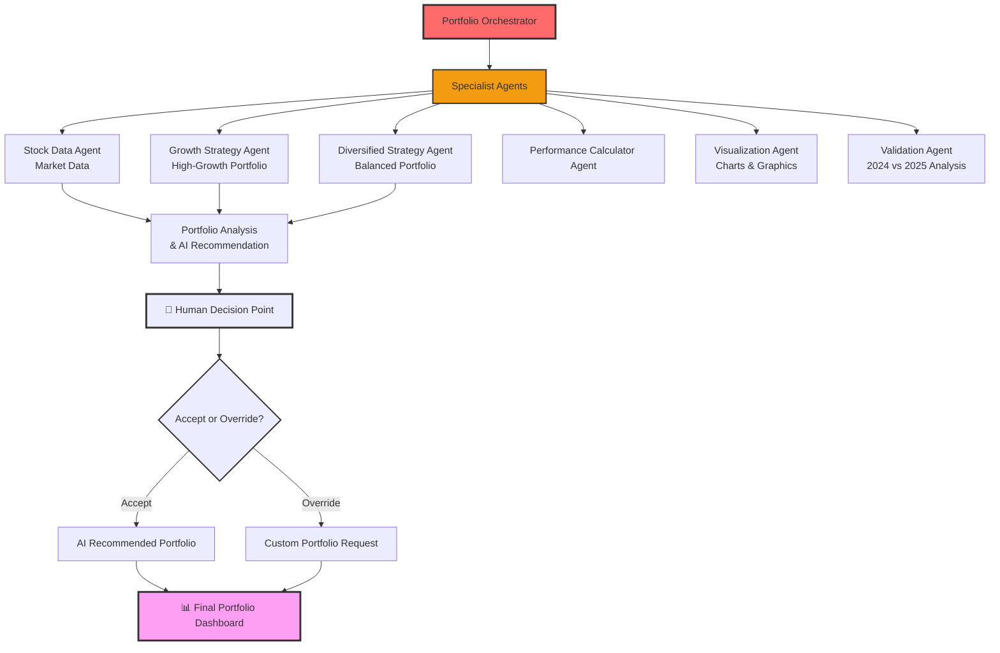
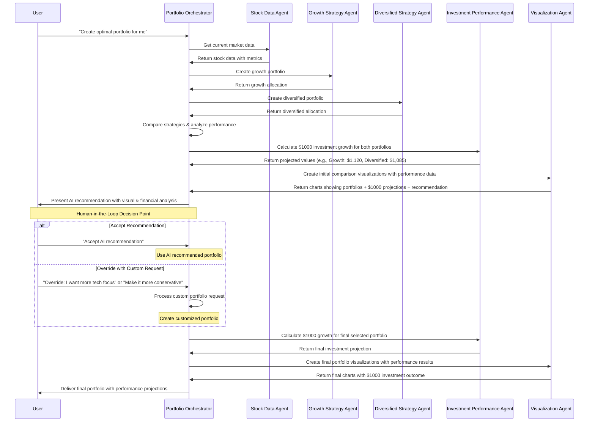

# Multi-Agent Portfolio Orchestrator Architecture

## System Overview

This multi-agent system demonstrates the Strands "agents as tools" pattern for creating sophisticated portfolio management workflows through specialized agent coordination. System analyzes 2024 historical data to create portfolios, then validates against 2025 actual market performance.

## Architecture Diagram



## Agent Responsibilities

### 1. Portfolio Orchestrator 
- **Role**: Coordinates all specialist agents and manages workflow
- **Responsibilities**: 
  - Routes user queries to appropriate specialist agents
  - Orchestrates data flow between agents
  - Provides AI recommendations to human for review
  - Handles human-in-the-loop decision making
  - Manages final portfolio creation workflow

### 2. Stock Data Agent
- **Role**: Market data specialist
- **Responsibilities**:
  - Fetches stock data from financial APIs
  - Calculates basic performance metrics (returns, volatility)
  - Provides clean data to strategy agents

### 3. Visualization Agent
- **Role**: Charts specialist
- **Responsibilities**:
  - Creates initial portfolio comparison charts before human review
  - Generates portfolio allocation visualizations
  - Shows performance comparisons and AI recommendations visually
  - Creates final portfolio visualizations after human decision

### 4. Investment Performance Agent
- **Role**: Financial calculation specialist
- **Responsibilities**:
  - Calculates $1000 investment growth for each portfolio
  - Shows projected returns after one year
  - Provides concrete dollar value comparisons
  - Helps users understand real-world portfolio impact

### 5. Validation Agent
- **Role**: Portfolio validation specialist
- **Responsibilities**:
  - Tests portfolios against 2025 actual market data
  - Compares expected returns (from 2024 analysis) vs actual 2025 performance
  - Shows analysis accuracy and strategy resilience

### 6. Strategy Specialist Agents

#### Growth Strategy Agent
- **Focus**: High-growth potential stocks
- **Approach**: Selects top-performing stocks by return
- **Portfolio**: Technology and growth-focused companies

#### Diversified Strategy Agent
- **Focus**: Diversified risk-return profile
- **Approach**: Uses diversification across different sectors
- **Portfolio**: Mix of growth and stable stocks

## Multi-Agent Workflow



## Key Benefits

1. **Modularity**: Each agent has a focused responsibility
2. **Human-in-the-Loop**: Combines AI intelligence with human judgment
3. **Transparency**: Users see AI reasoning before making decisions
4. **Concrete Performance**: $1000 projections make abstract returns tangible
5. **Market Validation**: Test 2024 analysis against 2025 actual performance
6. **Analysis Accuracy**: Compare expected vs actual returns for learning
7. **Visual Learning**: Charts show both allocation and financial outcomes
8. **Flexibility**: Users can override AI recommendations based on preferences
9. **Educational**: Demonstrates both AI capabilities and human oversight
10. **Reusability**: Agents can be used across different workflows

## Strands SDK Implementation Details

### Core Agent-as-Tool Pattern

This implementation showcases the Strands SDK's agent-as-tool pattern where each specialist agent is wrapped as a callable tool function. The portfolio orchestrator demonstrates advanced multi-agent coordination using the Strands framework.

```python
from strands import Agent, tool
from strands.models import BedrockModel

# Configure Claude 3.7 Sonnet model
model = BedrockModel(
    model_id="us.anthropic.claude-3-7-sonnet-20250219-v1:0"
)

@tool
def stock_data_agent(query: str) -> str:
    """Stock data specialist - fetches and analyzes market data"""
    agent = Agent(
        model=model,
        tools=[get_stock_data, get_stock_analysis],
        system_prompt="""You are a Stock Data Specialist with access to comprehensive market data tools.
        
        Your responsibilities:
        - Fetch real stock data using get_stock_data() or get_stock_analysis()
        - Provide clear analysis of market performance and trends
        - Calculate key metrics like returns, volatility, and Sharpe ratios
        - Use the global STOCK_UNIVERSE when no specific stocks are requested
        
        Present data clearly and highlight key insights for portfolio decisions.
        Keep analysis educational and easy to understand."""
    )
    return str(agent(query))

# Portfolio Orchestrator - Master Agent
portfolio_orchestrator = Agent(
    model=model,
    system_prompt="""You are the Portfolio Orchestrator, the master agent coordinating portfolio creation.
    
    Your workflow:
    1. Use stock_data_agent to get current market data and analysis
    2. Use growth_strategy_agent and diversified_strategy_agent to create different portfolio strategies
    3. Use performance_calculator_agent to calculate concrete $1000 investment projections
    4. Use visualization_agent to create comparison charts
    5. Present AI recommendation to human for review
    6. Process human decision (accept or override with custom requirements)
    7. Use validation_agent to test against actual market data if available
    8. Create final visualization showing results""",
    tools=[
        stock_data_agent,
        growth_strategy_agent, 
        diversified_strategy_agent,
        performance_calculator_agent,
        visualization_agent,
        validation_agent
    ]
)
```

### Specialized Agent System Prompts

Each agent has a focused system prompt that defines its specific domain expertise:

#### Growth Strategy Agent
```python
system_prompt="""You are a Growth Strategy Specialist focused on high-return portfolios.

Your approach:
1. Analyze stock data for growth potential (high returns)
2. Rank stocks by return potential and growth metrics
3. Create portfolios focused on maximum growth
4. Accept higher volatility for higher return potential

Create portfolios that prioritize:
- High annual returns
- Growth-oriented companies
- Technology and innovation sectors
- Aggressive but informed risk-taking"""
```

#### Diversified Strategy Agent
```python
system_prompt="""You are a Diversified Strategy Specialist focused on balanced portfolios.

Your approach:
1. Analyze stocks for risk-adjusted returns (Sharpe ratio)
2. Consider sector diversification and stability
3. Balance risk and return for sustainable growth
4. Prioritize stability and consistent performance

Create portfolios that prioritize:
- Strong Sharpe ratios (risk-adjusted returns)
- Sector diversification across industries
- Moderate risk with steady returns
- Long-term stability and consistency"""
```

### Business Logic Integration with Utils Module

The system demonstrates clean separation of concerns by moving complex business logic to a reusable utils.py module:

```python
# Portfolio creation functions decorated with @tool
from utils import (
    create_growth_portfolio,
    create_diversified_portfolio,
    calculate_portfolio_performance,
    visualize_portfolio_allocation,
    visualize_performance_comparison,
    validate_portfolio_performance,
    validation_agent
)

@tool
def create_growth_portfolio(stock_analysis: Dict[str, Any] = None, allocation_count: int = 4):
    """Create a growth-focused portfolio from stock analysis data"""
    # Focuses on high-return stocks with growth potential
    
@tool
def validate_portfolio_performance(portfolio_allocations: Dict[str, float], validation_data: Dict[str, Any] = None):
    """Validate portfolio performance against actual market data"""
    # Tests 2024 analysis against 2025 actual performance
```

### CSV Data Caching Strategy

Efficient data access through CSV caching for consistent performance:

```python
def _load_comprehensive_stock_data_from_csv(csv_filename: str = "comprehensive_stock_data.csv"):
    """Load comprehensive stock data from CSV with robust error handling"""
    try:
        df = pd.read_csv(csv_filename, index_col='ticker')
        stocks = {}
        for ticker, row in df.iterrows():
            stocks[ticker] = {
                'company': row.get('company', 'Unknown'),
                'sector': row.get('sector', 'Unknown'),
                'annual_return': float(row.get('annual_return', 0)),
                'volatility': float(row.get('volatility', 0)),
                'sharpe_ratio': float(row.get('sharpe_ratio', 0)),
                'current_price': float(row.get('current_price', 0))
            }
        return {'success': True, 'stocks': stocks, 'source': 'csv_cache'}
    except Exception as e:
        return {'success': False, 'error': f'CSV load failed: {str(e)}'}
```

### Main Workflow Functions

Clean interface functions for orchestrating the complete multi-agent workflow:

```python
def create_portfolio_analysis(user_requirements: str = None) -> str:
    """Main function to run the complete multi-agent portfolio analysis workflow"""
    if user_requirements is None:
        user_requirements = """
        Create an optimal investment portfolio using your multi-agent system.
        
        Please:
        1. Analyze current market data using your specialist agents
        2. Create both growth and diversified portfolio strategies  
        3. Show me the AI recommendation with visual comparisons
        4. Calculate concrete $1000 investment projections
        5. Provide a clear recommendation with reasoning
        
        Walk me through each step of the multi-agent coordination process.
        """
    return portfolio_orchestrator(user_requirements)

def process_human_decision(human_decision: str, previous_analysis: str = None) -> str:
    """Process human decision and create final portfolio based on their choice"""
    decision_prompt = f"""
    The human has made their decision: "{human_decision}"
    
    Please:
    1. Process this decision appropriately
    2. Create or modify the portfolio based on their choice
    3. Use the validation agent to test against current market data if possible
    4. Create final visualizations showing the results
    5. Provide a summary of the complete multi-agent workflow and final recommendation
    """
    return portfolio_orchestrator(decision_prompt)
```

### Key Strands SDK Features Demonstrated

1. **Agent Composition**: Multiple specialized agents working together
2. **Tool Integration**: Each agent has access to domain-specific tools
3. **System Prompt Engineering**: Focused prompts for specialized behavior
4. **Model Configuration**: Consistent model usage across all agents
5. **Tool Decoration**: Business logic functions wrapped as callable tools
6. **Agent Coordination**: Master agent orchestrating specialist agents
7. **Natural Language Processing**: Human override capabilities with conversational input
8. **Educational Framework**: Clear demonstration of multi-agent patterns

## Human-in-the-Loop Decision Process

The system implements a transparent decision-making process:

1. **Historical Analysis**: Agents analyze 2024 market data and create portfolio strategies
2. **AI Recommendation**: System provides data-driven recommendation with reasoning
3. **Initial Visualization**: Charts show both portfolios and AI recommendation visually
4. **Human Review**: User reviews AI analysis, recommendation, and visual comparisons
5. **Human Decision**: User can:
   - Accept the AI recommendation
   - Override with custom requirements using natural language prompts
6. **Portfolio Customization**: If override selected, system processes human prompts like:
   - "I want more technology focus"
   - "Make it more conservative" 
   - "Add more dividend stocks"
   - "Reduce risk but keep some growth"
7. **Market Validation**: Test selected portfolio against 2025 actual market performance
8. **Final Visualization**: System creates updated charts showing analysis vs reality

This pattern demonstrates responsible AI deployment where:
- **AI provides intelligence** through data analysis and pattern recognition
- **Humans retain control** over final investment decisions with natural language input
- **Transparency** ensures users understand AI reasoning
- **Market validation** shows analysis limitations using actual performance data
- **Educational value** demonstrates both capabilities and real-world testing

This architecture enables complex portfolio management workflows through intelligent agent coordination, human oversight, and market validation.