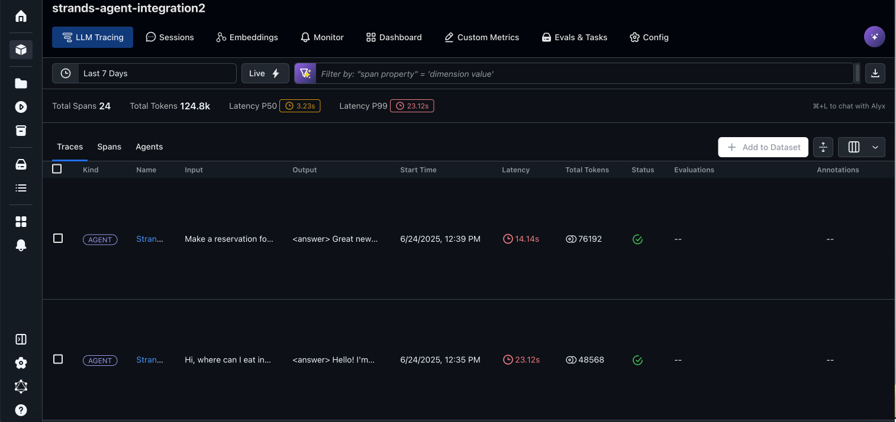
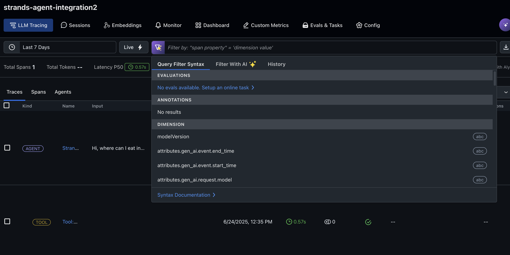
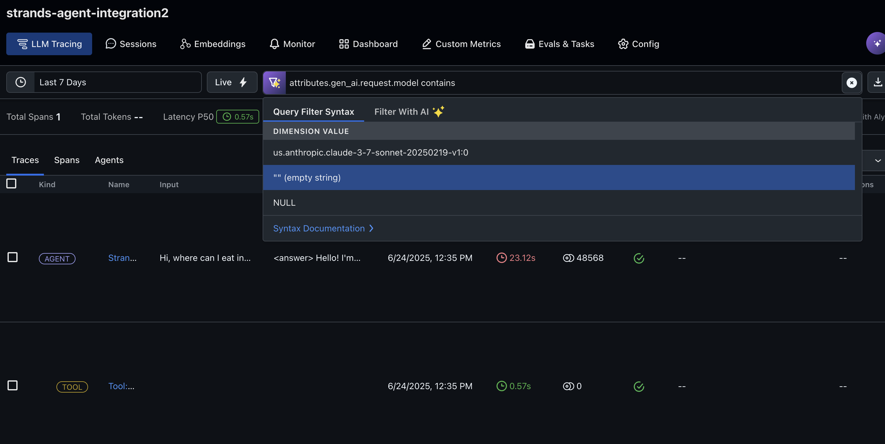
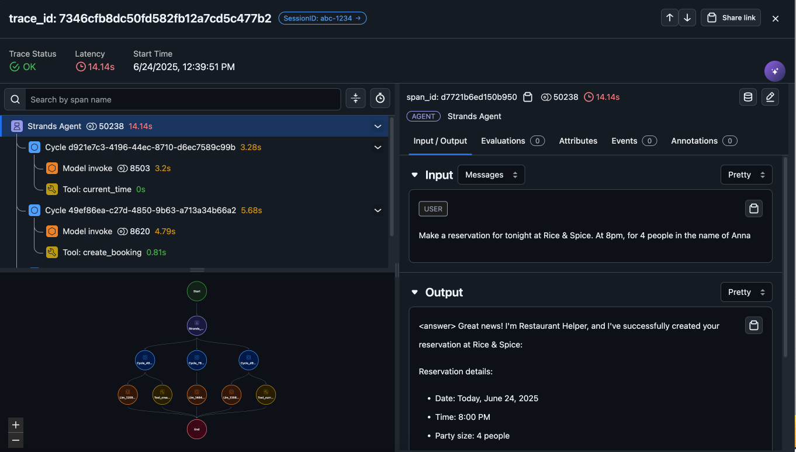
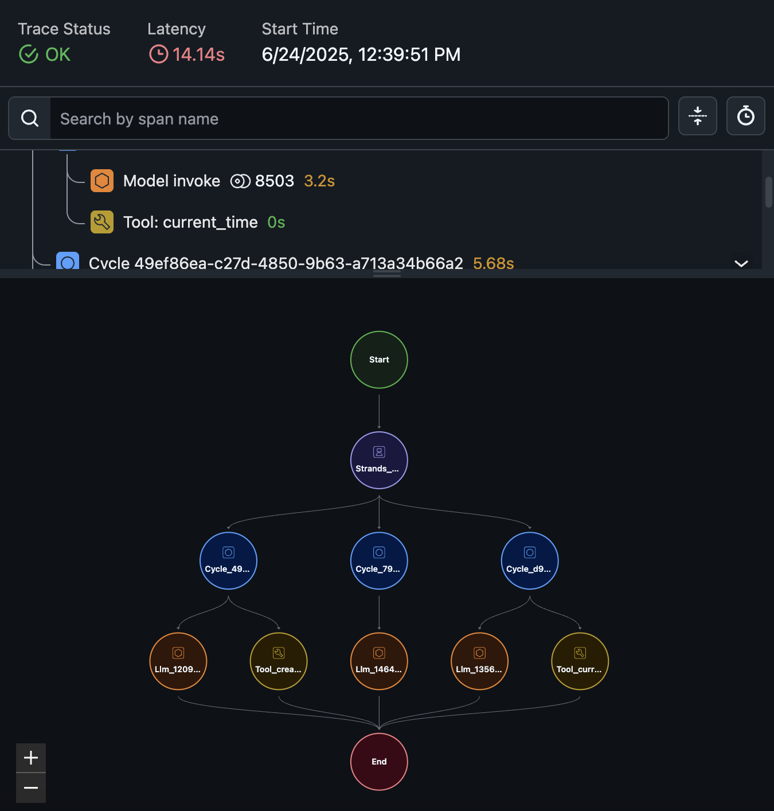
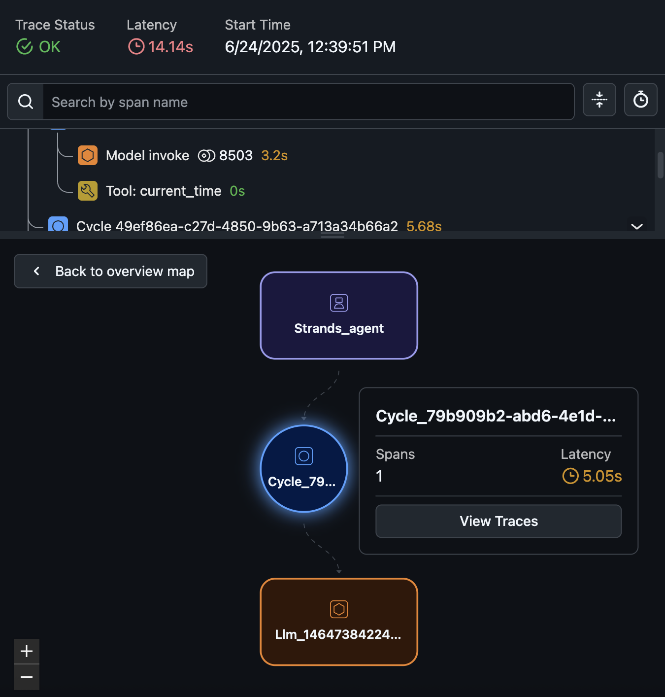
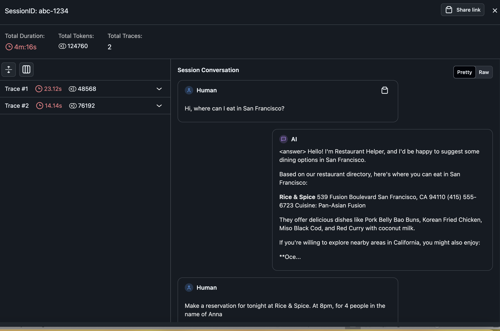

# Strands Agent with OpenInference and Arize Observability

This integration demonstrates how to use Strands Agents with OpenInference and Arize AI for observability. The example builds a restaurant assistant agent that helps customers with restaurant information and reservations.

## Prerequisites

* Python 3.10+
* AWS account with appropriate permissions
* Anthropic Claude 3.7 enabled on Amazon Bedrock
* IAM role with permissions to create Amazon Bedrock Knowledge Base, Amazon S3 bucket and Amazon DynamoDB
* [Arize AI account](https://app.arize.com/signup) with API key and Space ID

## Setup Instructions

1. Clone the repository:
   ```
   git clone https://github.com/strands-agents/samples.git
   cd  03-integrations/Openinference-Arize
   ```

2. Install the required packages:
   ```
   pip install -r requirements.txt
   ```

3. Deploy the prerequisites (Amazon knowledge base and Amazon DynamoDB table):
   ```
   sh deploy_prereqs.sh
   ```

4. Update the Arize AI credentials in the notebook:
   - Get your API key and Space ID from [Arize AI dashboard](https://app.arize.com/settings)
   - Replace the placeholder values in the notebook

5. Run the notebook:
   ```
   jupyter notebook Arize-Observability-openinference-strands.ipynb
   ```

6. View the traces in the [Arize AI dashboard](https://app.arize.com)

## Trace Visualization in Arize

After running the agent, you can explore the traces in Arize AI:

### Project Traces


### Filtering Traces
You can filter traces by various attributes to find specific interactions:



You can also filter by model ID:



For more information on filtering traces, see the [Arize documentation](https://arize.com/docs/ax/observe/tracing/how-to-query-traces/filter-traces).

### Trace Details


### Execution Graph


### Inspecting Execution Paths


### Session Information


7. Clean up resources when done:
   ```
   sh cleanup.sh
   ```

## What You'll Learn

- How to set up OpenInference with Arize AI for Strands Agents
- How to use the custom `StrandsToOpenInferenceProcessor` to convert telemetry
- How to build a functional restaurant assistant with Strands
- How to visualize and analyze agent behavior in Arize AI

## Additional Resources

- [Strands Agents Documentation](https://github.com/strands-agents/sdk-python)
- [OpenInference Specification](https://openinference.ai/)
- [Arize AI Documentation](https://docs.arize.com/)
- [Arize Trace Filtering Documentation](https://arize.com/docs/ax/observe/tracing/how-to-query-traces/filter-traces)
- [Amazon Bedrock Documentation](https://docs.aws.amazon.com/bedrock/)