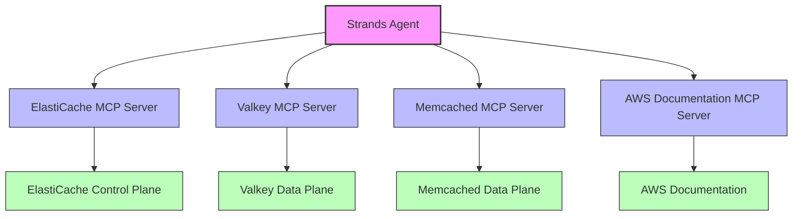

# ElastiCache Integration for Strands

This integration allows you to interact with AWS ElastiCache services using the Strands Agent framework. It supports four different MCP servers:

1. **ElastiCache MCP Server** - For managing ElastiCache control plane operations (creating/modifying/deleting clusters, etc.)
2. **Valkey MCP Server** - For interacting with Redis/Valkey data in ElastiCache
3. **Memcached MCP Server** - For interacting with Memcached data in ElastiCache
4. **AWS Documentation MCP Server** - For accessing AWS documentation related to ElastiCache and other AWS services

## Architecture

The integration uses the Model Context Protocol (MCP) to connect to the different ElastiCache services:



The diagram above shows how the integration works:

- **ElastiCache Control Plane**: Manage clusters, replication groups, and serverless caches
- **Valkey Data Plane**: Interact with Redis/Valkey data types (strings, lists, sets, hashes, etc.)
- **Memcached Data Plane**: Interact with Memcached data (key-value operations)
- **AWS Documentation**: Access AWS documentation for ElastiCache and other AWS services

## Prerequisites

1. Install `uv` from [Astral](https://docs.astral.sh/uv/getting-started/installation/) or the [GitHub README](https://github.com/astral-sh/uv#installation)
2. Install Python using `uv python install 3.10`
3. Set up AWS credentials with access to AWS ElastiCache services
4. Install the required dependencies:

```bash
uv venv
source .venv/bin/activate
uv pip install -r requirements.txt
```

## Configuration

Copy the `.env.example` file to `.env` and update the values:

```bash
cp .env.example .env
```

### Environment Variables

#### AWS Configuration
- `AWS_PROFILE`: AWS credential profile to use
- `AWS_REGION`: AWS region to connect to

#### Valkey Configuration
- `VALKEY_HOST`: ElastiCache Primary Endpoint or Valkey IP/hostname
- `VALKEY_PORT`: Valkey port (default: 6379)
- `VALKEY_USERNAME`: Database username (optional)
- `VALKEY_PWD`: Database password (optional)
- `VALKEY_USE_SSL`: Enable SSL/TLS (True/False)
- `VALKEY_CLUSTER_MODE`: Enable Valkey Cluster mode (True/False)

#### Memcached Configuration
- `MEMCACHED_HOST`: Memcached server hostname
- `MEMCACHED_PORT`: Memcached server port (default: 11211)
- `MEMCACHED_TIMEOUT`: Operation timeout in seconds
- `MEMCACHED_CONNECT_TIMEOUT`: Connection timeout in seconds
- `MEMCACHED_RETRY_TIMEOUT`: Retry delay in seconds
- `MEMCACHED_MAX_RETRIES`: Maximum number of retry attempts

#### AWS Documentation Configuration
- `AWS_DOCUMENTATION_PARTITION`: AWS partition to use for documentation (default: aws, use aws-cn for AWS China)

## Usage

Run the integration with a prompt:

```bash
python main.py "Your prompt here"
```

### Options

- `--mcp-server`: Specify which MCP server to use (elasticache, valkey, memcached, aws-docs, or all)
- `--ro`: Run in read-only mode (no writes allowed)

### Examples

1. Use all engines:
```bash
python main.py "Create a new ElastiCache replication group and store some data in it"
```

2. Use only the ElastiCache control plane:
```bash
python main.py "List all my ElastiCache clusters" --mcp-server elasticache
```

3. Use only Valkey in read-only mode:
```bash
python main.py "Get all keys in my Redis database" --mcp-server valkey --ro
```

4. Use only Memcached:
```bash
python main.py "Store a session token in Memcached" --mcp-server memcached
```

5. Use only AWS Documentation:
```bash
python main.py "Find documentation about ElastiCache serverless" --mcp-server aws-docs
```

## Available Operations

### ElastiCache Control Plane Operations

- Create, modify, and delete replication groups
- Create, modify, and delete cache clusters
- Create, modify, and delete serverless caches
- Describe replication groups, cache clusters, and serverless caches
- Manage service updates
- Configure CloudWatch metrics and logs
- Manage cost and usage data

### AWS Documentation Operations

- Read AWS documentation pages and convert to markdown
- Search AWS documentation using the official search API
- Get content recommendations for AWS documentation pages
- Get a list of available AWS services (China region only)

### Valkey Data Operations

- Strings: SET, GET, APPEND, INCREMENT, etc.
- Lists: LPUSH, RPUSH, LPOP, RPOP, etc.
- Sets: SADD, SMEMBERS, SISMEMBER, etc.
- Sorted Sets: ZADD, ZRANGE, ZRANK, etc.
- Hashes: HSET, HGET, HGETALL, etc.
- Streams: XADD, XREAD, XRANGE, etc.
- JSON: JSON.SET, JSON.GET, JSON.ARRAPPEND, etc.
- Bitmaps: SETBIT, GETBIT, BITCOUNT, etc.
- HyperLogLog: PFADD, PFCOUNT, etc.

### Memcached Operations

- GET, SET, ADD, REPLACE
- DELETE, TOUCH, FLUSH
- INCREMENT, DECREMENT
- APPEND, PREPEND
- CAS (Check and Set)
- Multi-operations: GET_MULTI, SET_MULTI, etc.
- Stats and server information

## Testing

Run the tests:

```bash
pytest tests/
```

## License

This project is licensed under the Apache License 2.0 - see the LICENSE file for details.
