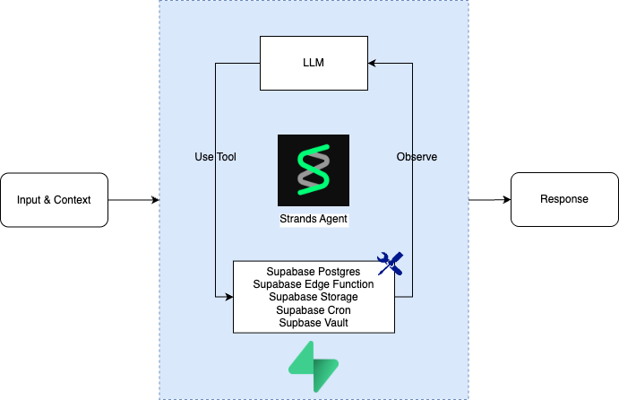
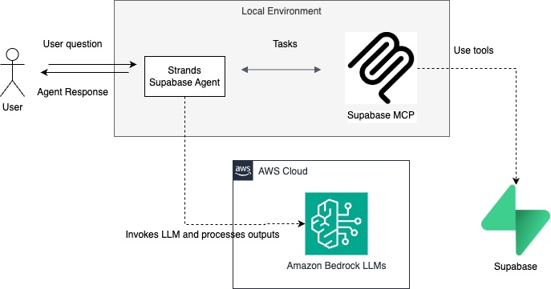

# Strands Agent with Supabase Integration

## Overview

[Supabase](https://supabase.com/) is an open-source Firebase alternative providing all the backend services you need to build a product: a PostgreSQL database, authentication, instant APIs, edge functions, realtime subscriptions, and storage. This integration demonstrates how to use Supabase with Strands AI agents through the Model Context Protocol (MCP).

## Supabase MCP Features

| Feature Group | Available Tools |
|---------------|----------------|
| Account | `list_projects`, `get_project`, `create_project`, `pause_project`, `restore_project`, `list_organizations`, `get_organization`, `get_cost`, `confirm_cost` |
| Knowledge Base | `search_docs` |
| Database | `list_tables`, `list_extensions`, `list_migrations`, `apply_migration`, `execute_sql` |
| Debug | `get_logs`, `get_advisors` |
| Development | `get_project_url`, `get_anon_key`, `generate_typescript_types` |
| Edge Functions | `list_edge_functions`, `deploy_edge_function` |
| Branching (Experimental) | `create_branch`, `list_branches`, `delete_branch`, `merge_branch`, `reset_branch`, `rebase_branch` |
| Storage | `list_storage_buckets`, `get_storage_config`, `update_storage_config` |

                                  

## Agenda
Run the notebook [`supabase-integration.ipynb`](./supabase-integration.ipynb) to explore the Supabase MCP features.

