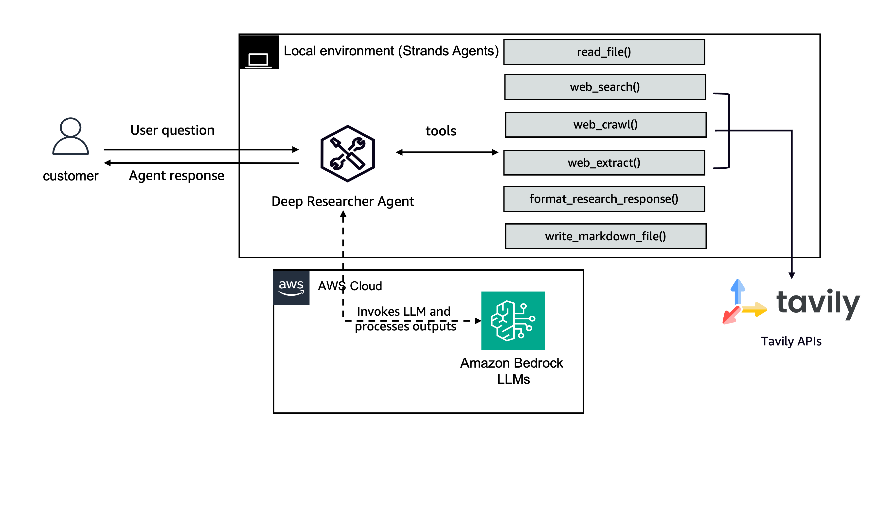

# Interactive Web Researcher

An intelligent terminal-based research assistant powered by Strands and [Tavily](https://www.tavily.com/). This agent uses Tavily's web search and web crawl API to gather information from reliable sources, extract key insights, and save comprehensive research reports in Markdown format.


## Features

- Web search using Tavily API
- Web crawling for deeper research
- Research formatting with Claude 3.5 Haiku
- Save research findings as markdown files (when needed)

Here's the architecture of the web-researcher:

<div style="text-align:center">
    
</div>

## Setup

1. Install [uv](https://docs.astral.sh/uv/getting-started/installation/).

2. Copy [.env.example](./.env.example) to `.env` and add your Tavily API key.
   ```
   cp .env.example .env
   ```

## Usage

Run the interactive researcher:

```
uv run deep_researcher.py
```

Example queries:

- "What are the latest developments in quantum computing?"
- "Find recent studies on climate change from 2022–2023, focusing on impact to coastal regions."

## Configuration

You can configure the following environment variables in your `.env` file:

- `TAVILY_API_KEY`: Your Tavily API key
- `AWS_REGION`: AWS region for Bedrock (default: us-east-1)

## Project Structure

- `deep_researcher.py`: Main script with agent and tools
- `utils/`: Helper functions and prompts
- `research_findings/`: Directory where research results are saved
