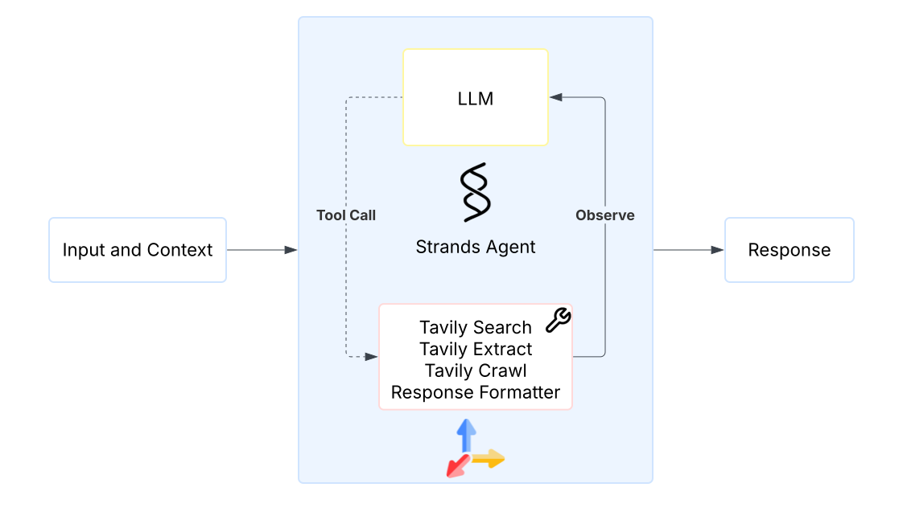

# Supercharge Your Strands Agent with Web Access Using Tavily

## Overview

This tutorial is designed for Python developers who want to empower their Strands agents with real-time web access, enabling agents to utilize up-to-date information as context. Live web information is critical for AI agents tasked with performing research, answering questions accurately, monitoring trends, or providing up-to-date recommendations. You'll learn how to build AI agents that can autonomously search the web, extract valuable content, navigate websites intelligently, and synthesize the relevant information.

## Agenda

This tutorial series follows a step-by-step learning path stand-alone tutorials:

2. In [tutorial #1 - deep research](./deep-research.ipynb), we'll **build a web agent** that can search and crawl the web agentically with the Strands SDK.

  

