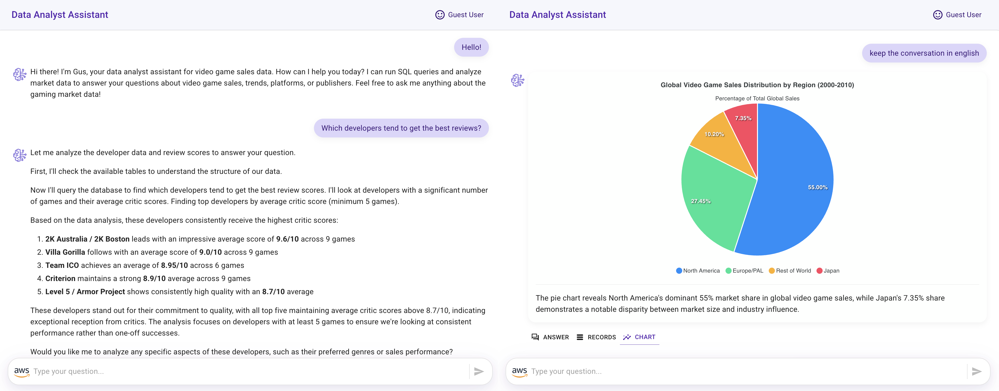
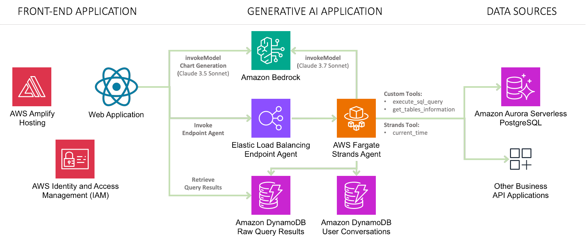
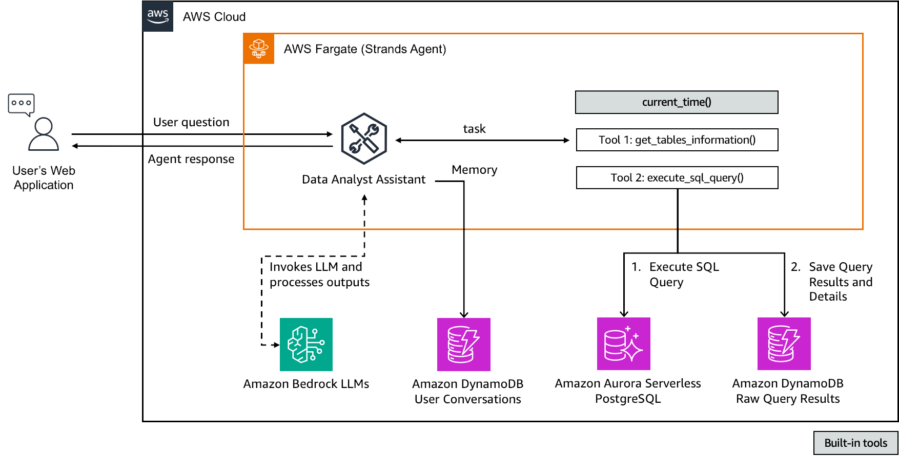
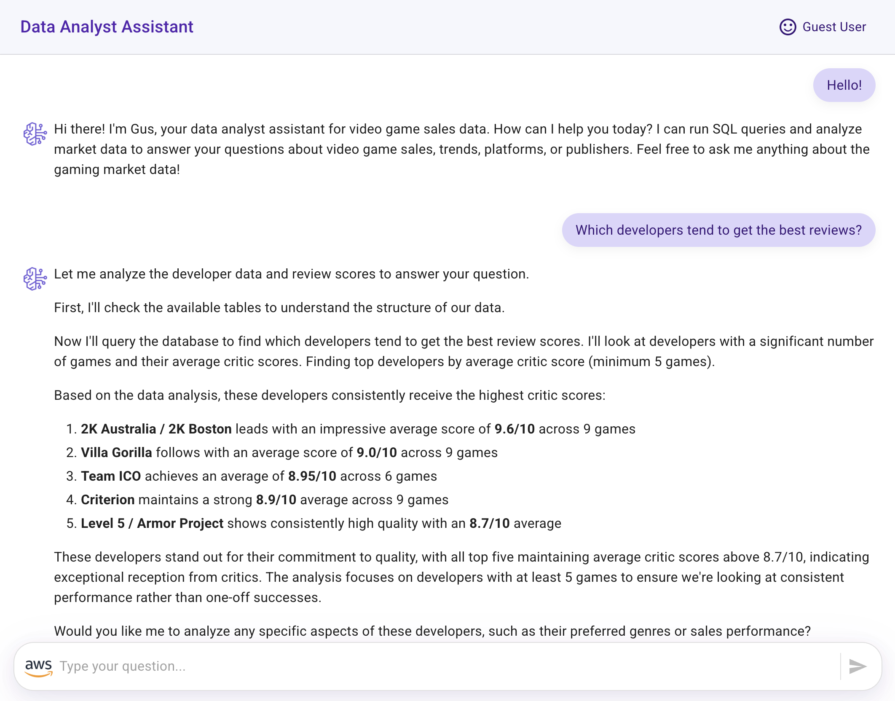
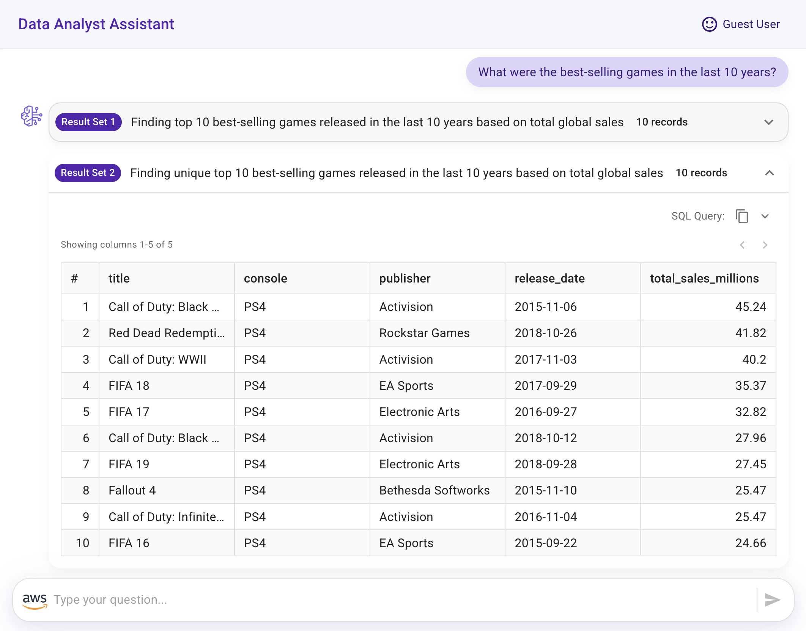
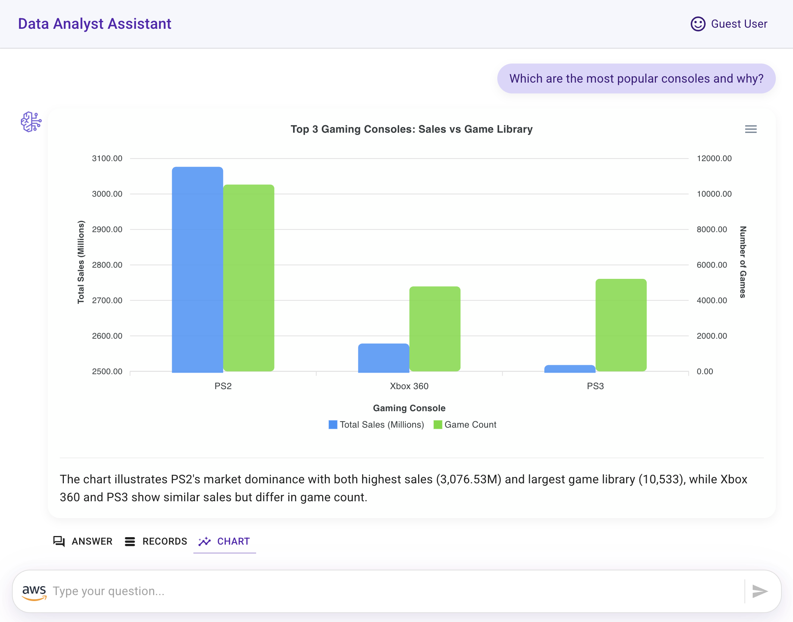
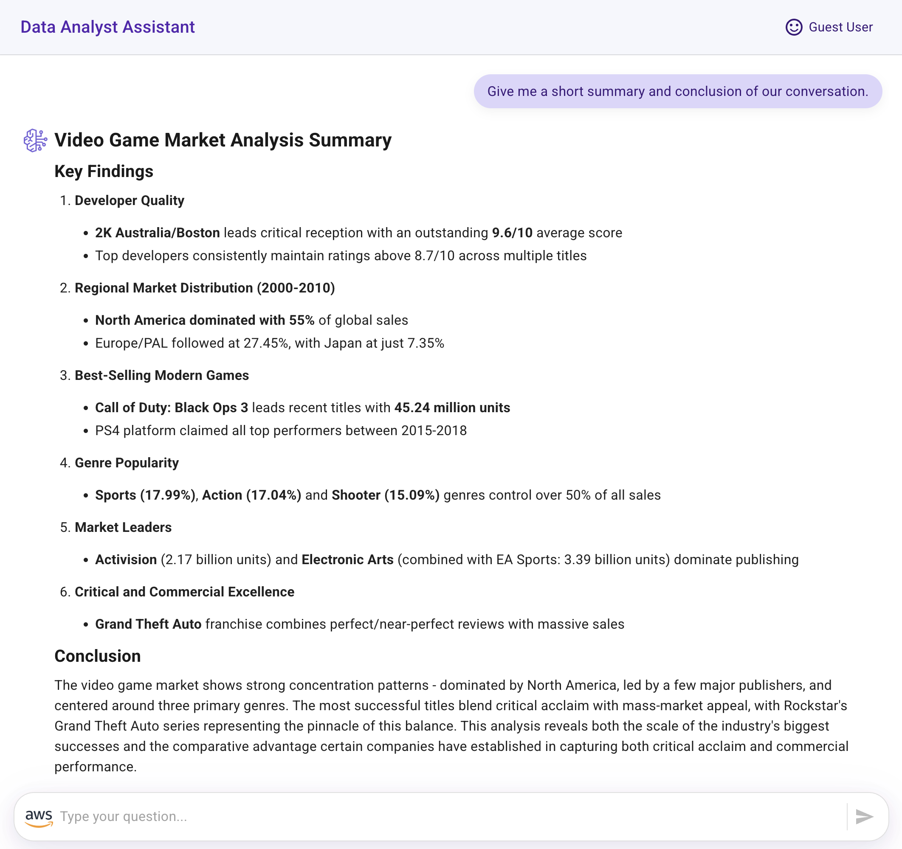

# Deploying a Conversational Data Analyst Assistant Solution with Strands Agents SDK

This solution provides a Generative AI application reference that allows users to interact with data through a natural language interface. The solution leverages [Strands Agents SDK](https://strandsagents.com/) to build an agent that connects to a PostgreSQL database, providing data analysis capabilities through a Web Application interface. The infrastructure is deployed using AWS CDK.

🤖 A Data Analyst Assistant offers an approach to data analysis that enables enterprises to interact with their structured data through natural language conversations rather than complex SQL queries. This kind of assistant provides an intuitive question-answering for data analysis conversations and can be improved by offering data visualizations to enhance the user experience.

✨ This solution enables users to:

- Ask questions about video game sales data in natural language
- Receive AI-generated responses based on SQL queries to a PostgreSQL database
- View query results in tabular format
- Explore data through automatically generated visualizations
- Get insights and analysis from the AI assistant

🚀 This reference solution can help you explore use cases like:

- Empower analysts with real-time business intelligence
- Provide quick answers to C-level executives for common business questions
- Unlock new revenue streams through data monetization (consumer behavior, audience segmentation)
- Optimize infrastructure through performance insights

## Solution Overview

The following architecture diagram illustrates a reference solution for a generative AI data analyst assistant that is built using Strands Agents SDK and powered by Amazon Bedrock. This assistant enables users to access structured data that is stored in a PostgreSQL database through a question-answering interface.

> [!IMPORTANT]
> This sample application is meant for demo purposes and is not production ready. Please make sure to validate the code with your organizations security best practices.
> 
> Cost Alert: This solution will cost approximately $230 USD per month, mainly for Aurora Serverless, RDS Proxy, Application Load Balanceer, Fargate container and VPC NAT Gateway, plus the usage of on-demand services like Amazon Bedrock. Please ensure you understand these costs before deployment.

The solution deploys the following AWS services through AWS CDK:

- **Application Load Balancer and Fargate Container for Strands Agent**: Powers the ***Data Analyst Assistant*** that answers questions by generating SQL queries using Claude 3.7 Sonnet
  - Contains all the logic for agent configuration and tools
  - Built-in tools include:
    - Custom tools:
        - execute_sql_query
        - get_tables_information
    - Strands tool:
        - current_time
- **Aurora Serverless PostgreSQL**: Stores the video game sales data
- **Amazon DynamoDB**: Tracks users' conversations and raw query results
- **AWS Secrets Manager**: Securely stores database credentials
- **Amazon VPC**: Provides network isolation for the database
- **React Web Application**: Delivers the user interface for the assistant
    - The application invokes the agent built with Strands Agents SDK for interacting with the assistant
    - For chart generation, the application directly invokes the Claude 3.5 Sonnet model

> [!NOTE]
> This solution references the use of AWS IAM credentials to connect to Amazon DynamoDB. 🚀 For production deployment, consider integrating Amazon Cognito or another identity provider for proper authentication and authorization instead of using IAM user credentials.

> [!TIP]
> You can also change the data source to connect to your preferred database engine by adapting the Agent's instructions and tool implementations.

> [!IMPORTANT] 
> Enhance AI safety and compliance by implementing **[Amazon Bedrock Guardrails](https://aws.amazon.com/bedrock/guardrails/)** for your AI applications.

The **user interaction workflow** operates as follows:

- The web application sends user business questions to the agent built with Strands Agents SDK
- The agent (powered by Claude 3.7 Sonnet) processes natural language and determines when to execute database queries
- The agent's built-in tools execute SQL queries against the Aurora PostgreSQL database and formulate an answer to the question
- After the agent's response is received by the web application, the raw data query results are retrieved from the DynamoDB table to display both the answer and the corresponding records
- For chart generation, the application invokes a model (powered by Claude 3.5 Sonnet) to analyze the agent's answer and raw data query results to generate the necessary data to render an appropriate chart visualization

### Strand Agent Architecture

| Feature | Description |
|----------|----------|
| Native Tools   | current_time - A built-in Strands tool that provides the current date and time information based on user's timezone. |
| Custom Tools | get_tables_information - A custom tool that retrieves metadata about the database tables, including their structure, columns, and relationships, to help the agent understand the database schema. execute_sql_query - A custom tool that allows the agent to run SQL queries against the PostgreSQL database based on the user's natural language questions, retrieving the requested data for analysis. |
| Model Provider | Amazon Bedrock |

## Deployment Instructions

The deployment consists of two main steps:

1. **Generative AI Application** - [Data Source and Strands Agent Deployment with CDK](./cdk-strands-data-analyst-assistant/)
2. **Front-End Implementation** - [Integrating Strands Agent with a Ready-to-Use Data Analyst Assistant Application](./amplify-video-games-sales-assistant-strands/)

> [!NOTE]
> *It is recommended to use the Oregon (us-west-2) or N. Virginia (us-east-1) regions to deploy the application.*

> [!IMPORTANT] 
> Remember to clean up resources after testing to avoid unnecessary costs by following the clean-up steps provided.

## Application Features

The following images showcase a conversational experience analysis that includes: natural language answers, the reasoning process used by the LLM to generate SQL queries, the database records retrieved from those queries, and the resulting chart visualizations.

- **Conversational interface with an agent responding to user questions**

- **Raw query results displayed in tabular format**

- **Chart visualization generated from the agent's answer and the data query results (created using [Apexcharts](https://apexcharts.com/))**.

- **Summary and conclusion derived from the data analysis conversation**

## Thank You

## License

This project is licensed under the Apache-2.0 License.