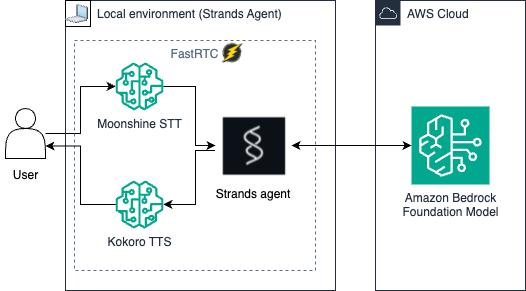

# Speech to speech assistant

Speech to speech agent powered by [FastRTC](https://fastrtc.org/) and [Strands SDK](https://github.com/strands-agents/sdk-python). 

- [Moonshine](https://huggingface.co/UsefulSensors/moonshine) for the speech to text part (running locally)
- Claude 3.5 Haiku for the strands agent (Bedrock call)
- [Kokoro](https://huggingface.co/spaces/hexgrad/Kokoro-TTS) for the text to speech part (running locally)

## Prerequisites

1. Ensure you enable model access to Anthropic Claude 3.5 Haiku (anthropic.claude-3-5-haiku-20241022-v1) in the Bedrock console in all the regions used by the system defined profile used by this sample. To use a different model, update the line containing `model_id="us.anthropic.claude-3-5-haiku-20241022-v1:0"` in [main.py](./main.py).
2. Chrome, Safari, or Edge browser environment (Firefox is currently not supported)
3. Microphone and speakers
4. [Python](https://www.python.org/downloads/) 3.11 or higher

## Getting started

1. Install [uv](https://docs.astral.sh/uv/getting-started/installation/).

2. Run `uv run main.py`

## Usage

1. Once the sample is running, access the UI at `http://127.0.0.1:7860` through a web browser.

2. Click to access microphone, then hit `record`. Once it is connected, you can interact with the agent.

## Agent description

### Agent Details
    
|Feature             |Description                                                |
|--------------------|-----------------------------------------------------------|
|Native tools used   |None                                 |
|Agent Structure     |Single agent architecture                                  |
|Model Provider	| Amazon Bedrock|

## Sample queries

Here are some sample queries you can try with this agent:

* What is your name?
* How old are you ?
