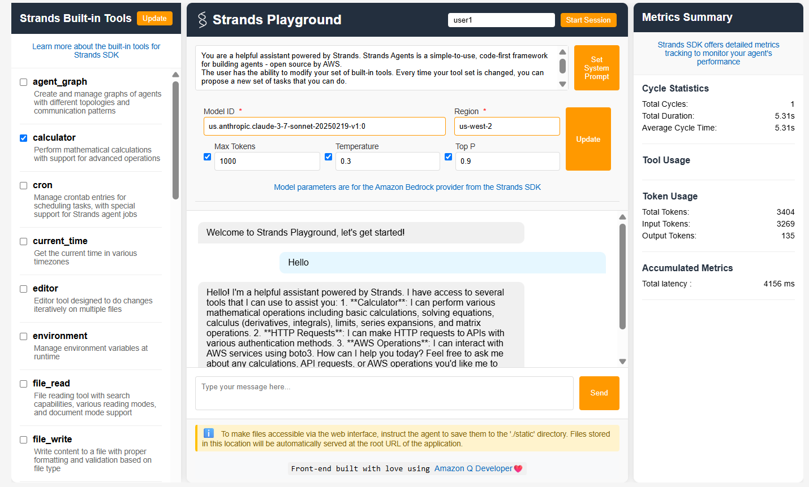
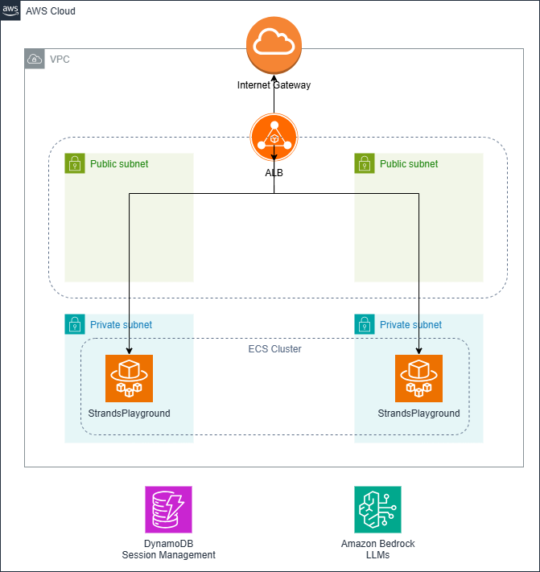

# Strands Playground

A web-based interactive playground for experimenting with the Strands SDK, allowing users to quickly test and prototype AI agents with configurable system prompts, model parameters, and tool selection. The Strands Playground provides the user with agent metrics with every agent invocation.



## Overview

This project provides a playground environment for developers to experiment with the Strands Agents framework. The playground allows you to:

- Quickly prototype and test AI agents powered by Strands SDK
- Configure and test different combinations of Strands [built-in tools](https://strandsagents.com/latest/user-guide/concepts/tools/example-tools-package/) and [Python tools](https://strandsagents.com/latest/user-guide/concepts/tools/python-tools/)
- Customize model parameters (e.g. temperature, max tokens, top P)
- Customize system prompts
- Model selection through the [Amazon Bedrock model provider](https://strandsagents.com/latest/user-guide/concepts/model-providers/amazon-bedrock/) with the ability to switch between supported regions and models. See [Models support by AWS Region in Amazon Bedrock](https://docs.aws.amazon.com/bedrock/latest/userguide/models-regions.html)
- View agent performance metrics, tool calls and cycle durations with every invocation
- Session management through DynamoDB with automatic fallback to file session management
- Persist conversations across sessions and conversation history
- Serve files generated by the agent through the web interface

## Project Structure
```
04-strands-playground/
├── app/                      # Application code
│   ├── static/               # Frontend assets
│   │   ├── app.js            # Main application logic
│   │   ├── index.html        # HTML interface
│   │   ├── styles.css        # CSS styling
│   │   ├── summary-panel.js  # Metrics visualization
│   │   └── tools-panel.js    # Tool selection interface
│   ├── workflows/            # Agent workflow definitions
│   ├── Dockerfile            # Container definition
│   ├── main.py               # FastAPI backend
│   └── requirements.txt      # Python dependencies
├── images/                   # Documentation images
│   ├── main_page_screenshot.png # Main application screenshot
│   └── strands_playground_arch.png # Architecture diagram
└── infra/                    # Infrastructure as code (CDK Deployment)
    ├── lib/                  # CDK stack definition
    ├── bin/                  # CDK entry point
    └── ...                   # AWS CDK deployment code
```


## Features

- **Interactive Playground Interface**: Clean, responsive design for experimenting with Strands agents
- **Comprehensive Tool Selection**: Access to 25+ Strands tools including:
  - File operations (read/write)
  - AWS service integration
  - Python REPL execution
  - HTTP requests
  - Image generation
  - Calculator
  - Shell commands
  - And many more
- **Tool Configuration**: Select which Strands tools the agent can use during experiments
- **Performance Metrics**: Real-time display of:
  - Latency measurements
  - Token usage statistics
  - Tool execution metrics
  - Agent cycle information
- **User Sessions**: Persistent conversations across page reloads
- **Customizable System Prompt**: Modify the agent's behavior through system prompt configuration
- **Model Parameter Tuning**: Configure Bedrock model settings including:
  - Model ID
  - Region
  - Max tokens
  - Temperature
  - Top P

## Getting Started

### Prerequisites

- Python 3.11+
- Node.js 14+ (for CDK deployment)
- npx (comes with Node.js/npm installations since npm 5.2.0)
- AWS credentials configured (for AWS Bedrock access)
- AWS CLI installed and configured (for CDK deployment)
- Docker (required for CDK deployment and local containerized deployment)

### Option 1: Local Development

#### Without DynamoDB (File-based Session Storage)

1. Clone the repository and navigate to the project directory:
   ```bash
   git clone https://github.com/strands-agents/samples.git
   cd samples/04-strands-playground
   ```

2. Install Python dependencies:
   ```bash
   cd app
   pip install -r requirements.txt
   ```

3. Run the FastAPI server with default file-based session storage:
   ```bash
   uvicorn main:app --reload --host 0.0.0.0 --port 8003
   ```

4. Open your browser and navigate to `http://localhost:8003`

#### With DynamoDB Session Storage

1. Create a DynamoDB table in your AWS account:
   ```bash
   aws dynamodb create-table \
     --table-name <table-name>  \
     --attribute-definitions AttributeName=SessionId,AttributeType=S \
     --key-schema AttributeName=SessionId,KeyType=HASH \
     --billing-mode PAY_PER_REQUEST \
     --region <table-region>
   ```

2. Run the FastAPI server with DynamoDB configuration:
   ```bash
   cd app
   TABLE_NAME=<table-name> TABLE_REGION=<table-region> PRIMARY_KEY="SessionId" uvicorn main:app --host 0.0.0.0 --reload --port 8003
   ```

3. Open your browser and navigate to `http://localhost:8003`

### Option 2: Docker Deployment

Build and run the application using Docker:

#### Without DynamoDB (File-based Session Storage)
```bash
cd app
docker build -t strands-playground .
docker run -p 8003:8003 strands-playground
```

#### With DynamoDB Session Storage
```bash
cd app
docker build -t strands-playground .
docker run -p 8003:8003 \
  -e TABLE_NAME="<table-name>" \
  -e TABLE_REGION="<table-region>" \
  -e PRIMARY_KEY="SessionId" \
  strands-playground
```

### Option 3: Full CDK Deployment to AWS

Deploy a complete production-ready environment to AWS using CDK:

1. Ensure Docker is running on your machine (required for CDK deployment)

2. Navigate to the infrastructure directory:
   ```bash
   cd infra
   ```

3. Bootstrap your AWS environment (if not already done):
   ```bash
   npx cdk bootstrap
   ```

4. Deploy the stack:
   ```bash
   npx cdk deploy
   ```

The CDK deployment creates the following AWS resources:

- **VPC**: A Virtual Private Cloud with public and private subnets
- **ECS Cluster**: To host the containerized application
- **DynamoDB Table**: For persistent session storage
- **Fargate Service**: Running 2 instances of the application for high availability
- **Application Load Balancer**: For distributing traffic to the Fargate instances
- **IAM Roles**: With permissions for Bedrock API access
- **CloudWatch Logs**: For application logging

After deployment, the application will be accessible via the load balancer's DNS name, which is provided as an output from the CDK stack.

#### Architecture



The Strands Playground follows a modern web application architecture:

- **Frontend**: Vanilla JavaScript, HTML, and CSS served by the FastAPI application
- **Backend**: Python FastAPI server that handles API requests and manages agent interactions
- **Session Storage**: Flexible storage options (local files or DynamoDB)
- **AI Integration**: Direct integration with Amazon Bedrock through the Strands SDK
- **Deployment**: Containerized application deployable locally or on AWS infrastructure


## Usage Examples

### Basic Experimentation
1. Enter a user ID and click "Start Session"
2. Type your prompt in the chat input field
3. The agent will respond based on its configured system prompt and available tools

### Configuring Tools
1. Use the tools panel on the left side
2. Select or deselect tools from the list
3. Click "Update" to apply changes
4. The agent will now use only the selected tools in future interactions

### Customizing Model Parameters
1. Enter the desired model ID (e.g., "us.anthropic.claude-3-7-sonnet-20250219-v1:0")
2. Specify the AWS region (e.g., "us-west-2")
3. Optionally configure max tokens, temperature, and top P values
4. Click "Update" to apply changes

### Modifying the System Prompt
1. Enter a new system prompt in the settings panel
2. Click "Set System Prompt" to apply changes
3. The agent's behavior will update according to the new instructions

### Working with Files
To make files accessible via the web interface, instruct the agent to save them to the './static' directory. Files stored in this location will be automatically served at the root URL of the application.

## Session Management

The playground supports two methods for managing conversation sessions:

1. **Local File-Based Storage**: By default, conversations are stored in local files in a `sessions` directory.

2. **DynamoDB Storage**: For persistent storage across container restarts or in production environments, configure the following environment variables:
   - `TABLE_NAME`: Name of your DynamoDB table
   - `TABLE_REGION`: AWS region where your DynamoDB table is located
   - `PRIMARY_KEY`: Primary key name for your DynamoDB table (typically "SessionId")

## Extending the Playground

### Adding New Tools
To add custom tools, modify the `available_tools` dictionary in `main.py` and add your tool implementation along with a description in the `tool_descriptions` dictionary.

### Customizing the Frontend
The frontend is built with vanilla JavaScript and can be easily modified by editing the files in the `static` directory.

## Troubleshooting

### Common Issues

#### AWS Credentials Not Found
If you encounter AWS credential errors:
```
botocore.exceptions.NoCredentialsError: Unable to locate credentials
```
Make sure your AWS credentials are properly configured:
```bash
aws configure
```

#### DynamoDB Table Access Issues
If the application can't access your DynamoDB table:
1. Verify the table exists in the specified region
2. Check that your IAM role/user has appropriate permissions
3. Confirm environment variables are correctly set: `TABLE_NAME`, `TABLE_REGION`, and `PRIMARY_KEY`

#### Model Access Errors
If you encounter errors accessing Bedrock models:
1. Verify the model is available in your selected region
2. Ensure your AWS account has access to the model
3. Check that your IAM role has `bedrock:InvokeModel` permissions

#### Docker Build Failures
If Docker build fails:
1. Ensure Docker is running
2. Check for syntax errors in the Dockerfile
3. Verify network connectivity for downloading dependencies

## Security Considerations

When deploying this application, consider the following security best practices:

1. **IAM Permissions**: Use the principle of least privilege when configuring IAM roles
2. **API Access**: Implement proper authentication for the API in production environments
3. **Environment Variables**: Never hardcode sensitive information; use environment variables or AWS Secrets Manager
4. **CORS Settings**: Restrict CORS settings to specific origins in production
5. **Network Security**: Deploy within a VPC with appropriate security groups and network ACLs

## Contributing

Contributions to the Strands Playground are welcome! To contribute:

1. Fork the repository
2. Create a feature branch (`git checkout -b feature/amazing-feature`)
3. Commit your changes (`git commit -m 'Add some amazing feature'`)
4. Push to the branch (`git push origin feature/amazing-feature`)
5. Open a Pull Request

Please ensure your code follows the existing style and includes appropriate tests.

## Version History

- **1.0.0** - Initial release with core playground functionality
- **1.0.1** - Added support for Claude 3.7 Sonnet model

## License

This project is licensed under the Apache License 2.0 - see the LICENSE file for details.