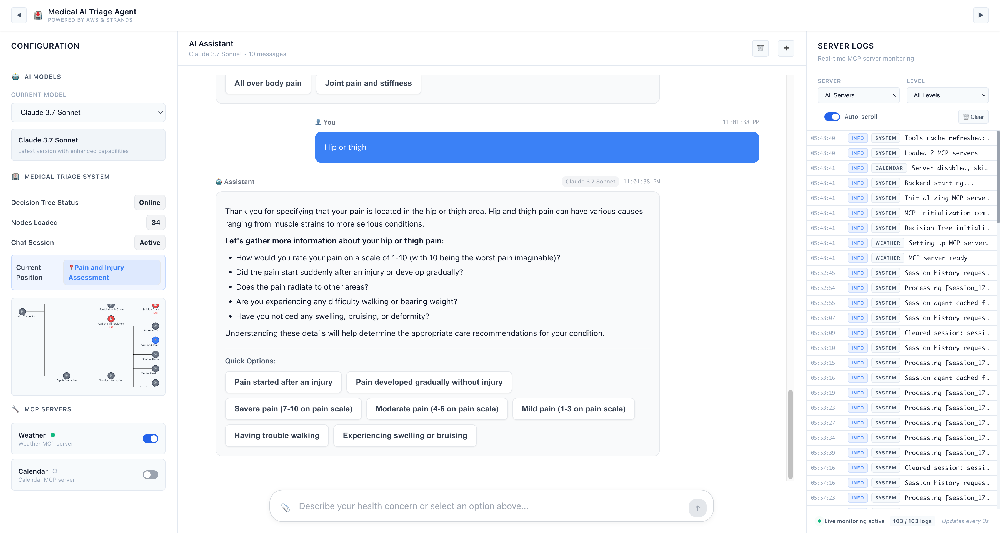

## AI Triage Agent with MCP

This is **AI Triage Agent**, a comprehensive AI-powered productivity platform that integrates multiple tools and services to enhance daily productivity. The project leverages AWS Bedrock's Claude models through the Strands AI framework and MCP (Model Context Protocol) servers to provide intelligent assistance for tasks, calendar management, weather updates, calculations, and more.



*AI-powered productivity platform with unified chat interface, task management, and intelligent assistance*

## Use case

This project addresses the common challenge of managing multiple productivity tools across different platforms and contexts. Users often switch between various applications for task management, calendar scheduling, weather checking, calculations, and email management, leading to fragmented workflows and reduced efficiency.

**AI Triage Agent** consolidates these essential productivity functions into a single, intelligent interface that:

- **Unifies Task Management**: Create, track, and manage tasks with priority levels and completion status
- **Integrates Calendar Events**: Access and manage calendar events seamlessly
- **Provides Weather Intelligence**: Get current weather information for better planning
- **Offers Quick Calculations**: Perform calculations without switching to external tools
- **Manages Communication**: Access email history and insights
- **Enables Intelligent Conversations**: Interact with AI assistants that understand context across all productivity domains

## Value proposition

**AI Triage Agent** delivers significant value to end users by:

🚀 **Streamlined Workflow**: Eliminate the need to switch between multiple applications - everything you need is in one intelligent interface

🧠 **AI-Powered Intelligence**: Leverage advanced AI models (Claude 3.7 Sonnet) to get intelligent suggestions, automate routine tasks, and provide contextual assistance

🔧 **Modular Architecture**: Built on MCP (Model Context Protocol) servers, allowing easy extension and customization of productivity tools

⚡ **Real-time Integration**: Connect with your existing calendar, weather services, and other productivity tools for seamless data flow

🎯 **Context-Aware Assistance**: The AI understands your tasks, calendar, and preferences to provide personalized productivity recommendations

💡 **Unified Experience**: A beautiful, modern React-based interface that makes productivity management enjoyable rather than overwhelming

This solution transforms fragmented productivity workflows into a cohesive, AI-enhanced experience that adapts to your working style and helps you accomplish more with less effort.

## Quick Start

To get started with the AI Triage Agent, follow these simple steps:

### Prerequisites

- Python 3.11 or higher
- Node.js 16 or higher
- npm or yarn package manager

### Installation and Running

1. **Clone the repository:**
   ```bash
   git clone <repository-url>
   cd triage-agents
   ```

2. **Start the application:**
   ```bash
   ./start.sh
   ```

   This script will:
   - Create a Python virtual environment
   - Install all Python dependencies
   - Install Node.js dependencies
   - Start both backend (port 8000) and frontend (port 3000) servers

3. **Access the application:**
   - Frontend: http://localhost:3000
   - Backend API: http://localhost:8000

4. **Stop the application:**
   ```bash
   ./stop.sh
   ```

The application will automatically check for port availability and guide you through any issues.

## AWS Deployment

For AWS deployment, use the provided CloudFormation template:

```bash
cd deploy
./deploy.sh
```

This script deploys:
- **EC2**: Backend server with FastAPI application
- **S3**: Frontend hosting bucket
- **CloudFront**: Global content distribution
- **VPC**: Secure network infrastructure

## Development approach

When working with this project, the agent should ensure it is working within a git repo. If one is not configured yet, the agent should create one.

The agent should update and extend this README.md file with additional information about the project as development progresses, and commit changes to this file and the other planning files below as they are updated.

Working with the user, the agent will implement the project step by step, first by working out the requirements, then the design/architecture including AWS infrastructure components, then the list of tasks needed to: 1) implement the project source code and AWS infrastructure as code, 2) deploy the project to a test AWS environment, 3) run any integration tests against the deployed project.

Once all planning steps are completed and documented, and the user is ready to proceed, the agent will begin implementing the tasks one at a time until the project is completed. 

## Project layout

### Core Application Structure

```
triage-agents/
├── backend/                    # Python FastAPI backend
│   ├── main.py                # Main FastAPI application
│   ├── mcpmanager.py          # MCP server management
│   ├── mcp.json               # MCP server configuration
│   ├── requirements.txt       # Python dependencies
│   └── mcp_servers/           # MCP server implementations
│       ├── task_manager_server.py     # Task management functionality
│       ├── calculator_server.py       # Calculator functionality
│       ├── calendar/                  # Calendar integration
│       ├── weather/                   # Weather services
│       ├── email_history/             # Email management
│       └── strands/                   # Strands agent integration
├── frontend/                   # React frontend application
│   ├── public/                # Static assets
│   ├── src/                   # React source code
│   │   ├── App.js            # Main application component
│   │   └── components/       # React components
│   ├── package.json          # Node.js dependencies
│   └── tailwind.config.js    # Tailwind CSS configuration
├── start.sh                   # Application startup script
├── stop.sh                    # Application shutdown script
├── preview.png                # Application preview image
└── README.md                  # Project documentation
```

### Documentation Files

* **requirements.md**: Defines the functional and non-functional requirements for this project
* **design.md**: Defines the system design, architecture, and AWS infrastructure components
* **tasks.md**: Lists the discrete implementation tasks with checkboxes for tracking progress
* **test-plan.md**: Describes unit test, integration test, and performance test strategies
* **threat-model.md**: Comprehensive security threat model and security testing plan

### Technology Stack

- **Backend**: Python 3.11+, FastAPI, AWS Bedrock, Strands AI, MCP Protocol
- **Frontend**: React 18, Tailwind CSS, Axios
- **AI Models**: Claude 3.7 Sonnet via AWS Bedrock
- **Infrastructure**: AWS (Bedrock, EC2, S3, CloudFormation)
- **Development**: Git, Docker (optional), AWS CLI

## Features

### Core Capabilities

- **AI Triage System**: AI-powered decision tree for guiding users through structured assessments
- **Multi-Modal Chat Interface**: Support for text and image inputs with streaming responses
- **Task Management**: Comprehensive task creation, tracking, and management
- **Calendar Integration**: Seamless calendar event management and scheduling
- **Weather Services**: Real-time weather information and forecasts
- **Calculator Tools**: Built-in calculation capabilities
- **Email History**: Access and manage email communications

### Technical Features

- **MCP Server Architecture**: Modular server components for extensibility
- **Real-time Streaming**: Streaming responses for improved user experience
- **Session Management**: Persistent user sessions and conversation state
- **Decision Tree Navigation**: Structured conversation flows and reasoning
- **Tool Integration**: Dynamic tool loading and execution

## Architecture

The application follows a modern microservices architecture with:

- **Frontend**: React-based SPA with Tailwind CSS for responsive design
- **Backend**: FastAPI server with async support for high performance
- **AI Integration**: AWS Bedrock integration with Claude models via Strands SDK
- **MCP Protocol**: Standardized protocol for tool and server communication
- **State Management**: Session-based state management for conversation flows

## Contributing

Please refer to [CONTRIBUTING.md](../../CONTRIBUTING.md) for detailed contribution guidelines, development practices, and code standards.

## License

This project is licensed under the MIT License - see the [LICENSE.md](../../LICENSE.md) file for details.

## Support

For questions, issues, or feature requests, please open an issue in the GitHub repository.

