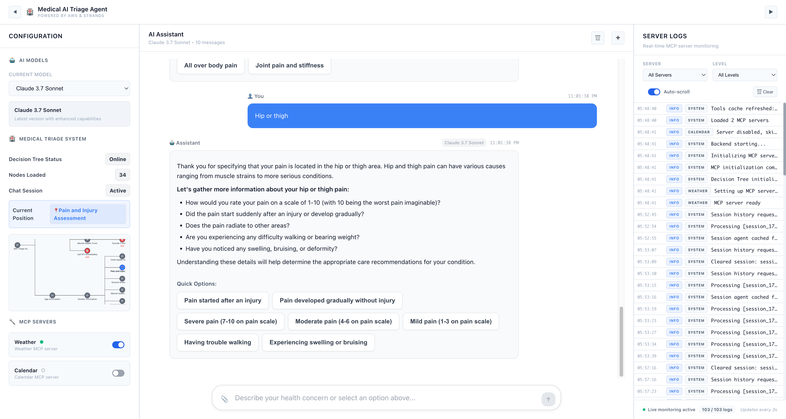

## AI Triage Agent with MCP

This is **AI Triage Agent**, a demonstration of an AI-powered medical triage system that showcases intelligent patient assessment through **"structured decision tree navigation"**. The project leverages Amazon Bedrock through the Strands AI framework and MCP (Model Context Protocol) servers, with integrated calendar scheduling and weather information for comprehensive patient care coordination.



_AI-powered productivity platform with unified chat interface, task management, and intelligent assistance_

## Important Disclaimer

**⚠️ This is a Proof of Concept (PoC) demonstration only.** This application is designed for educational and demonstration purposes to showcase AI integration capabilities and productivity tool orchestration. It is not intended to provide medical advice, professional consultation, or replace qualified professional judgment in any domain.

The AI responses and any data generated are produced by artificial intelligence models and should be treated as mock/demo content only. Use this application at your own risk. The developers and contributors are not responsible for any decisions made based on the output from this system.

For any medical, legal, financial, or other professional advice, please consult with qualified professionals in the respective fields.

## Use case

This project demonstrates how AI can assist in medical triage workflows by providing structured patient assessment, intelligent questioning, and decision tree navigation. The system showcases how healthcare organizations could potentially streamline initial patient evaluations while maintaining safety and accuracy standards.

**AI Triage Agent** demonstrates essential medical triage functions through an intelligent interface that:

- **AI-Powered Medical Assessment**: Demonstrates structured patient evaluation workflows and intelligent questioning
- **Decision Tree Navigation**: Showcases systematic medical triage decision-making processes
- **Calendar Integration**: Demonstrates appointment scheduling and healthcare provider coordination
- **Weather Intelligence**: Shows how environmental factors can be integrated into patient care decisions
- **Intelligent Healthcare Conversations**: Demonstrates AI assistants that understand medical context and workflows

## Quick Start

To get started with the AI Triage Agent, follow these simple steps:

### Prerequisites

- Python 3.11 or higher
- Node.js 16 or higher
- npm or yarn package manager

### Installation and Running

1. **Clone the repository:**

   ```bash
   git clone https://github.com/strands-agents/samples.git
   cd 04-UX-demos/04-triage-agent
   ```

2. **Configure your AWS Credentials**
   You can use `aws configure` command in your terminal to setup your credentials.

   OR export environment variables

   ```bash
   export AWS_ACCESS_KEY_ID=<your_access_key>
   export AWS_SECRET_ACCESS_KEY=<your_secret_key>
   export AWS_DEFAULT_REGION=<aws-region>
   ```

3. **Start the application:**

   ```bash
   bash start.sh
   ```

   This script will:

   - Create a Python virtual environment
   - Install all Python dependencies
   - Install Node.js dependencies
   - Start both backend (port 8000) and frontend (port 3000) servers

4. **Access the application:**

   - Frontend: http://localhost:3000
   - Backend API: http://localhost:8000

5. **Stop the application:**
   ```bash
   bash stop.sh
   ```

The application will automatically check for port availability and guide you through any issues.

## AWS Deployment

For AWS deployment, use the provided CloudFormation template:

```bash
cd deploy
./deploy.sh
```

This script deploys:

- **EC2**: Backend server with FastAPI application
- **S3**: Frontend hosting bucket
- **CloudFront**: Global content distribution
- **VPC**: Secure network infrastructure

## Development approach

When working with this project, the agent should ensure it is working within a git repo. If one is not configured yet, the agent should create one.

The agent should update and extend this README.md file with additional information about the project as development progresses, and commit changes to this file and the other planning files below as they are updated.

Working with the user, the agent will implement the project step by step, first by working out the requirements, then the design/architecture including AWS infrastructure components, then the list of tasks needed to: 1) implement the project source code and AWS infrastructure as code, 2) deploy the project to a test AWS environment, 3) run any integration tests against the deployed project.

Once all planning steps are completed and documented, and the user is ready to proceed, the agent will begin implementing the tasks one at a time until the project is completed.

## Project layout

### Core Application Structure

```
triage-agents/
├── backend/                    # Python FastAPI backend
│   ├── main.py                # Main FastAPI application
│   ├── mcpmanager.py          # MCP server management
│   ├── mcp.json               # MCP server configuration
│   ├── requirements.txt       # Python dependencies
│   └── mcp_servers/           # MCP server implementations
│       ├── task_manager_server.py     # Task management functionality
│       ├── calculator_server.py       # Calculator functionality
│       ├── calendar/                  # Calendar integration
│       ├── weather/                   # Weather services
│       ├── email_history/             # Email management
│       └── strands/                   # Strands agent integration
├── frontend/                   # React frontend application
│   ├── public/                # Static assets
│   ├── src/                   # React source code
│   │   ├── App.js            # Main application component
│   │   └── components/       # React components
│   ├── package.json          # Node.js dependencies
│   └── tailwind.config.js    # Tailwind CSS configuration
├── start.sh                   # Application startup script
├── stop.sh                    # Application shutdown script
├── preview.png                # Application preview image
└── README.md                  # Project documentation
```

### Technology Stack

- **Backend**: Python 3.11+, FastAPI, AWS Bedrock, Strands AI, MCP Protocol
- **Frontend**: React 18, Tailwind CSS, Axios
- **AI Models**: Claude 3.7 Sonnet via AWS Bedrock
- **Infrastructure**: AWS (Bedrock, EC2, S3, CloudFormation)
- **Development**: Git, Docker (optional), AWS CLI

## Architecture

The application follows a modern microservices architecture with:

- **Frontend**: React-based SPA with Tailwind CSS for responsive design
- **Backend**: FastAPI server with async support for high performance
- **AI Integration**: AWS Bedrock integration with Claude models via Strands SDK
- **MCP Protocol**: Standardized protocol for tool and server communication
- **State Management**: Session-based state management for conversation flows

## Contributing

Please refer to [CONTRIBUTING.md](../../CONTRIBUTING.md) for detailed contribution guidelines, development practices, and code standards.

## License

This project is licensed under the MIT License - see the [LICENSE.md](../../LICENSE.md) file for details.

## Support

For questions, issues, or feature requests, please open an issue in the GitHub repository.
