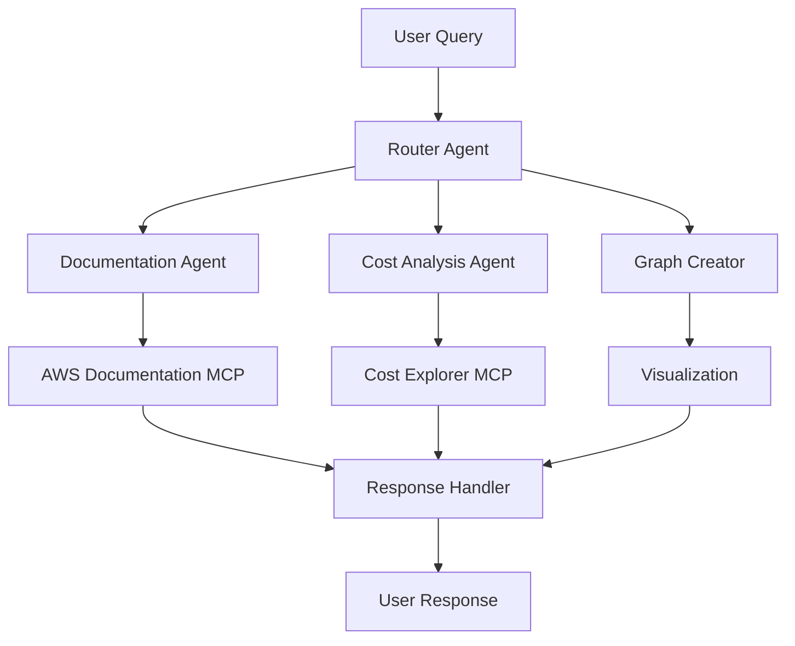

# AWS Assistant

A sophisticated multi-agent system that provides comprehensive insights for AWS-related queries using MCP servers for documentation research and cost analysis.

## Overview

This pattern demonstrates how to build an AWS assistant that:
- Searches and analyzes AWS documentation
- Analyzes AWS account spending
- Creates visual cost breakdowns
- Provides detailed technical explanations

### Key Benefits
- Automated documentation research
- Cost analysis visualization
- Multi-agent collaboration
- MCP server integration
- Real-time insights

## Architecture

## Prerequisites

Before implementing this pattern, ensure you have:

- Python 3.10+
- strands-agents>=0.1.0
- AWS Account with Bedrock access
- AWS Cost Explorer access
- Docker installed and running
- AWS credentials configured

## Implementation

The complete implementation of this pattern is available in the [samples repository](https://github.com/strands-agents/samples/tree/main/samples/02-samples/03-aws-assistant-mcp). The implementation includes:

### Key Components

1. **Router Agent**
   - Analyzes incoming queries
   - Routes to specialized agents
   - Maintains conversation context
   - Located in [main.py](https://github.com/strands-agents/samples/tree/main/samples/02-samples/03-aws-assistant-mcp/main.py)

2. **Documentation Researcher**
   - Searches AWS documentation
   - Provides detailed explanations
   - Uses AWS Documentation MCP server

3. **Cost Assistant**
   - Analyzes AWS spending
   - Generates cost breakdowns
   - Uses AWS Cost Explorer MCP server

4. **Graph Creator**
   - Visualizes cost data
   - Creates interactive plots
   - Uses Plotly for visualization

### Example Usage

For detailed usage examples and implementation details, refer to the source repository. The assistant can:

- Research AWS services and features
- Analyze account spending patterns
- Create cost visualizations
- Provide technical guidance

## Best Practices

1. **Documentation Research**: 
   - Use specific queries
   - Include service context
   - Reference official docs
   - Validate information

2. **Cost Analysis**:
   - Set time ranges
   - Group by services
   - Include all regions
   - Track trends

3. **Visualization**:
   - Use appropriate charts
   - Include legends
   - Add clear labels
   - Show comparisons

4. **MCP Integration**:
   - Handle rate limits
   - Cache responses
   - Validate data
   - Error handling

## Common Issues

### Issue 1: Documentation Coverage
**Problem**: Missing or outdated documentation
**Solution**: Implement fallback to web search

### Issue 2: Cost Data Access
**Problem**: Limited Cost Explorer permissions
**Solution**: Use role-based access control

### Issue 3: Response Time
**Problem**: Slow MCP server responses
**Solution**: Implement caching and parallel requests

## Related Patterns

- [Personal Assistant](../bedrock-personal-assistant/)
- [Code Assistant](../bedrock-code-assistant/)
- [Bedrock Knowledge Base with DynamoDB](../bedrock-knowledgebase-dynamodb/)

## Resources

- [Source Code Repository](https://github.com/strands-agents/samples/tree/main/samples/02-samples/03-aws-assistant-mcp)
- [AWS Documentation MCP Server](https://awslabs.github.io/mcp/servers/aws-documentation-mcp-server/)
- [AWS Cost Explorer MCP Server](https://github.com/aarora79/aws-cost-explorer-mcp-server)
- [Amazon Bedrock Documentation](https://docs.aws.amazon.com/bedrock/) 