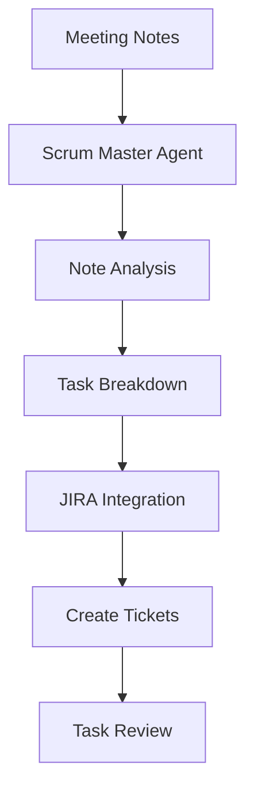

# Scrum Master Assistant

An expert agile development assistant that converts meeting notes into actionable JIRA tickets, helping product teams transform high-level planning items into well-structured tasks.

## Overview

This pattern demonstrates how to build a JIRA integration that:
- Processes meeting notes into structured tasks
- Creates well-formatted JIRA tickets
- Maintains agile best practices
- Automates task breakdown

### Key Benefits
- Automated task creation from notes
- Consistent ticket formatting
- Agile methodology adherence
- Time-saving automation
- Enhanced task clarity

## Architecture

## Prerequisites

Before implementing this pattern, ensure you have:

- Python 3.10+
- strands-agents>=0.1.0
- AWS Account with Bedrock access
- JIRA account with API access
- AWS credentials configured

## Implementation

The complete implementation of this pattern is available in the [samples repository](https://github.com/aws-samples/strands/tree/main/samples/02-samples/02-scrum-master-assistant). The implementation includes:

### Key Components

1. **Scrum Master Agent**
   - Processes meeting notes
   - Analyzes task requirements
   - Creates JIRA tickets
   - Located in [jira_assistant.py](https://github.com/aws-samples/strands/tree/main/samples/02-samples/02-scrum-master-assistant/jira_assistant.py)

2. **JIRA Integration**
   - Handles JIRA API communication
   - Creates and updates tickets
   - Manages ticket metadata

3. **Custom Tools**
   - `create_jira_ticket`: Creates new JIRA tickets
   - `file_read`: Reads meeting notes files
   - Located in the source repository

### Example Usage

For detailed usage examples and implementation details, refer to the source repository. The agent can:

- Process meeting notes into tasks
- Create JIRA epics and stories
- Break down large tasks
- Maintain agile relationships

## Best Practices

1. **Task Analysis**: 
   - Use clear acceptance criteria
   - Include task dependencies
   - Specify story points
   - Add relevant labels

2. **JIRA Integration**:
   - Use proper ticket hierarchy
   - Maintain consistent formatting
   - Include necessary metadata
   - Link related tickets

3. **Meeting Notes**:
   - Use structured formats
   - Include key details
   - Mark priorities
   - Note dependencies

4. **Agile Practices**:
   - Follow team conventions
   - Use proper ticket types
   - Include sprint context
   - Add time estimates

## Common Issues

### Issue 1: Missing Context
**Problem**: Insufficient information in meeting notes
**Solution**: Implement note templates and validation

### Issue 2: JIRA API Limits
**Problem**: Rate limiting on API calls
**Solution**: Implement request throttling and batching

### Issue 3: Task Granularity
**Problem**: Tasks too large or small
**Solution**: Use configurable breakdown rules

## Related Patterns

- [Personal Assistant](../personal-assistant/)
- [AWS Assistant](../aws-cost-documentation-assistant/)
- [Code Assistant](../code-assistant/)

## Resources

- [Source Code Repository](https://github.com/aws-samples/strands/tree/main/samples/02-samples/02-scrum-master-assistant)
- [JIRA API Documentation](https://developer.atlassian.com/cloud/jira/platform/rest/v3/intro/)
- [Amazon Bedrock Documentation](https://docs.aws.amazon.com/bedrock/)
- [Agile Best Practices](https://www.atlassian.com/agile/tutorials) 