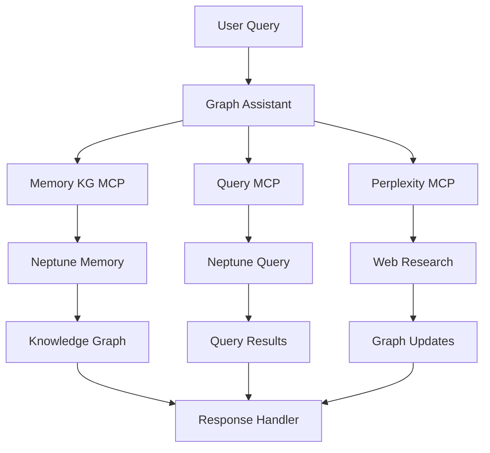

# Amazon Neptune Graph Assistant

A pattern demonstrating how to use Amazon Neptune with Strands agents for graph database operations, including memory knowledge graphs and graph queries using MCP servers.

## Overview

This pattern demonstrates how to build a Neptune integration that:
- Creates knowledge graphs
- Executes graph queries
- Persists agent memory
- Analyzes graph data
- Uses multiple MCP servers

### Key Benefits
- Graph-based memory
- Complex query support
- MCP server integration
- Analytics capabilities
- Persistent storage

## Architecture

## Prerequisites

Before implementing this pattern, ensure you have:

- Python 3.10+
- strands-agents>=0.1.0
- AWS Account with Bedrock access
- Amazon Neptune instance
- Neptune Analytics instance
- AWS credentials configured

## Implementation

The complete implementation of this pattern is available in the [samples repository](https://github.com/strands-agents/samples/tree/main/samples/03-integrations/Amazon-Neptune). The implementation includes:

### Key Components

1. **Memory Knowledge Graph**
   - Creates graph structures
   - Stores relationships
   - Manages persistence
   - Located in [memory_kg_mcp_example.py](https://github.com/strands-agents/samples/tree/main/samples/03-integrations/Amazon-Neptune/memory_kg_mcp_example.py)

2. **Query System**
   - Executes graph queries
   - Handles analytics
   - Processes results
   - Located in [query_mcp_example.py](https://github.com/strands-agents/samples/tree/main/samples/03-integrations/Amazon-Neptune/query_mcp_example.py)

3. **AWS Integration**
   - Manages resources
   - Controls access
   - Handles operations
   - Located in [use_aws_example.py](https://github.com/strands-agents/samples/tree/main/samples/03-integrations/Amazon-Neptune/use_aws_example.py)

### Example Usage

For detailed usage examples and implementation details, refer to the source repository. The system can:

1. **Knowledge Graph Operations**
   - Create vertices and edges
   - Update relationships
   - Query structures
   - Analyze patterns

2. **Memory Management**
   - Store agent memory
   - Retrieve context
   - Update knowledge
   - Maintain persistence

3. **Graph Analytics**
   - Run complex queries
   - Perform analysis
   - Generate insights
   - Visualize results

## Best Practices

1. **Graph Design**: 
   - Plan schema carefully
   - Use clear labels
   - Define relationships
   - Consider scaling

2. **Query Optimization**:
   - Write efficient queries
   - Use indexes
   - Cache results
   - Monitor performance

3. **Memory Management**:
   - Structure data well
   - Update consistently
   - Handle conflicts
   - Clean old data

4. **MCP Integration**:
   - Handle errors
   - Validate responses
   - Monitor usage
   - Implement retries

## Common Issues

### Issue 1: Graph Complexity
**Problem**: Overly complex schemas
**Solution**: Use modular design patterns

### Issue 2: Query Performance
**Problem**: Slow graph traversals
**Solution**: Optimize query patterns

### Issue 3: Memory Growth
**Problem**: Unbounded graph growth
**Solution**: Implement pruning strategies

## Related Patterns

- [Bedrock Knowledge Base with DynamoDB](../bedrock-knowledgebase-dynamodb/)
- [Multi-Modal Email Assistant](../bedrock-nova-email/)
- [Finance Assistant Swarm](../bedrock-finance-swarm/)

## Resources

- [Source Code Repository](https://github.com/strands-agents/samples/tree/main/samples/03-integrations/Amazon-Neptune)
- [Neptune MCP Server](https://github.com/awslabs/mcp/tree/main/src/amazon-neptune-mcp-server)
- [Neptune Memory MCP](https://github.com/aws-samples/amazon-neptune-generative-ai-samples/tree/main/neptune-mcp-servers/neptune-memory)
- [Amazon Neptune Documentation](https://docs.aws.amazon.com/neptune/) 