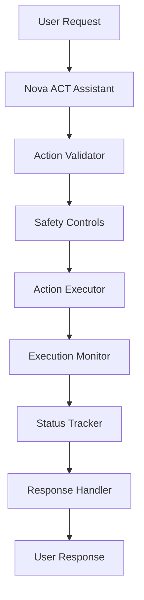

# Nova ACT Assistant

A pattern demonstrating how to use Amazon Bedrock's Nova ACT (Action) capabilities for controlled task execution and automation with safety guardrails.

## Overview

This pattern demonstrates how to build a task execution system that:
- Executes controlled actions
- Validates task safety
- Monitors execution
- Implements guardrails
- Manages automation

### Key Benefits
- Controlled execution
- Safety guardrails
- Real-time monitoring
- Error handling
- Automation control

## Architecture

## Prerequisites

Before implementing this pattern, ensure you have:

- Python 3.10+
- strands-agents>=0.1.0
- AWS Account with Bedrock access
- Nova ACT access
- AWS credentials configured

## Implementation

The complete implementation of this pattern is available in the [samples repository](https://github.com/strands-agents/samples/tree/main/samples/03-integrations/nova-act). The implementation includes:

### Key Components

1. **Action Validator**
   - Validates requests
   - Checks permissions
   - Ensures safety
   - Located in the source repository

2. **Action Executor**
   - Executes tasks
   - Manages processes
   - Handles errors
   - Located in the source repository

3. **Execution Monitor**
   - Tracks progress
   - Reports status
   - Manages logs
   - Located in the source repository

4. **Safety Controls**
   - Implements guardrails
   - Controls access
   - Manages limits
   - Located in the source repository

### Example Usage

For detailed usage examples and implementation details, refer to the source repository. The system can:

1. **Task Execution**
   - Execute controlled actions
   - Validate safety
   - Monitor progress
   - Report status

2. **Safety Controls**
   - Check permissions
   - Validate requests
   - Implement limits
   - Manage access

3. **Monitoring**
   - Track execution
   - Log activities
   - Report metrics
   - Handle errors

## Best Practices

1. **Action Validation**: 
   - Check permissions
   - Validate inputs
   - Verify safety
   - Set limits

2. **Execution Control**:
   - Monitor progress
   - Handle timeouts
   - Manage resources
   - Log activities

3. **Safety Management**:
   - Implement guardrails
   - Control access
   - Set boundaries
   - Handle errors

4. **Monitoring**:
   - Track status
   - Report metrics
   - Alert issues
   - Maintain logs

## Common Issues

### Issue 1: Permission Control
**Problem**: Unauthorized actions
**Solution**: Implement strict validation

### Issue 2: Resource Usage
**Problem**: Resource overuse
**Solution**: Set execution limits

### Issue 3: Error Handling
**Problem**: Failed executions
**Solution**: Implement retry logic

## Related Patterns

- [Multi-Modal Email Assistant](../bedrock-nova-email/)
- [AWS Assistant](../bedrock-aws-assistant/)
- [Personal Assistant](../bedrock-personal-assistant/)

## Resources

- [Source Code Repository](https://github.com/strands-agents/samples/tree/main/samples/03-integrations/nova-act)
- [Amazon Bedrock Documentation](https://docs.aws.amazon.com/bedrock/)
- [Nova ACT Documentation](https://docs.aws.amazon.com/bedrock/latest/userguide/nova-act.html)
- [AWS Security Best Practices](https://docs.aws.amazon.com/wellarchitected/latest/security-pillar/) 