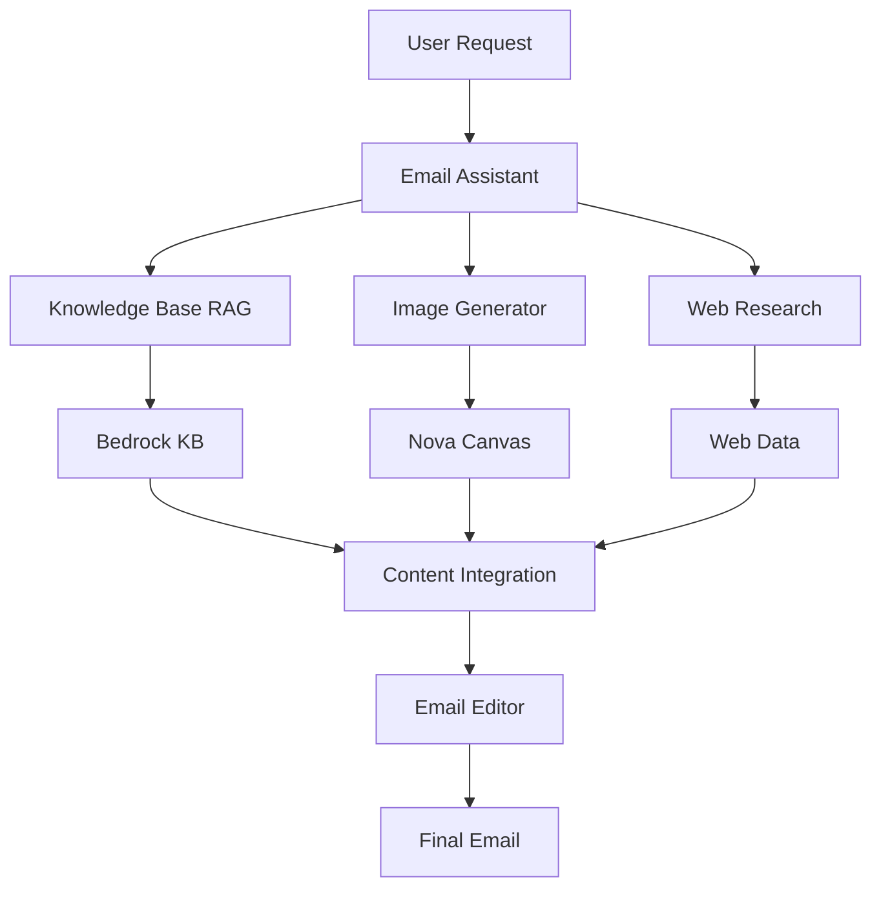

# Multi-Modal Email Assistant

A sophisticated email assistant that combines RAG, image generation, and web research to create high-quality, multi-modal email content with contextual images and knowledge base integration.

## Overview

This pattern demonstrates how to build an email assistant that:
- Retrieves relevant knowledge
- Generates contextual images
- Researches web content
- Creates polished emails
- Integrates multi-modal elements

### Key Benefits
- Knowledge-based responses
- Custom image generation
- Web research integration
- Professional formatting
- Multi-modal content

## Architecture

## Prerequisites

Before implementing this pattern, ensure you have:

- Python 3.10+
- strands-agents>=0.1.0
- AWS Account with Bedrock access
- Bedrock Knowledge Base setup
- Nova Canvas access
- AWS credentials configured

## Implementation

The complete implementation of this pattern is available in the [samples repository](https://github.com/strands-agents/samples/tree/main/samples/02-samples/10-multi-modal-email-assistant-agent). The implementation includes:

### Key Components

1. **Email Assistant**
   - Coordinates tools and agents
   - Manages content flow
   - Ensures quality
   - Located in [email_assistant.py](https://github.com/strands-agents/samples/tree/main/samples/02-samples/10-multi-modal-email-assistant-agent/email_assistant.py)

2. **Knowledge Base RAG**
   - Retrieves context
   - Processes queries
   - Integrates knowledge
   - Located in [kb_rag.py](https://github.com/strands-agents/samples/tree/main/samples/02-samples/10-multi-modal-email-assistant-agent/kb_rag.py)

3. **Image Generator**
   - Creates visuals
   - Handles styles
   - Manages formats
   - Located in [image_generation_agent.py](https://github.com/strands-agents/samples/tree/main/samples/02-samples/10-multi-modal-email-assistant-agent/image_generation_agent.py)

4. **Web Research**
   - Gathers information
   - Validates sources
   - Enriches content
   - Located in the source repository

### Example Usage

For detailed usage examples and implementation details, refer to the source repository. The assistant creates emails with:

1. **Knowledge Context**
   - Relevant information
   - Historical data
   - Expert insights

2. **Visual Content**
   - Custom images
   - Branded graphics
   - Visual aids

3. **Web Research**
   - Current facts
   - Market data
   - Industry trends

## Best Practices

1. **Knowledge Retrieval**: 
   - Use precise queries
   - Validate context
   - Maintain relevance
   - Update knowledge

2. **Image Generation**:
   - Follow brand guidelines
   - Optimize quality
   - Consider context
   - Test rendering

3. **Web Research**:
   - Verify sources
   - Check freshness
   - Cite references
   - Filter content

4. **Email Composition**:
   - Structure clearly
   - Format professionally
   - Include visuals
   - Proofread content

## Common Issues

### Issue 1: Knowledge Gaps
**Problem**: Missing context in KB
**Solution**: Implement web fallback

### Issue 2: Image Quality
**Problem**: Inconsistent visuals
**Solution**: Use style templates

### Issue 3: Content Integration
**Problem**: Poor multi-modal flow
**Solution**: Use structured templates

## Related Patterns

- [Finance Assistant Swarm](../bedrock-finance-swarm/)
- [Personal Assistant](../bedrock-personal-assistant/)
- [AWS Assistant](../bedrock-aws-assistant/)

## Resources

- [Source Code Repository](https://github.com/strands-agents/samples/tree/main/samples/02-samples/10-multi-modal-email-assistant-agent)
- [Amazon Bedrock Knowledge Base](https://docs.aws.amazon.com/bedrock/latest/userguide/knowledge-base.html)
- [Nova Canvas Documentation](https://docs.aws.amazon.com/bedrock/latest/userguide/nova-canvas.html)
- [Email Writing Guide](https://www.grammarly.com/blog/email-writing-guide/) 