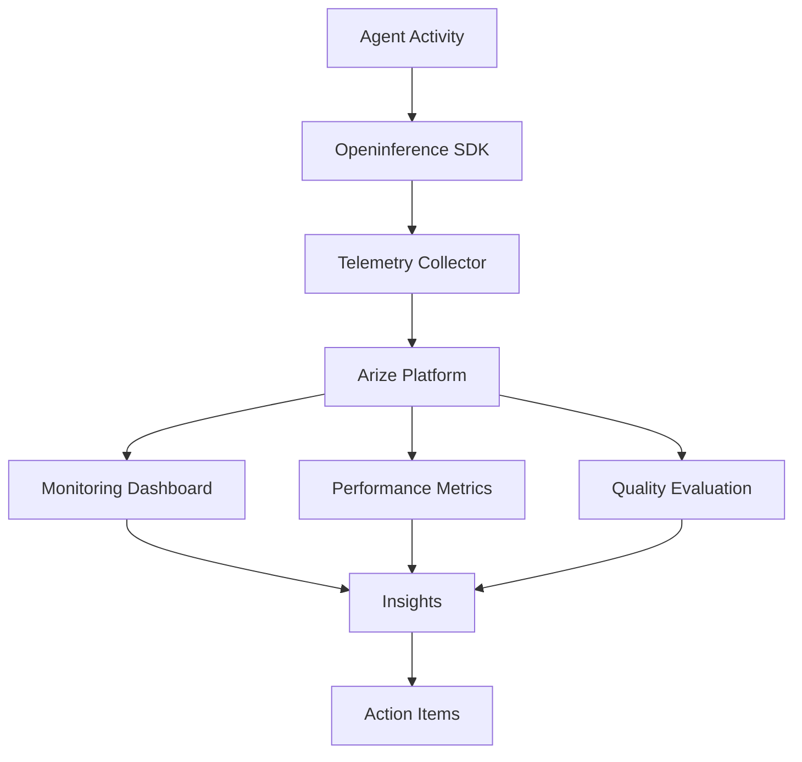

# Openinference Arize Integration

A pattern demonstrating how to integrate Openinference with Arize for comprehensive agent observability, monitoring, and evaluation using standardized telemetry.

## Overview

This pattern demonstrates how to build an observability system that:
- Collects standardized telemetry
- Monitors agent performance
- Evaluates agent quality
- Tracks key metrics
- Provides insights

### Key Benefits
- Standardized telemetry
- Real-time monitoring
- Quality evaluation
- Performance tracking
- Actionable insights

## Architecture

## Prerequisites

Before implementing this pattern, ensure you have:

- Python 3.10+
- strands-agents>=0.1.0
- AWS Account with Bedrock access
- Arize account
- AWS credentials configured

## Implementation

The complete implementation of this pattern is available in the [samples repository](https://github.com/strands-agents/samples/tree/main/samples/03-integrations/Openinference-Arize). The implementation includes:

### Key Components

1. **Telemetry Collector**
   - Collects metrics
   - Standardizes data
   - Manages pipeline
   - Located in the source repository

2. **Performance Monitor**
   - Tracks metrics
   - Analyzes trends
   - Generates alerts
   - Located in the source repository

3. **Quality Evaluator**
   - Assesses quality
   - Provides scores
   - Suggests improvements
   - Located in the source repository

4. **Dashboard Integration**
   - Visualizes data
   - Shows trends
   - Provides insights
   - Located in the source repository

### Example Usage

For detailed usage examples and implementation details, refer to the source repository. The system can:

1. **Telemetry Collection**
   - Collect metrics
   - Track performance
   - Monitor usage
   - Analyze patterns

2. **Performance Monitoring**
   - Track latency
   - Monitor resources
   - Analyze trends
   - Generate alerts

3. **Quality Evaluation**
   - Assess responses
   - Score quality
   - Track improvements
   - Provide feedback

## Best Practices

1. **Telemetry Collection**: 
   - Use standards
   - Collect context
   - Handle volume
   - Manage storage

2. **Performance Monitoring**:
   - Set baselines
   - Track trends
   - Alert issues
   - Analyze patterns

3. **Quality Evaluation**:
   - Define metrics
   - Set standards
   - Track progress
   - Provide feedback

4. **Data Management**:
   - Handle volume
   - Secure data
   - Manage retention
   - Enable access

## Common Issues

### Issue 1: Data Volume
**Problem**: High telemetry volume
**Solution**: Implement sampling

### Issue 2: Performance Impact
**Problem**: Collection overhead
**Solution**: Optimize instrumentation

### Issue 3: Data Quality
**Problem**: Inconsistent metrics
**Solution**: Standardize collection

## Related Patterns

- [AWS Assistant](../bedrock-aws-assistant/)
- [Nova ACT Assistant](../bedrock-nova-act/)
- [Neptune Graph Assistant](../bedrock-neptune-graph/)

## Resources

- [Source Code Repository](https://github.com/strands-agents/samples/tree/main/samples/03-integrations/Openinference-Arize)
- [Openinference Documentation](https://openinference.ai/)
- [Arize Documentation](https://docs.arize.com/)
- [Observability Best Practices](https://docs.aws.amazon.com/wellarchitected/latest/operational-excellence-pillar/) 