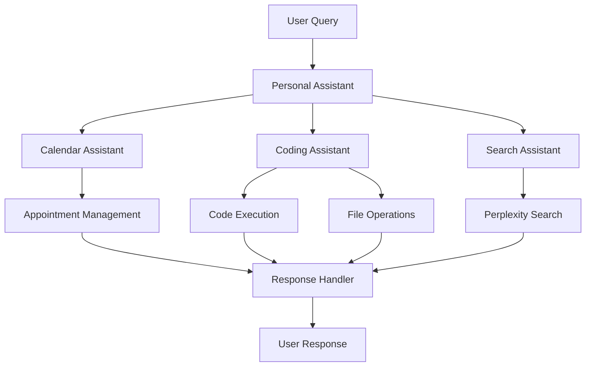

# Personal Assistant

A comprehensive personal assistant that combines calendar management, coding assistance, and web search capabilities using agents as tools functionality.

## Overview

This pattern demonstrates how to build a personal assistant that:
- Manages calendar appointments
- Provides coding assistance
- Performs web searches
- Handles file operations
- Maintains daily journals

### Key Benefits
- Multi-agent collaboration
- Calendar automation
- Interactive coding help
- Real-time web search
- Task organization

## Architecture

## Prerequisites

Before implementing this pattern, ensure you have:

- Python 3.10+
- strands-agents>=0.1.0
- AWS Account with Bedrock access
- Perplexity API access
- Docker installed and running
- AWS credentials configured

## Implementation

The complete implementation of this pattern is available in the [samples repository](https://github.com/strands-agents/samples/tree/main/samples/02-samples/05-personal-assistant). The implementation includes:

### Key Components

1. **Calendar Assistant**
   - Manages appointments
   - Handles scheduling
   - Provides daily agendas
   - Located in [calendar_assistant.py](https://github.com/strands-agents/samples/tree/main/samples/02-samples/05-personal-assistant/calendar_assistant.py)

2. **Coding Assistant**
   - Executes Python code
   - Manages files
   - Provides shell access
   - Located in [code_assistant.py](https://github.com/strands-agents/samples/tree/main/samples/02-samples/05-personal-assistant/code_assistant.py)

3. **Search Assistant**
   - Performs web searches
   - Uses Perplexity MCP
   - Provides real-time info
   - Located in [search_assistant.py](https://github.com/strands-agents/samples/tree/main/samples/02-samples/05-personal-assistant/search_assistant.py)

### Example Usage

For detailed usage examples and implementation details, refer to the source repository. The assistant can:

- Schedule and manage appointments
- Write and debug code
- Search for information
- Execute system commands

## Best Practices

1. **Calendar Management**: 
   - Use clear descriptions
   - Include all details
   - Set reminders
   - Handle conflicts

2. **Code Assistance**:
   - Test code safely
   - Handle errors
   - Document changes
   - Use version control

3. **Search Operations**:
   - Validate sources
   - Cache results
   - Handle rate limits
   - Filter content

4. **System Integration**:
   - Secure operations
   - Monitor resources
   - Log activities
   - Handle errors

## Common Issues

### Issue 1: Calendar Conflicts
**Problem**: Overlapping appointments
**Solution**: Implement conflict detection

### Issue 2: Code Execution
**Problem**: Unsafe code execution
**Solution**: Use sandboxed environments

### Issue 3: Search Limits
**Problem**: API rate limiting
**Solution**: Implement request throttling

## Related Patterns

- [AWS Assistant](../bedrock-aws-assistant/)
- [Code Assistant](../code-assistant/)
- [Startup Advisor](../perplexity-startup-advisor/)

## Resources

- [Source Code Repository](https://github.com/strands-agents/samples/tree/main/samples/02-samples/05-personal-assistant)
- [Strands Agents Documentation](https://strandsagents.com/latest/user-guide/concepts/multi-agent/agents-as-tools/)
- [Perplexity MCP Server](https://github.com/jsonallen/perplexity-mcp)
- [Amazon Bedrock Documentation](https://docs.aws.amazon.com/bedrock/) 