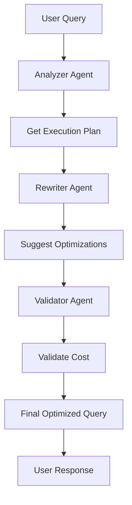

# Data Warehouse Query Optimizer

A multi-agent system that optimizes SQL queries using Amazon Bedrock, demonstrating query analysis, optimization, and validation with a SQLite database simulating a data warehouse.

## Overview

This pattern demonstrates how to build a query optimization system that:
- Analyzes query execution plans
- Suggests performance improvements
- Validates query costs
- Provides collaborative agent-based optimization

### Key Benefits
- Automated query optimization
- Cost-based analysis
- Multi-agent collaboration
- OpenTelemetry integration
- Extensible architecture

## Architecture

## Prerequisites

Before implementing this pattern, ensure you have:

- Python 3.10+
- strands-agents>=0.1.0
- AWS Account with Bedrock access
- SQLite database
- OpenTelemetry SDK
- AWS credentials configured

## Implementation

The complete implementation of this pattern is available in the [samples repository](https://github.com/aws-samples/strands/tree/main/samples/02-samples/08-data-warehouse-optimizer). The implementation includes:

### Key Components

1. **Query Analyzer Agent**
   - Analyzes SQL query execution plans
   - Identifies table scans, index usage, and join strategies
   - Located in [agent.py](https://github.com/aws-samples/strands/tree/main/samples/02-samples/08-data-warehouse-optimizer/main.py)

2. **Query Rewriter Agent**
   - Suggests query optimizations
   - Handles index recommendations and join order improvements
   - Uses the same agent implementation with different tools

3. **Query Validator Agent**
   - Validates optimized queries
   - Estimates execution costs
   - Provides performance insights

4. **Custom Tools**
   - `get_query_execution_plan`: Analyzes query plans
   - `suggest_optimizations`: Provides optimization suggestions
   - `validate_query_cost`: Validates query costs
   - Located in [utils/tools.py](https://github.com/aws-samples/strands/tree/main/samples/02-samples/08-data-warehouse-optimizer/utils/tools.py)

5. **OpenTelemetry Integration**
   - Provides observability and tracing
   - Monitors agent performance
   - Tracks optimization metrics

### Example Usage

For detailed usage examples and implementation details, refer to the [main.py](https://github.com/aws-samples/strands/tree/main/samples/02-samples/08-data-warehouse-optimizer/main.py) file in the source repository.

Key usage patterns include:
- Query analysis and optimization
- Cost-based validation
- Multi-agent collaboration
- OpenTelemetry integration

## Best Practices

1. **Query Analysis**: 
   - Always check execution plans
   - Look for table scans
   - Monitor join strategies
   - Analyze index usage

2. **Optimization Strategy**:
   - Start with index recommendations
   - Consider materialized views
   - Optimize join orders
   - Use appropriate data types

3. **Performance**:
   - Monitor query costs
   - Use appropriate indexes
   - Cache frequent queries
   - Implement query timeouts

4. **Observability**:
   - Enable OpenTelemetry tracing
   - Monitor agent performance
   - Track optimization success
   - Log query patterns

## Common Issues

### Issue 1: Missing Indexes
**Problem**: Full table scans on large tables
**Solution**: Implement automated index recommendations

### Issue 2: Complex Joins
**Problem**: Poor join order selection
**Solution**: Use statistics-based join optimization

### Issue 3: Memory Usage
**Problem**: Large result sets consuming memory
**Solution**: Implement pagination and streaming

## Related Patterns

- [Bedrock Knowledge Base with DynamoDB](../bedrock-knowledgebase-dynamodb/)
- [AWS Assistant](../aws-cost-documentation-assistant/)
- [Agent Orchestrator](../agent-orchestrator/)

## Resources

- [Source Code Repository](https://github.com/aws-samples/strands/tree/main/samples/02-samples/08-data-warehouse-optimizer)
- [SQLite Documentation](https://www.sqlite.org/docs.html)
- [Amazon Bedrock Documentation](https://docs.aws.amazon.com/bedrock/)
- [OpenTelemetry Documentation](https://opentelemetry.io/docs/) 