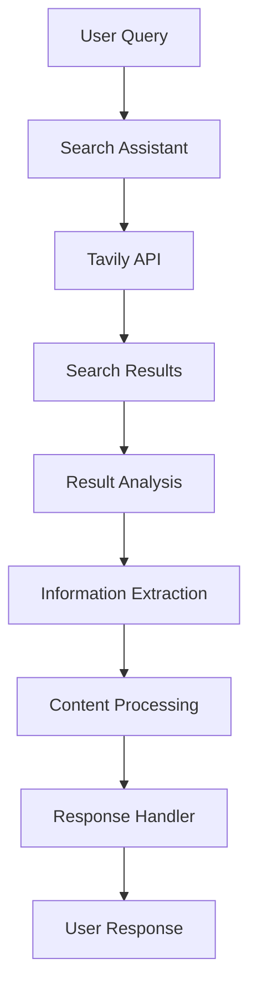

# Tavily Search Integration

A pattern demonstrating how to integrate Tavily's AI-powered search capabilities with Strands agents for enhanced web research and information retrieval.

## Overview

This pattern demonstrates how to build a search integration that:
- Performs web searches
- Analyzes results
- Extracts information
- Processes content
- Provides insights

### Key Benefits
- AI-powered search
- Result analysis
- Information extraction
- Content processing
- Research automation

## Architecture

## Prerequisites

Before implementing this pattern, ensure you have:

- Python 3.10+
- strands-agents>=0.1.0
- AWS Account with Bedrock access
- Tavily API key
- AWS credentials configured

## Implementation

The complete implementation of this pattern is available in the [samples repository](https://github.com/strands-agents/samples/tree/main/samples/03-integrations/tavily). The implementation includes:

### Key Components

1. **Search Handler**
   - Processes queries
   - Calls Tavily API
   - Manages results
   - Located in the source repository

2. **Result Analyzer**
   - Analyzes content
   - Extracts information
   - Processes data
   - Located in the source repository

3. **Information Extractor**
   - Extracts key data
   - Structures information
   - Formats output
   - Located in the source repository

### Example Usage

For detailed usage examples and implementation details, refer to the source repository. The system can:

1. **Web Search**
   - Execute searches
   - Filter results
   - Sort by relevance
   - Handle pagination

2. **Result Analysis**
   - Analyze content
   - Extract insights
   - Process data
   - Structure information

3. **Information Extraction**
   - Extract key data
   - Format content
   - Organize information
   - Generate summaries

## Best Practices

1. **Search Strategy**: 
   - Use clear queries
   - Filter results
   - Handle errors
   - Cache responses

2. **Result Processing**:
   - Validate content
   - Extract key data
   - Structure output
   - Handle formats

3. **API Integration**:
   - Handle rate limits
   - Manage errors
   - Cache results
   - Monitor usage

4. **Content Management**:
   - Structure data
   - Format output
   - Handle types
   - Validate content

## Common Issues

### Issue 1: Rate Limiting
**Problem**: API usage limits
**Solution**: Implement request throttling

### Issue 2: Result Quality
**Problem**: Irrelevant results
**Solution**: Refine search queries

### Issue 3: Data Extraction
**Problem**: Complex content
**Solution**: Use structured extraction

## Related Patterns

- [Personal Assistant](../bedrock-personal-assistant/)
- [Multi-Modal Email Assistant](../bedrock-nova-email/)
- [Startup Advisor](../perplexity-startup-advisor/)

## Resources

- [Source Code Repository](https://github.com/strands-agents/samples/tree/main/samples/03-integrations/tavily)
- [Tavily API Documentation](https://docs.tavily.com/)
- [Amazon Bedrock Documentation](https://docs.aws.amazon.com/bedrock/)
- [Web Search Best Practices](https://docs.tavily.com/guides/best-practices) 