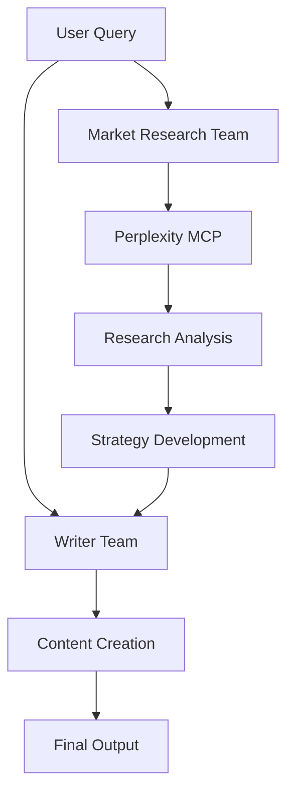

# Startup Advisor with Perplexity Search

A multi-agent system that uses Perplexity MCP server to conduct market research and generate marketing strategies for startups, including campaign ideas and copy generation.

## Overview

This pattern demonstrates how to build a startup advisor that:
- Conducts comprehensive market research
- Develops marketing strategies
- Creates campaign content
- Generates video ad scripts

### Key Benefits
- Real-time market insights
- Data-driven strategies
- Multi-agent collaboration
- Automated content creation
- Research-backed decisions

## Architecture

## Prerequisites

Before implementing this pattern, ensure you have:

- Python 3.10+
- strands-agents>=0.1.0
- AWS Account with Bedrock access
- Perplexity API access
- AWS credentials configured

## Implementation

The complete implementation of this pattern is available in the [samples repository](https://github.com/strands-agents/samples/tree/main/samples/02-samples/04-startup-advisor-mcp). The implementation includes:

### Key Components

1. **Market Research Team**
   - Conducts market analysis
   - Identifies opportunities
   - Researches competitors
   - Located in [market_research_team.py](https://github.com/strands-agents/samples/tree/main/samples/02-samples/04-startup-advisor-mcp/market_research_team.py)

2. **Writer Team**
   - Creates marketing content
   - Develops campaign ideas
   - Writes ad scripts
   - Located in [writer_team.py](https://github.com/strands-agents/samples/tree/main/samples/02-samples/04-startup-advisor-mcp/writer_team.py)

3. **Perplexity Integration**
   - Real-time web research
   - Data aggregation
   - Insight generation

### Example Usage

For detailed usage examples and implementation details, refer to the source repository. The advisor can:

- Research market trends
- Analyze competition
- Generate marketing plans
- Create campaign content

## Best Practices

1. **Market Research**: 
   - Define clear objectives
   - Use multiple sources
   - Validate findings
   - Track trends

2. **Content Creation**:
   - Follow brand guidelines
   - Maintain consistency
   - Target audience focus
   - Test messaging

3. **Strategy Development**:
   - Set clear goals
   - Define metrics
   - Plan implementation
   - Include timelines

4. **MCP Integration**:
   - Handle rate limits
   - Cache responses
   - Validate data
   - Error handling

## Common Issues

### Issue 1: Research Depth
**Problem**: Insufficient market data
**Solution**: Implement multi-source research

### Issue 2: Content Quality
**Problem**: Inconsistent messaging
**Solution**: Use content templates and guidelines

### Issue 3: API Limits
**Problem**: Perplexity rate limiting
**Solution**: Implement request queuing and caching

## Related Patterns

- [Personal Assistant](../personal-assistant/)
- [AWS Assistant](../bedrock-aws-assistant/)
- [Multi-Modal Email Assistant](../bedrock-nova-email-assistant/)

## Resources

- [Source Code Repository](https://github.com/strands-agents/samples/tree/main/samples/02-samples/04-startup-advisor-mcp)
- [Perplexity MCP Server](https://github.com/jsonallen/perplexity-mcp)
- [Amazon Bedrock Documentation](https://docs.aws.amazon.com/bedrock/)
- [Marketing Strategy Guide](https://www.perplexity.ai/guides/marketing-strategy) 