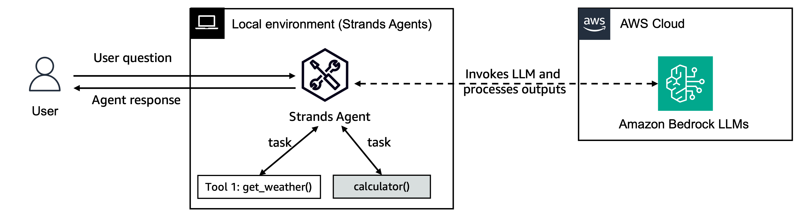
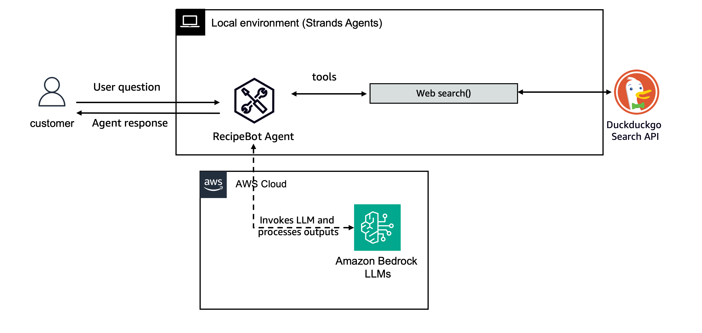

# Getting Started with Strands Agents

This tutorial walks you through building your first Strands agent. You start with a minimal agent, add custom tools, invoke tools directly, configure logging, choose a model provider, and finish with a small interactive RecipeBot you can run from the command line.



## Tutorial Details

| Information            | Details                                                  |
|------------------------|----------------------------------------------------------|
| **Strands Features**   | `Agent`, `@tool` decorator, `BedrockModel`               |
| **Agent Pattern**      | Single agent                                             |
| **Tools**              | Custom tools via the `@tool` decorator                  |
| **Model**              | Claude Sonnet 4.5 on Amazon Bedrock (`us.anthropic.claude-sonnet-4-5-20250929-v1:0`) |

## Key Concepts

- **Agent**: The core component that manages the conversation and orchestrates tools
- **Model**: The underlying LLM that powers the agent
- **Tools**: Functions the agent can call to perform tasks. A tool's typed arguments and docstring become the input schema the model reads to decide when and how to call it.

## Prerequisites

- Python 3.10 or higher
- An AWS account with credentials configured
- Access to Anthropic Claude Sonnet 4.5 (`us.anthropic.claude-sonnet-4-5-20250929-v1:0`) on Amazon Bedrock (see [model access](https://docs.aws.amazon.com/bedrock/latest/userguide/model-access.html))
- Basic understanding of Python

## Tutorial Structure

| Path | Description |
|------|-------------|
| [01-first-agent.ipynb](./01-first-agent.ipynb) | Quickstart notebook: create your first agent, add custom tools, invoke tools directly, configure logging, choose a model provider, and assemble a RecipeBot use case |
| [recipe-bot-cli/](./recipe-bot-cli/) | The RecipeBot as a standalone command-line script |

The command-line script runs the RecipeBot interactively:



## Getting Started

1. **Install dependencies:**
   ```bash
   pip install strands-agents
   ```

2. **Run the notebook:** open [`01-first-agent.ipynb`](./01-first-agent.ipynb) and run the cells in order. It covers:
   - Creating a simple agent
   - Adding custom tools
   - Invoking tools directly with `agent.tool.<name>`
   - Configuring logging
   - Choosing and configuring a model provider

3. **Run the interactive RecipeBot from the command line:**
   ```bash
   cd recipe-bot-cli
   pip install -r requirements.txt
   python recipe_bot.py
   ```

## Project Structure

```
01-first-agent/
├── 01-first-agent.ipynb
├── images/
│   ├── simple_agent.png
│   ├── agent_with_tools.png
│   └── interactive_recipe_agent.png
├── recipe-bot-cli/
│   ├── recipe_bot.py
│   └── requirements.txt
└── README.md
```

## Cleanup

This tutorial does not create any persistent AWS resources. The agent calls Amazon Bedrock for inference only, so there is nothing to clean up.

## Additional Resources

- [Strands documentation](https://strandsagents.com/docs/user-guide/quickstart/python/)
- [Session Management](https://strandsagents.com/docs/user-guide/concepts/agents/session-management/)
- [Agent Loop](https://strandsagents.com/docs/user-guide/concepts/agents/agent-loop/)
- [Context Management](https://strandsagents.com/docs/user-guide/concepts/context-management/)
- [strands-agents-tools](https://github.com/strands-agents/tools) repository for pre-implemented tools
