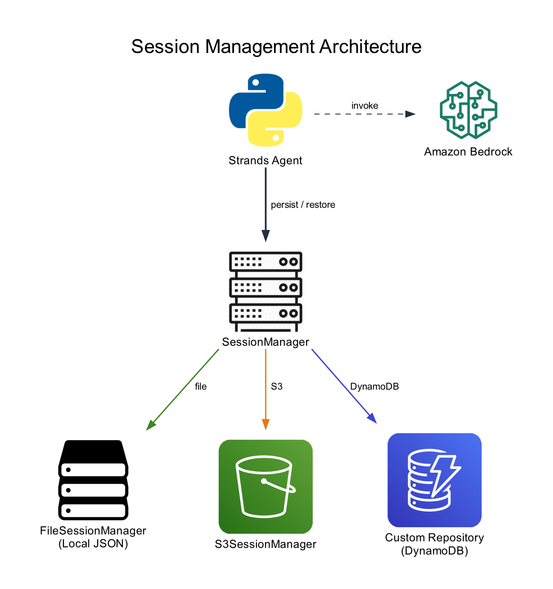

# Session Management

This tutorial demonstrates how to persist agent conversation state across restarts using the Strands Agents session management system. You'll progress from a stateless baseline to file-based, S3-based, and custom DynamoDB backends, then apply session persistence to multi-agent patterns.

## Tutorial Details

| Information            | Details                                                  |
|------------------------|----------------------------------------------------------|
| **Strands Features**   | `SessionManager`, `FileSessionManager`, `S3SessionManager`, `SessionRepository`, `Swarm`, `Graph` |
| **Agent Pattern**      | Single agent, Swarm, Graph                               |
| **Tools**              | None                                                     |
| **Model**              | Default Bedrock model                                    |

## Key Concepts



- **SessionManager**: Abstract interface that hooks into agent lifecycle events to persist conversation state automatically
- **FileSessionManager**: Built-in backend that stores sessions as JSON files on the local filesystem
- **S3SessionManager**: Built-in backend that stores sessions in an S3 bucket for cloud-based persistence
- **SessionRepository**: Abstract interface for implementing custom storage backends (e.g., DynamoDB)
- **Multi-agent sessions**: Session persistence applied to Swarm and Graph orchestration patterns

## Prerequisites

- Python 3.10 or higher
- AWS account with Amazon Bedrock model access
- Model access enabled in Amazon Bedrock
- S3 bucket (for the S3SessionManager section)
- DynamoDB table (for the custom backend section)

## Tutorial Structure

| Notebook | Description |
|----------|-------------|
| [01-baseline.ipynb](./01-baseline.ipynb) | Agent without session management — state lost on restart |
| [02-file-session-manager.ipynb](./02-file-session-manager.ipynb) | Local persistence with FileSessionManager |
| [03-s3-session-manager.ipynb](./03-s3-session-manager.ipynb) | Cloud persistence with S3SessionManager |
| [04-custom-dynamodb-backend.ipynb](./04-custom-dynamodb-backend.ipynb) | Implementing a custom DynamoDB session repository |
| [05-multi-agent-sessions.ipynb](./05-multi-agent-sessions.ipynb) | Session persistence with Swarm and Graph patterns |

## Getting Started

### Option A: Local Machine

1. **Create and activate a virtual environment:**
   ```bash
   python3 -m venv venv
   source venv/bin/activate
   ```

2. **Install dependencies:**
   ```bash
   pip install -r requirements.txt
   ```

3. **Install Jupyter (if not already installed):**
   ```bash
   pip install jupyter
   ```

4. **Launch the notebooks:**
   ```bash
   jupyter notebook
   ```

### Option B: SageMaker Notebook Instance

1. **Open a terminal** in your SageMaker notebook instance.

2. **Clone the repository** (if not already done):
   ```bash
   git clone https://github.com/strands-agents/samples.git
   cd samples/python/01-learn/14-session-management
   ```

3. **Install dependencies** in the first cell of each notebook (already included):
   ```python
   %pip install -q --upgrade strands-agents boto3
   ```
   SageMaker notebook instances come with Jupyter pre-installed. The `%pip` magic command installs packages into the active kernel. No virtual environment is needed.

4. **Open the notebooks** from the Jupyter file browser and run them in order.

### Notebook Progression

- **Notebook 1**: See how an agent loses state on restart
- **Notebook 2**: Add FileSessionManager for local persistence
- **Notebook 3**: Switch to S3SessionManager for cloud storage
- **Notebook 4**: Build a custom DynamoDB backend
- **Notebook 5**: Apply sessions to Swarm and Graph agents

## Project Structure

```
14-session-management/
├── README.md
├── requirements.txt
├── images/
│   └── architecture.png
├── 01-baseline.ipynb
├── 02-file-session-manager.ipynb
├── 03-s3-session-manager.ipynb
├── 04-custom-dynamodb-backend.ipynb
└── 05-multi-agent-sessions.ipynb
```

## Cleanup

- **FileSessionManager**: Session files are stored in a temp directory by default. Delete the `sessions/` folder if you specified a custom `storage_dir`.
- **S3SessionManager**: The cleanup cell in notebook 03 deletes the session objects and the bucket.
- **DynamoDB**: Delete the DynamoDB table created in notebook 04.

## Additional Resources

- [Strands Agents Documentation](https://strandsagents.com/)
- [SessionManager API Reference](https://strandsagents.com/docs/api/python/strands.session.session_manager/)
- [FileSessionManager API Reference](https://strandsagents.com/docs/api/python/strands.session.file_session_manager/)
- [S3SessionManager API Reference](https://strandsagents.com/docs/api/python/strands.session.s3_session_manager/)
- [SessionRepository API Reference](https://strandsagents.com/docs/api/python/strands.session.session_repository/)
