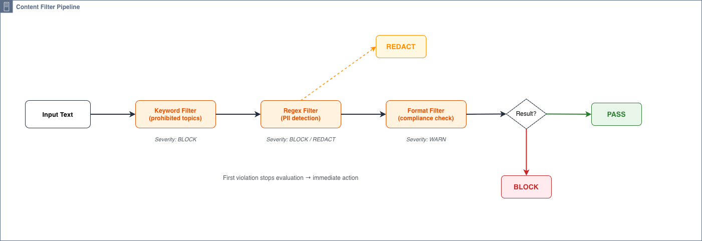

# Input/Output Guardrails

Build custom input validation, output validation, and content filtering for Strands Agents using hooks — entirely in Python.

## Overview

This tutorial teaches you how to implement guardrails that inspect and control what goes into and comes out of your agent. You'll build:

- **Input guardrails** that block harmful or non-compliant user messages before they reach the model
- **Output guardrails** that redact PII or replace unsafe responses before they reach the user
- **Tool call guardrails** that restrict which tools the agent can invoke
- **A reusable HookProvider** that bundles all guardrail logic into a single component

### Architecture

<div style="text-align:center">
    
</div>

### How is this different from `05-guardrails`?

The `05-guardrails` tutorial uses **Amazon Bedrock Guardrails** — a managed service you configure through AWS and attach via model parameters. It's great when you want AWS to handle content filtering for you.

This tutorial takes a different approach: you build guardrails **in pure Python** using the Strands SDK's `HookProvider` infrastructure. This gives you:

- Full control over validation logic (regex, keywords, custom classifiers)
- Model-agnostic implementation (works with any provider)
- Testable in isolation without a live model connection
- Composable filters you can mix and match per use case

## Prerequisites

- Python 3.10+
- `strands-agents` SDK 1.40.0+ installed
- A configured model provider (AWS Bedrock, Anthropic, etc.) — optional for testing

Install dependencies:

```bash
pip install strands-agents strands-agents-tools --upgrade
```

## Tutorial Structure

| File | Description |
|------|-------------|
| `01_input_guardrail.ipynb` | Input validation using `BeforeInvocationEvent` via `HookProvider` |
| `02_output_guardrail.ipynb` | Output validation with BLOCK and REDACT behaviors |
| `03_content_filters.ipynb` | Reusable content filter classes (regex, keyword, format) |
| `04_guardrail_plugin.ipynb` | Full `GuardrailPlugin` class implementing `HookProvider` |
| `05_tool_call_validation.ipynb` | Tool call restriction using `BeforeToolCallEvent` |
| `06_error_handling.ipynb` | Fail-open vs fail-closed error handling patterns |
| `content_filters.py` | Shared content filter module imported by all notebooks |

---

## Step 1: Input Guardrails

**File:** `01_input_guardrail.ipynb`

Input guardrails intercept user messages *before* they reach the model. The Strands SDK fires a `BeforeInvocationEvent` at the start of each agent invocation, giving you access to `event.agent.messages` — the full conversation history you can inspect and modify.

### How it works

1. Extract text from the last user message
2. Run it through your content filters
3. If a violation is found, replace the messages with a rejection prompt

### Key code

```python
from strands.hooks import HookProvider, HookRegistry, BeforeInvocationEvent

class InputGuardrailHook(HookProvider):
    def register_hooks(self, registry: HookRegistry) -> None:
        registry.add_callback(BeforeInvocationEvent, self._validate_input)

    def _validate_input(self, event: BeforeInvocationEvent) -> None:
        messages = event.agent.messages
        if not messages:
            return

        last_message = messages[-1]
        if last_message.get("role") != "user":
            return

        text = _extract_text_from_message(last_message)
        result = keyword_filter.evaluate(text)

        if not result.passed:
            # Replace messages with a rejection prompt
            messages.clear()
            messages.append({
                "role": "user",
                "content": [{"text": (
                    "Respond only with: I cannot process that request. "
                    "The input was blocked by a content safety filter."
                )}],
            })
```

### Registering the hook

```python
from strands import Agent

agent = Agent(
    system_prompt="You are a helpful assistant.",
    hooks=[InputGuardrailHook()],
)
```

### Composing multiple filters

The tutorial also demonstrates a `combined_input_guardrail_logic` that chains keyword detection and PII detection in sequence — the first violation stops evaluation:

```python
filters = [keyword_filter, pii_filter]
violation = run_filters(text, filters)

if violation is not None:
    # Block the request with the violation's message
    messages.clear()
    messages.append(...)
```

---

## Step 2: Output Guardrails

**File:** `02_output_guardrail.ipynb`

Output guardrails inspect model responses *after* inference completes. The SDK fires an `AfterInvocationEvent` with `event.agent` — access the conversation history via `event.agent.messages` which includes the assistant's reply.

### Two behaviors: BLOCK vs REDACT

| Behavior | What happens | Use case |
|----------|-------------|----------|
| **BLOCK** | Replace the entire response with a safe fallback | Prohibited topics, classified info |
| **REDACT** | Replace only matched patterns with `[REDACTED]` | PII in responses (emails, phone numbers) |

### BLOCK example

```python
from strands.hooks import HookProvider, HookRegistry, AfterInvocationEvent

class OutputGuardrailHook(HookProvider):
    def register_hooks(self, registry: HookRegistry) -> None:
        registry.add_callback(AfterInvocationEvent, self._validate_output)

    def _validate_output(self, event: AfterInvocationEvent) -> None:
        messages = event.agent.messages
        # Find last assistant message and evaluate it
        response_text = _get_last_assistant_text(messages)
        result = output_keyword_filter.evaluate(response_text)

        if not result.passed:
            _replace_assistant_response(messages, "Blocked by content filter.")
```

### REDACT example

```python
def pii_output_guardrail_logic(messages: list) -> None:
    """Redact PII from model responses."""
    response_text = _get_last_assistant_text(messages)
    result = pii_redaction_filter.evaluate(response_text)

    if not result.passed:
        _redact_assistant_response(messages, result.redacted_text)
```

Given input `"The user's email is john@example.com and phone is 555-123-4567."`, the output becomes:
`"The user's email is [REDACTED] and phone is [REDACTED]."`

### Registering the hook

```python
agent = Agent(
    system_prompt="You are a helpful assistant.",
    hooks=[OutputGuardrailHook()],
)
```

---

## Step 3: Custom Content Filters

**File:** `03_content_filters.ipynb` and `content_filters.py`

Content filters are the building blocks of guardrails. This module defines a composable filter architecture with a base class, concrete implementations, and a pipeline runner.

### Architecture

```
ContentFilter (base class)
├── RegexContentFilter     — pattern matching (PII, structured data)
├── KeywordContentFilter   — keyword/phrase detection (topic blocking)
└── FormatComplianceFilter — structural validation (no code execution instructions)
```

<div style="text-align:center">
    
</div>

### Severity levels

```python
class Severity(Enum):
    BLOCK = "block"    # Reject the entire request/response
    WARN = "warn"      # Log a warning but allow through
    REDACT = "redact"  # Remove/replace the matched content
```

### Pipeline runner

`run_filters()` evaluates text against a list of filters in order, returning the first violation:

```python
def run_filters(text: str, filters: list[ContentFilter]) -> Optional[FilterResult]:
    """Return the first failing filter's result, or None if all pass."""
    for content_filter in filters:
        result = content_filter.evaluate(text)
        if not result.passed:
            return result
    return None
```

---

## Step 4: Guardrail Plugin (HookProvider)

**File:** `04_guardrail_plugin.ipynb`

For production use, package your guardrails as a **HookProvider**. This bundles input, output, and tool call validation into a single reusable component.

### The HookProvider pattern

<div style="text-align:center">
    
</div>

```python
from strands.hooks import HookProvider, HookRegistry, BeforeInvocationEvent, AfterInvocationEvent, BeforeToolCallEvent

class GuardrailPlugin(HookProvider):
    def __init__(
        self,
        input_filters: list[ContentFilter] | None = None,
        output_filters: list[ContentFilter] | None = None,
        tool_allowlist: list[str] | None = None,
        fail_open: bool = True,
    ):
        self.input_filters = input_filters or []
        self.output_filters = output_filters or []
        self.tool_allowlist = tool_allowlist
        self.fail_open = fail_open

    def register_hooks(self, registry: HookRegistry) -> None:
        registry.add_callback(BeforeInvocationEvent, self._validate_input)
        registry.add_callback(AfterInvocationEvent, self._validate_output)
        registry.add_callback(BeforeToolCallEvent, self._validate_tool_call)

    def _validate_input(self, event: BeforeInvocationEvent) -> None:
        """Validate user input before model inference."""
        ...

    def _validate_output(self, event: AfterInvocationEvent) -> None:
        """Validate model output before returning to user."""
        ...

    def _validate_tool_call(self, event: BeforeToolCallEvent) -> None:
        """Validate tool calls against the configured allowlist."""
        ...
```

### Key features

- **`register_hooks`** — registers callbacks for all three event types in one place
- **Configurable filters** — pass different filter lists for input vs output
- **Tool allowlist** — restrict which tools the agent can call (set to `None` to allow all)
- **Fail-open/fail-closed** — control error handling behavior via constructor parameter
- **Audit logging** — all decisions are logged with structured formatting

### Attaching to an agent

```python
plugin = GuardrailPlugin(
    input_filters=[
        KeywordContentFilter("topics", ["hack", "exploit"], Severity.BLOCK),
        RegexContentFilter("pii", [r"\b\d{3}-\d{2}-\d{4}\b"], Severity.BLOCK),
    ],
    output_filters=[
        RegexContentFilter("pii_redactor", [r"\b\d{3}-\d{2}-\d{4}\b"], Severity.REDACT),
    ],
    tool_allowlist=["calculator", "web_search"],
    fail_open=True,
)

agent = Agent(hooks=[plugin])
```

---

## Step 5: Tool Call Validation

**File:** `05_tool_call_validation.ipynb`

Tool call guardrails intercept tool invocations *before* execution using `BeforeToolCallEvent`. This lets you enforce which tools the agent can use and validate their arguments.

### Event structure

```python
event.tool_use = {
    "name": "shell_execute",
    "toolUseId": "abc-123",
    "input": {"command": "rm -rf /"}
}
event.cancel_tool = None  # Set this to a string to block the tool call
```

### Pattern 1: Allowlist

Only listed tools can execute. Everything else is blocked:

```python
def allowlist_validate(event, allowed_tools: list[str]) -> None:
    tool_name = event.tool_use.get("name", "")
    if tool_name not in allowed_tools:
        event.cancel_tool = f"Tool '{tool_name}' is not permitted."
```

### Pattern 2: Blocklist

Specific tools are blocked. Everything else is allowed.

### Pattern 3: Argument validation

Inspect tool arguments for dangerous patterns (sensitive paths, destructive commands).

### Registering tool call hooks

```python
class ToolGuardrailHook(HookProvider):
    def __init__(self, allowed_tools=None):
        self.allowed_tools = allowed_tools

    def register_hooks(self, registry: HookRegistry) -> None:
        registry.add_callback(BeforeToolCallEvent, self._validate_tool)

    def _validate_tool(self, event: BeforeToolCallEvent) -> None:
        ...

agent = Agent(
    tools=[calculator, file_reader, shell_execute],
    hooks=[ToolGuardrailHook(allowed_tools=["calculator", "file_reader"])],
)
```

---

## Step 6: Error Handling

**File:** `06_error_handling.ipynb`

In production, content filters can fail — network timeouts, malformed input, bugs in custom classifiers. The key design decision: should a filter failure **allow** or **block** the request?

### Fail-open vs fail-closed

| Mode | On filter exception | Best for |
|------|-------------------|----------|
| `fail_open=True` | Log error, allow request through | Production systems prioritizing availability |
| `fail_open=False` | Log error, block request | High-security systems prioritizing safety |

### When to use each

- **Fail-open**: Customer-facing chatbots, general assistants — a crashed filter shouldn't break the user experience
- **Fail-closed**: Financial compliance, healthcare, legal — safety is non-negotiable

### Audit logging

Every guardrail decision is logged with structured formatting for compliance:

```python
audit_logger.warning(
    f"direction=input filter={filter_name} action=blocked "
    f'snippet="{content[:50]}" message="{reason}"'
)
```

---

## Summary

You've learned how to build a complete guardrail system for Strands Agents:

1. **Input guardrails** intercept messages via `BeforeInvocationEvent` and block/modify them before inference
2. **Output guardrails** intercept responses via `AfterInvocationEvent` and can BLOCK or REDACT content
3. **Content filters** are composable building blocks with severity levels (BLOCK, WARN, REDACT)
4. **The HookProvider pattern** bundles everything into a reusable component
5. **Tool call validation** restricts which tools the agent can invoke via `BeforeToolCallEvent`
6. **Error handling** lets you choose fail-open (availability) or fail-closed (safety)

### Key takeaways

- Guardrails are `HookProvider` classes that register callbacks for lifecycle events
- Access messages via `event.agent.messages` in both `BeforeInvocationEvent` and `AfterInvocationEvent`
- The `hooks=` parameter on `Agent` expects a list of `HookProvider` instances
- Always test guardrails in isolation before deploying with a live model
- Choose fail-open vs fail-closed based on your application's risk profile
- Audit logging is essential for compliance and debugging

### API Quick Reference (strands-agents 1.40.0)

```python
from strands.hooks import HookProvider, HookRegistry, BeforeInvocationEvent, AfterInvocationEvent, BeforeToolCallEvent

class MyHook(HookProvider):
    def register_hooks(self, registry: HookRegistry) -> None:
        registry.add_callback(BeforeInvocationEvent, self._before)
        registry.add_callback(AfterInvocationEvent, self._after)
        registry.add_callback(BeforeToolCallEvent, self._tool)

    def _before(self, event: BeforeInvocationEvent) -> None:
        messages = event.agent.messages  # Access/modify messages

    def _after(self, event: AfterInvocationEvent) -> None:
        messages = event.agent.messages  # Access/modify messages (includes assistant reply)

    def _tool(self, event: BeforeToolCallEvent) -> None:
        event.tool_use  # {"name": ..., "toolUseId": ..., "input": {...}}
        event.cancel_tool = "reason"  # Set to block the tool call

agent = Agent(hooks=[MyHook()])
```

### Next steps

- Explore the [hooks tutorial](../06-hooks/) for more lifecycle event patterns
- Check out [05-guardrails](../05-guardrails/) for the managed Bedrock Guardrails approach
- Add custom ML-based classifiers (toxicity, sentiment) as `ContentFilter` subclasses
- Integrate with external moderation APIs by wrapping them in the `ContentFilter` interface
