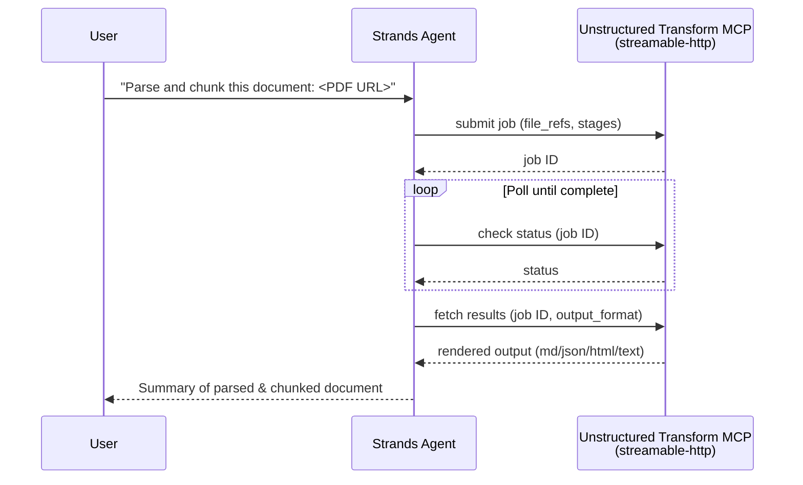

# Unstructured Transform MCP

A Strands agent that connects to the hosted Unstructured Transform MCP server to parse, chunk, and enrich documents through an asynchronous processing pipeline.

## Overview

[Unstructured Transform](https://docs.unstructured.io/transform/overview) is a hosted, remote MCP server that exposes Unstructured's document-processing pipeline as MCP tools, parsing PDFs, spreadsheets, scans, and many file types with tables and layout intact. Instead of running a local document-parsing binary, your agent calls a hosted service over streamable-http and gets back parsed text, chunks, tables, image descriptions, or embeddings, depending on which pipeline stages you request.

### Sample Details

| Information            | Details                                                    |
|------------------------|-------------------------------------------------------------|
| **Agent Architecture** | Single-agent                                                |
| **Native Tools**       | None                                                         |
| **Custom Tools**       | None                                                         |
| **MCP Servers**        | [Unstructured Transform MCP](https://mcp.transform.unstructured.io) |
| **Use Case Vertical**  | Document processing / RAG                                   |
| **Complexity**         | Intermediate                                                 |
| **Model Provider**     | Amazon Bedrock                                               |
| **SDK Used**           | Strands Agents SDK                                           |

### Architecture



The agent connects to Transform MCP over `streamable-http`, authenticating with an Unstructured API key passed as a bearer token. It discovers the server's tools at runtime via `list_tools_sync()` rather than assuming fixed names, since Unstructured adds and renames tools as it ships new features, then drives the async pipeline: submit a job, poll its status, and fetch the rendered output once complete.

### Key Features

- **Hosted, remote MCP server**: no local binaries, containers, or native dependencies (e.g. LibreOffice, poppler) to install, just a URL and an API key.
- **Async job pipeline**: submitting a job returns a job ID immediately; the agent polls for status and fetches results once complete, matching how a production integration would handle longer-running documents.
- **Configurable pipeline stages**: partition (`auto` / `fast` / `hi_res` / `vlm`), enrich (image descriptions, table-to-HTML, NER, generative OCR), chunk, and embed stages can be composed per request via the `stages` argument.
- **Two auth paths**: browser OAuth/OIDC for interactive clients, or an API-key bearer token for headless frameworks like this one.

## Prerequisites

- Python **3.10+**
- [uv](https://docs.astral.sh/uv/getting-started/installation/) for dependency management
- An Unstructured API key from the [Transform get-started page](https://transform.unstructured.io/get-started) (free tier includes 15,000 pages a month)
- AWS CLI configured with credentials that have [Amazon Bedrock model access](https://docs.aws.amazon.com/bedrock/latest/userguide/model-access-modify.html) enabled for Claude Sonnet 4.5

## Setup

1. **Configure environment variables:**
   ```bash
   cp .env.example .env
   # Edit .env and set UNSTRUCTURED_API_KEY and your AWS credentials
   ```

2. **Install dependencies:**
   ```bash
   uv sync
   ```

## Usage

**Run the sample:**
```bash
uv run main.py
```

The agent connects to Transform MCP, lists the available tools, then submits a small public sample PDF for parsing and chunking, polls the job until it completes, and prints a summary of the results.

If `UNSTRUCTURED_API_KEY` is not set, the script exits immediately with a clear error message pointing to the Transform get-started page.

## Comparison to AWS Labs Document Loader

[`awslabs.document-loader-mcp-server`](https://github.com/awslabs/mcp/tree/main/src/document-loader-mcp-server) is a local, stdio-only MCP server with three synchronous, single-shot tools (`read_document`, `read_image`, `extract_slides_as_images`). It depends on native binaries (LibreOffice, poppler-utils) installed on the host, and has no hosted/remote transport, no OAuth story, and no job/status model.

Unstructured Transform MCP is a hosted alternative for the same broad task (getting document content into an agent) with a different capability profile:

| | AWS Labs Document Loader | Unstructured Transform MCP |
|---|---|---|
| Transport | stdio (local process) | streamable-http (hosted) |
| Execution model | Synchronous, single-shot | Async job (submit → poll → fetch) |
| Native dependencies | LibreOffice, poppler-utils | None (fully hosted) |
| Auth | None | OAuth/OIDC or API-key bearer token |
| Pipeline depth | Basic text/image extraction | Configurable partition (incl. `hi_res`/VLM), enrichment (table/image descriptions, NER, OCR), chunking, and embeddings |

Choose whichever fits your deployment: Document Loader for a fully local, dependency-managed extraction step; Transform MCP when you want a hosted pipeline with richer partitioning, enrichment, chunking, and embedding stages and don't want to manage native binaries yourself.

## AgentCore Gateway

If you want to expose Transform MCP's tools alongside other MCP servers behind a single managed endpoint (with centralized auth and a unified tool catalog), see [AGENTCORE_GATEWAY.md](./AGENTCORE_GATEWAY.md) for a guide on federating Transform MCP as an Amazon Bedrock AgentCore Gateway target.

---

## Disclaimer

This sample is provided for educational and demonstration purposes only. It is not intended for production use without further development, testing, and hardening.

For production deployments, consider:
- Implementing appropriate content filtering and safety measures
- Following security best practices for your deployment environment
- Conducting thorough testing and validation
- Reviewing and adjusting configurations for your specific requirements
