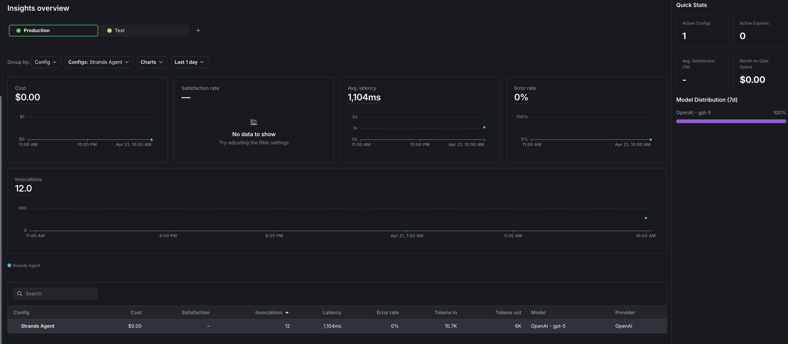

# Strands Agents with LaunchDarkly AI Configs

This sample shows how to drive a [Strands](https://strandsagents.com) agent entirely from [LaunchDarkly AI Configs](https://launchdarkly.com/docs/home/ai-configs): the model, the instructions, the parameters, the tool list, **and** the multi-agent graph topology all live in LaunchDarkly. The notebook builds a multi-provider order-status triage agent (OpenAI, Anthropic, and Bedrock-hosted Claude), attaches a governed tool, composes a second "specialist" agent into an Agent Graph, then runs a generic graph-driven dispatcher that materializes Strands `Agent` instances from each node at runtime.

Provider, tool list, agent instructions, and graph shape can all be changed from the LaunchDarkly UI — no code change, no redeploy.

## Prerequisites

* Python 3.10+
* A [LaunchDarkly account](https://launchdarkly.com/start-trial) with an API token that has the **Writer** role (the notebook creates the project, AI Configs, variations, tool, and graph for you)
* `OPENAI_API_KEY` for the `gpt-5-agent` variation and the specialist
* `ANTHROPIC_API_KEY` for the `claude-sonnet-agent` variation
* *(Optional)* AWS credentials with Bedrock model access for the `bedrock-claude-agent` variation. The variation is created either way; serving it only succeeds if Bedrock is reachable.

## Setup Instructions

1. Clone the repository and change into this directory:

   ```bash
   git clone https://github.com/strands-agents/samples.git
   cd samples/python/03-integrate/runtime-control/launchdarkly
   ```

2. Install dependencies (the notebook's first cell does this for you if you'd rather skip it):

   ```bash
   pip install -r requirements.txt
   ```

3. Create a `.env` file in this directory:

   ```bash
   LAUNCHDARKLY_API_TOKEN=api-...
   OPENAI_API_KEY=sk-...
   ANTHROPIC_API_KEY=sk-ant-...

   # Optional overrides
   # LAUNCHDARKLY_PROJECT_KEY=strands-launchdarkly-sample
   # LAUNCHDARKLY_PROJECT_NAME=Strands + LaunchDarkly Sample
   # LAUNCHDARKLY_ENVIRONMENT=production

   # Optional: only required if you want the Bedrock variation to serve
   # AWS_ACCESS_KEY_ID=...
   # AWS_SECRET_ACCESS_KEY=...
   # AWS_REGION=us-west-2
   ```

4. Run the notebook:

   ```bash
   jupyter notebook LaunchDarkly-AI-Configs-strands.ipynb
   ```

   The notebook is self-contained: it creates the LaunchDarkly project, the `strands-agent` triage AI Config (three variations), a governed `get_order_status` tool, default targeting, a `strands-specialist-agent` AI Config, and an Agent Graph that wires them together with a `handoff` edge. Re-running is idempotent.

5. After the run, open the AI Config in LaunchDarkly and switch to the **Monitoring** tab to see invocation count, token usage, duration, tool-call counts, and error rate per variation. The **Agent Graph** view shows per-node metrics + the handoff edges.

## What You'll Learn

* **Map an `AIAgentConfig` to a Strands model class.** `create_strands_model` dispatches on `config.provider.name` (with a Bedrock model-id fallback) — no per-provider branching in your code.
* **Drive an agent's tool list from LaunchDarkly.** Tools come from `config.model.parameters['tools']`, resolved against a local `TOOL_REGISTRY` at runtime. Detach a tool in the UI and the next invocation has no tools.
* **Govern tool schemas centrally.** Register tools with `POST /ai-tools` and attach per-variation via `PATCH /ai-configs/.../variations/{key}`.
* **Track per-agent metrics correctly for async work.** `tracker.track_metrics_of_async(extractor, lambda: agent.invoke_async(...))` atomically fires duration + success/error + tokens; tool calls are tracked from the `@tool` body via a fresh per-invocation tracker.
* **Compose multiple AI Configs into an Agent Graph.** Each edge carries `handoff` metadata (a `route` key the LLM emits + a human-readable `reason`).
* **Drive multi-agent behavior from the graph at runtime.** `execute_graph` walks `graph.root().get_edges()`, builds a Strands `Agent` per node from `node.get_config()`, parses the LLM's `{"route": "..."}` envelope, and jumps to the matching edge target — *or terminates cleanly when no handoff is needed*. The dispatcher also records graph-level handoff success/failure + the final path via `graph.create_tracker()`.
* **Adding a node + edge in LaunchDarkly changes runtime behavior without code changes.** The only key the dispatcher hardcodes is `GRAPH_KEY`.

## What the notebook prints

Section 9 runs two queries that exercise both branches of the graph:

```
========== Query 1: status only ==========
┌─ INVOKED agent: strands-agent ─
│ input (40 chars):
│   What's the status of order ORD-789?
├─ response ─
Order ORD-789 was delivered on Monday.
└─ done: strands-agent
[INFO] strands-agent omitted route JSON — terminating here.
[OK] Path invoked: strands-agent

========== Query 2: needs analysis ==========
┌─ INVOKED agent: strands-agent ─
[one-line status + {"route": "specialist"}]
└─ done: strands-agent
[INFO] strands-agent chose route 'specialist' → strands-specialist-agent
┌─ INVOKED agent: strands-specialist-agent ─
[full investigation + comms templates + escalation path]
└─ done: strands-specialist-agent
[OK] Path invoked: strands-agent → strands-specialist-agent
```

## Changing the graph at runtime

Add a node + edge in LaunchDarkly's Agent Graph UI, save, and re-run the section 9 cell. The dispatcher re-fetches the live topology on every call and self-heals the SDK client if a prior cleanup closed it, so new nodes show up without restarting the kernel. The most reliable refresh after any LD UI change is still **Kernel → Restart and Run All**, which guarantees a fresh streaming connection.

## Monitoring in LaunchDarkly

After running the agent, view metrics on the AI Config's **Monitoring** tab, or open **Insights** under **AI** in the left navigation for aggregated cost, latency, error rate, and model-distribution metrics across every AI Config in your project. The **Agent Graph** view (same nav) shows the same metrics laid out by node + the edges between them.



## Additional Resources

* [LaunchDarkly + Strands guide](https://launchdarkly.com/docs/guides/ai-configs/strands) — the canonical walkthrough, including a Node.js example
* [LaunchDarkly AI Configs documentation](https://launchdarkly.com/docs/home/ai-configs)
* [LaunchDarkly Agent Graphs](https://launchdarkly.com/docs/home/ai-configs/agent-graphs)
* [LaunchDarkly Python AI SDK reference](https://launchdarkly.com/docs/sdk/ai/python)
* [Strands Agents documentation](https://strandsagents.com)
