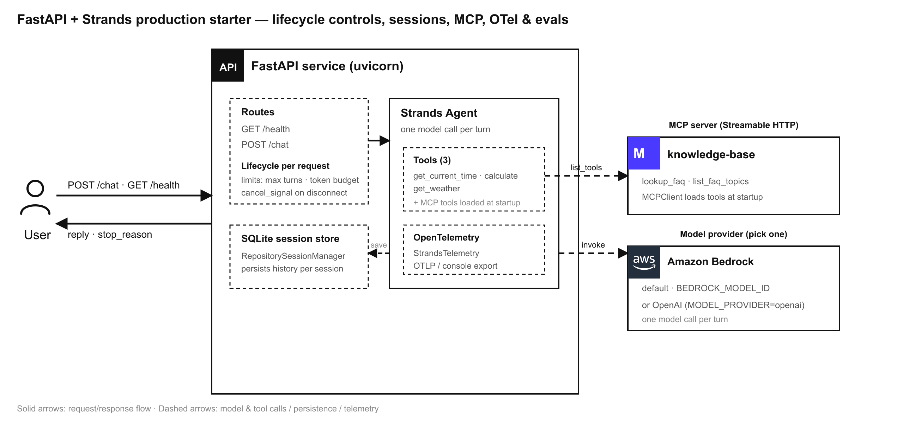

# FastAPI + Strands production starter

A single runnable Python service, in the shape of a benchmark chatbot repo (FastAPI, three tools, one model call), rebuilt on Strands Agents. It wires the production concerns you actually ship with: an OpenAI or Bedrock provider, max turns and a token budget, cancellation on client disconnect, a SQLite-backed session store built on the shipped `RepositorySessionManager`, one MCP server, OpenTelemetry export, and a 10-case Strands Evals regression suite.

## Overview

| Information            | Details                                                                                  |
|------------------------|------------------------------------------------------------------------------------------|
| **Agent Architecture** | Single-agent                                                                             |
| **Native Tools**       | None                                                                                     |
| **Custom Tools**       | `get_current_time`, `calculate`, `get_weather`                                           |
| **MCP Servers**        | One bundled server (`knowledge-base`) exposing `lookup_faq`, `list_faq_topics`           |
| **Use Case Vertical**  | Technical / production starter                                                            |
| **Complexity**         | Advanced                                                                                 |
| **Model Provider**     | Amazon Bedrock (default) or OpenAI                                                        |
| **SDK Used**           | Strands Agents SDK + Strands Agents Evals                                                 |

### Architecture



A user calls the FastAPI service, which runs a Strands agent per request. Each `POST /chat` applies per-request lifecycle limits (max turns and a token budget) and a cancel signal wired to client disconnect. The agent makes one model call per turn against Amazon Bedrock (or OpenAI), calls its three local tools plus the tools loaded from the MCP server at startup, and persists conversation history in the SQLite session store built on `RepositorySessionManager`. OpenTelemetry export is configured at startup.

### Key Features

- FastAPI service with `POST /chat` and `GET /health`.
- Three tools plus one model call per turn, the shape of the benchmark repo.
- Native lifecycle controls: max turns and a token budget per request.
- Cancellation on client disconnect via a `cancel_signal`.
- A SQLite session store implemented on the shipped `RepositorySessionManager`.
- One MCP server, connected at startup with its tools loaded into the agent.
- OpenTelemetry export (OTLP endpoint, or console for local runs).
- A 10-case Strands Evals regression suite scoring output and trajectory.

## Prerequisites

- Python **3.10+**
- [uv](https://docs.astral.sh/uv/getting-started/installation/) for dependency management
- For Bedrock (default): AWS credentials in the default credential chain and [model access](https://docs.aws.amazon.com/bedrock/latest/userguide/model-access-modify.html) for the configured model
- For OpenAI (optional): an `OPENAI_API_KEY`

## Setup

1. **Configure environment variables:**
   ```bash
   cd python/05-technical-use-cases/fastapi-strands-production-starter
   cp .env.example .env
   # Edit .env: choose MODEL_PROVIDER, set model ids, limits, MCP and OTel settings
   ```

2. **Install dependencies:**
   ```bash
   uv venv
   uv pip install -e ".[evals,openai]"   # drop "openai" if you only use Bedrock
   ```

## Usage

The service loads the MCP server's tools at startup, so start the MCP server first, then the API.

**Start the MCP server** (one terminal):
```bash
uv run python -m mcp_server.server
```

**Start the API** (another terminal):
```bash
uv run uvicorn app.main:app --port 8080
```

**Send a chat request:**
```bash
curl -X POST http://localhost:8080/chat \
  -H 'Content-Type: application/json' \
  -d '{"message": "What time is it in Tokyo?", "session_id": "demo"}'
```

Send another request with the same `session_id` to continue the conversation — history is restored from the session store.

## OpenAI or Bedrock provider

The agent runs on either provider, selected by `MODEL_PROVIDER`:

- `MODEL_PROVIDER=bedrock` (default) uses `BedrockModel` with `AWS_REGION` and `BEDROCK_MODEL_ID`.
- `MODEL_PROVIDER=openai` uses `OpenAIModel` with `OPENAI_API_KEY` and `OPENAI_MODEL_ID`.

The provider is built in `app/agent_factory.py::build_model`; the OpenAI import is lazy so a Bedrock-only install needs no OpenAI dependency.

## Max turns and token budget

Every request passes a per-invocation `Limits` (built from `MAX_TURNS`, `MAX_OUTPUT_TOKENS`, `MAX_TOTAL_TOKENS`) to `invoke_async`. When a cap is reached, the agent loop stops gracefully at a turn boundary with a `stop_reason` of `limit_turns`, `limit_total_tokens`, or `limit_output_tokens` — no exception, and `agent.messages` stays reinvokable. See `app/config.py::Settings.limits`.

## Cancellation on client disconnect

`POST /chat` starts a background watcher that polls `request.is_disconnected()` and sets a `threading.Event` passed to `invoke_async` as `cancel_signal`. If the caller goes away, the agent stops promptly at its next cancellation-safe point and returns `stop_reason="cancelled"`. See `app/main.py::_watch_disconnect`.

## SQLite session store built on RepositorySessionManager

The SDK ships File, S3, and Repository session managers, among others; SQLite is not a first-party one. `app/session_store.py` provides it by implementing the `SessionRepository` interface (8 CRUD methods) and combining it with `RepositorySessionManager` — the same pattern the built-in `FileSessionManager` uses. Sessions, agents, and per-message rows persist in one SQLite file (`SESSION_DB_PATH`), so conversations survive restarts.

## One MCP server

`mcp_server/server.py` is a single MCP server exposed over Streamable HTTP (`FastMCP`), providing a small knowledge base (`lookup_faq`, `list_faq_topics`). At startup the API connects to it with the Strands `MCPClient` (`MCP_SERVER_URL`) and loads its tools alongside the local tools, so the agent can call them in the same turn.

## OTel export

`app/agent_factory.py::configure_telemetry` sets up OpenTelemetry once at startup with `StrandsTelemetry`: it exports to `OTEL_EXPORTER_OTLP_ENDPOINT` when set, and otherwise falls back to the console exporter so traces are visible during local runs. `OTEL_SERVICE_NAME` names the service in traces.

## 10-case Strands Evals regression suite

`evals/eval_suite.py` defines ten `Case`s spanning each tool (time, math, weather), general knowledge, reasoning, and a no-tool greeting, with `expected_trajectory` on the tool cases. An `Experiment` scores the agent's responses with the LLM-based `OutputEvaluator` and the tool choices with the `TrajectoryEvaluator`.

**Run the suite:**
```bash
uv run python -m evals.eval_suite
```

Results print to the console and are saved to `fastapi_starter_evaluation.json`. The evaluators use Amazon Bedrock (Claude) as the judge model by default, so this step needs AWS credentials with Bedrock access.

## Cleanup

This sample provisions no cloud infrastructure. To remove local artifacts:
```bash
rm -f sessions.db fastapi_starter_evaluation.json
rm -rf .venv
```

## Troubleshooting

| Symptom                                   | Likely Cause                                | Fix                                                            |
|-------------------------------------------|---------------------------------------------|----------------------------------------------------------------|
| `/chat` returns a 500 about credentials   | No AWS/OpenAI credentials configured        | Configure the provider's credentials and model access          |
| Startup logs "could not connect" to MCP   | MCP server not running / wrong `MCP_SERVER_URL` | Start `python -m mcp_server.server`; check the URL/port    |
| `stop_reason` is `limit_turns`            | Request hit the `MAX_TURNS` cap             | Raise `MAX_TURNS`, or accept it as the intended budget         |
| Eval run errors on the judge model        | Evaluators need Bedrock access              | Configure AWS credentials with access to the judge model       |

## Additional Resources

- [Strands Agents Documentation](https://strandsagents.com/)
- [Strands Evals SDK](https://strandsagents.com/docs/user-guide/evals-sdk/)
- [Session management](https://strandsagents.com/docs/user-guide/sdk/memory/overview/)
- [Model Context Protocol](https://modelcontextprotocol.io/)

## Disclaimer

This sample is provided for educational and demonstration purposes only. It is not intended for production use without further development, testing, and hardening. For production, consider a shared session store (the SDK ships S3), authentication and input validation on the API, a managed OTLP backend, and appropriate content filtering and safety measures.
