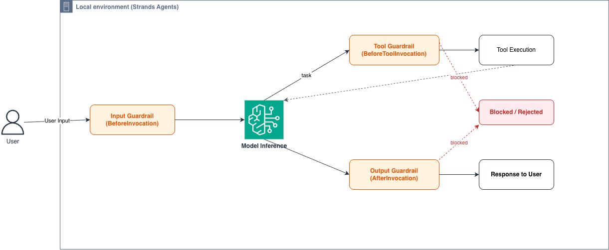
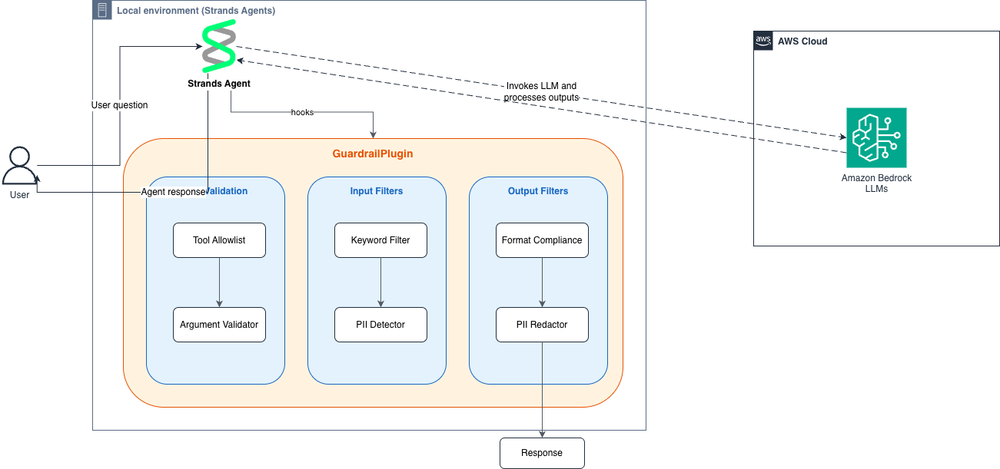

# Custom Python Guardrails with Hooks

Build custom input validation, output validation, and content filtering for Strands Agents using the hooks lifecycle — entirely in Python.

## Overview

This tutorial applies the Strands Agents **hooks** system to a concrete problem: guarding what goes into and comes out of your agent. Using the lifecycle events you already know from [`01-learn/16-hooks-lifecycle`](../../../01-learn/16-hooks-lifecycle/), you'll build:

- **Input guardrails** that block harmful or non-compliant user messages before they reach the model
- **Output guardrails** that redact PII or replace unsafe responses before they reach the user
- **Tool call guardrails** that restrict which tools the agent can invoke
- **A reusable `HookProvider`** that bundles all guardrail logic into a single component

### Architecture

<div style="text-align:center">
    
</div>

## Prerequisites

This is a **technical use case**, not a hooks primer. It assumes you already understand the hooks lifecycle. Before starting, complete:

- **[`01-learn/16-hooks-lifecycle`](../../../01-learn/16-hooks-lifecycle/)** — how hooks fire, how to register a `HookProvider`, and the writable event fields (`messages`, `cancel_tool`, `retry`, `resume`). This tutorial uses those mechanics directly and does not re-teach them.

You'll also need:

- Python 3.10+
- `strands-agents` SDK 1.40.0+ installed
- A configured model provider (AWS Bedrock, Anthropic, etc.) — optional for testing, since guardrail logic is tested against mock messages

Install dependencies:

```bash
pip install -r requirements.txt
```

### How this relates to the other guardrail samples

Strands offers several ways to add guardrails. This sample is the **pure-Python, hooks-based** approach. The others live in [`03-integrate/guardrails/`](../../../03-integrate/guardrails/) and wrap managed or third-party services (NVIDIA NeMo, Llama Firewall, Alice WonderFence).

| Approach | Where | Best when |
|----------|-------|-----------|
| Custom Python filters via hooks | **this sample** | You want full control, model-agnostic logic, and no external dependency |
| Managed / third-party guardrail services | [`03-integrate/guardrails/`](../../../03-integrate/guardrails/) | You want a vendor to handle content classification for you |

The value of the hooks-based approach: full control over validation logic (regex, keywords, custom classifiers), a model-agnostic implementation, testability in isolation without a live model, and composable filters you can mix and match per use case.

## Tutorial Structure

| File | Description |
|------|-------------|
| `01_input_guardrail.ipynb` | Input validation using `BeforeInvocationEvent` |
| `02_output_guardrail.ipynb` | Output validation with BLOCK and REDACT behaviors |
| `03_content_filters.ipynb` | Reusable content filter classes (regex, keyword, format) |
| `04_guardrail_plugin.ipynb` | Full `GuardrailPlugin` bundling all guardrails in one `HookProvider` |
| `05_tool_call_validation.ipynb` | Tool call restriction using `BeforeToolCallEvent` |
| `06_error_handling.ipynb` | Fail-open vs fail-closed error handling patterns |

---

## Step 1: Input Guardrails

**File:** `01_input_guardrail.ipynb`

Input guardrails intercept user messages *before* they reach the model. As covered in `16-hooks-lifecycle`, `BeforeInvocationEvent` fires at the start of each agent invocation and exposes the conversation history via `event.agent.messages`, which you can inspect and modify.

Here we apply that event to guardrails:

1. Extract text from the last user message
2. Run it through your content filters
3. If a violation is found, replace the messages with a rejection prompt

```python
def _validate_input(self, event: BeforeInvocationEvent) -> None:
    messages = event.agent.messages
    if not messages or messages[-1].get("role") != "user":
        return

    text = _extract_text_from_message(messages[-1])
    result = keyword_filter.evaluate(text)

    if not result.passed:
        messages.clear()
        messages.append({
            "role": "user",
            "content": [{"text": (
                "Respond only with: I cannot process that request. "
                "The input was blocked by a content safety filter."
            )}],
        })
```

### Composing multiple filters

The notebook also demonstrates chaining keyword detection and PII detection in sequence — the first violation stops evaluation:

```python
filters = [keyword_filter, pii_filter]
violation = run_filters(text, filters)
if violation is not None:
    # Block the request with the violation's message
    ...
```

---

## Step 2: Output Guardrails

**File:** `02_output_guardrail.ipynb`

Output guardrails inspect model responses *after* inference completes, using `AfterInvocationEvent`. Access the conversation history via `event.agent.messages`, which now includes the assistant's reply.

### Two behaviors: BLOCK vs REDACT

| Behavior | What happens | Use case |
|----------|-------------|----------|
| **BLOCK** | Replace the entire response with a safe fallback | Prohibited topics, classified info |
| **REDACT** | Replace only matched patterns with `[REDACTED]` | PII in responses (emails, phone numbers) |

Given input `"The user's email is john@example.com and phone is 555-123-4567."`, a REDACT filter produces:
`"The user's email is [REDACTED] and phone is [REDACTED]."`

---

## Step 3: Custom Content Filters

**File:** `03_content_filters.ipynb`

Content filters are the building blocks of guardrails — the guardrail-specific logic this tutorial contributes on top of the hooks foundation. The notebook defines a composable filter architecture with a base class, concrete implementations, and a pipeline runner.

### Architecture

```
ContentFilter (base class)
├── RegexContentFilter     — pattern matching (PII, structured data)
├── KeywordContentFilter   — keyword/phrase detection (topic blocking)
└── FormatComplianceFilter — structural validation (no code execution instructions)
```

<div style="text-align:center">
    
</div>

### Severity levels

```python
class Severity(Enum):
    BLOCK = "block"    # Reject the entire request/response
    WARN = "warn"      # Log a warning but allow through
    REDACT = "redact"  # Remove/replace the matched content
```

`run_filters()` evaluates text against a list of filters in order, returning the first violation.

---

## Step 4: Guardrail Plugin

**File:** `04_guardrail_plugin.ipynb`

For production use, package your guardrails as a single `HookProvider` (the packaging pattern is introduced in `16-hooks-lifecycle`; here we fill it with guardrail logic). This bundles input, output, and tool call validation into one reusable, configurable component.

<div style="text-align:center">
    
</div>

```python
class GuardrailPlugin(HookProvider):
    def __init__(self, input_filters=None, output_filters=None,
                 tool_allowlist=None, fail_open=True):
        self.input_filters = input_filters or []
        self.output_filters = output_filters or []
        self.tool_allowlist = tool_allowlist
        self.fail_open = fail_open

    def register_hooks(self, registry: HookRegistry) -> None:
        registry.add_callback(BeforeInvocationEvent, self._validate_input)
        registry.add_callback(AfterInvocationEvent, self._validate_output)
        registry.add_callback(BeforeToolCallEvent, self._validate_tool_call)
```

### Key features

- **Configurable filters** — pass different filter lists for input vs output
- **Tool allowlist** — restrict which tools the agent can call (set to `None` to allow all)
- **Fail-open/fail-closed** — control error handling behavior via constructor parameter
- **Audit logging** — all decisions are logged with structured formatting

### Attaching to an agent

```python
plugin = GuardrailPlugin(
    input_filters=[
        KeywordContentFilter("topics", ["hack", "exploit"], Severity.BLOCK),
        RegexContentFilter("pii", [r"\b\d{3}-\d{2}-\d{4}\b"], Severity.BLOCK),
    ],
    output_filters=[
        RegexContentFilter("pii_redactor", [r"\b\d{3}-\d{2}-\d{4}\b"], Severity.REDACT),
    ],
    tool_allowlist=["calculator", "web_search"],
    fail_open=True,
)

agent = Agent(hooks=[plugin])
```

---

## Step 5: Tool Call Validation

**File:** `05_tool_call_validation.ipynb`

Tool call guardrails intercept tool invocations *before* execution using `BeforeToolCallEvent` and its writable `cancel_tool` field (both covered in `16-hooks-lifecycle`). This lets you enforce which tools the agent can use and validate their arguments.

```python
def _validate_tool(self, event: BeforeToolCallEvent) -> None:
    tool_name = event.tool_use.get("name", "")
    if tool_name not in self.allowed_tools:
        event.cancel_tool = f"Tool '{tool_name}' is not permitted."
```

The notebook covers three patterns: **allowlist** (only listed tools run), **blocklist** (specific tools blocked), and **argument validation** (inspect tool arguments for dangerous patterns like sensitive paths or destructive commands).

---

## Step 6: Error Handling

**File:** `06_error_handling.ipynb`

In production, content filters can fail — network timeouts, malformed input, bugs in custom classifiers. The key design decision: should a filter failure **allow** or **block** the request?

| Mode | On filter exception | Best for |
|------|-------------------|----------|
| `fail_open=True` | Log error, allow request through | Systems prioritizing availability (customer chatbots, general assistants) |
| `fail_open=False` | Log error, block request | Systems prioritizing safety (financial compliance, healthcare, legal) |

Every guardrail decision is logged with structured formatting for compliance:

```python
audit_logger.warning(
    f"direction=input filter={filter_name} action=blocked "
    f'snippet="{content[:50]}" message="{reason}"'
)
```

---

## Summary

You've applied the hooks lifecycle to build a complete guardrail system for Strands Agents:

1. **Input guardrails** intercept messages via `BeforeInvocationEvent` and block/modify them before inference
2. **Output guardrails** intercept responses via `AfterInvocationEvent` and can BLOCK or REDACT content
3. **Content filters** are composable building blocks with severity levels (BLOCK, WARN, REDACT)
4. **The `GuardrailPlugin`** bundles everything into a reusable `HookProvider`
5. **Tool call validation** restricts which tools the agent can invoke via `BeforeToolCallEvent`
6. **Error handling** lets you choose fail-open (availability) or fail-closed (safety)

### Key takeaways

- Guardrails are just guardrail-specific logic layered on the hooks you learned in `16-hooks-lifecycle`
- Access messages via `event.agent.messages` in both `BeforeInvocationEvent` and `AfterInvocationEvent`
- Always test guardrails in isolation (mock messages) before deploying with a live model
- Choose fail-open vs fail-closed based on your application's risk profile
- Audit logging is essential for compliance and debugging

### Next steps

- Revisit [`01-learn/16-hooks-lifecycle`](../../../01-learn/16-hooks-lifecycle/) for the full lifecycle event reference
- Explore [`03-integrate/guardrails/`](../../../03-integrate/guardrails/) for managed and third-party guardrail integrations
- Add custom ML-based classifiers (toxicity, sentiment) as `ContentFilter` subclasses
- Integrate with external moderation APIs by wrapping them in the `ContentFilter` interface
