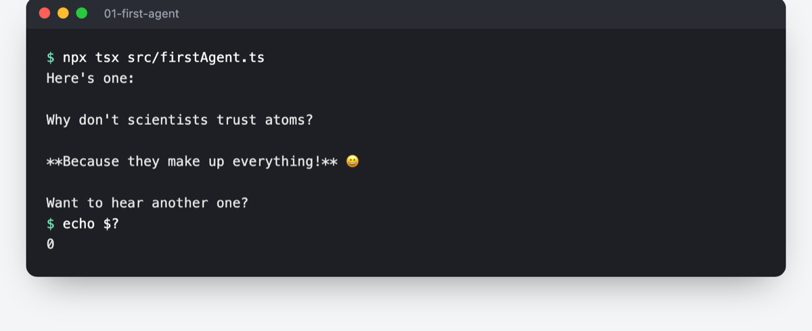

# Getting started with Strands Agents (TypeScript)

Strands Agents is an open source SDK that takes a model-driven approach to building AI agents in just a few lines of code. This quickstart guide will walk you through creating your first agent in TypeScript using large language models to handle planning and tool usage autonomously.


## Prerequisites

- Node.js 22 or later (the version `@strands-agents/sdk` supports; older versions print warnings)
- AWS credentials configured with access to Amazon Bedrock, and the model enabled in your region
- Basic understanding of TypeScript/JavaScript programming

## What this agent does

This is the smallest useful Strands agent: one agent, one model, no tools. It shows the loop every Strands agent is built on.

1. **You create an agent** with a model (Claude Sonnet 4.6 on Amazon Bedrock) and a system prompt that sets its behaviour: *"You are a helpful assistant that provides concise responses."*
2. **You invoke it with a message**: *"Hello! Tell me a joke."*
3. **Strands sends the conversation to the model** and streams the reply back to your terminal as it is generated.

There are no tools yet, so the model answers directly. Later samples add tools, and the same `agent.invoke()` call then lets the model decide when to use them.

## Creating Your First Agent


| Feature | Description |
|---------|-------------|
| Agent Structure | Single agent architecture |

The example in `src/firstAgent.ts` demonstrates how to:

- Create a basic agent with the Claude Sonnet 4.6 model from Amazon Bedrock
- Configure the agent with a system prompt
- Invoke the agent with a message
- Stream the response to the console

## Running the Example

```bash
cd typescript/01-learn/01-first-agent
npm install
npx tsx src/firstAgent.ts
```

To use a different Bedrock model or inference profile, set `MODEL_ID`:

```bash
MODEL_ID=us.anthropic.claude-haiku-4-5-20251001-v1:0 npx tsx src/firstAgent.ts
```
## Expected output

The agent prints one short, friendly reply, and the command exits with status `0`. The joke varies from run to run because the model generates it fresh each time.



```text
$ npx tsx src/firstAgent.ts
Here's one:

Why don't scientists trust atoms?

**Because they make up everything!** 😄

Want to hear another one?
```

## Check that it works

| Check | Command | Expected |
|---|---|---|
| Runs end to end | `npx tsx src/firstAgent.ts` | One reply, printed once, then `echo $?` shows `0` |
| Compiles | `npm run build && npm start` | Same reply from the compiled `dist/firstAgent.js` |
| Model override | `MODEL_ID=us.anthropic.claude-haiku-4-5-20251001-v1:0 npx tsx src/firstAgent.ts` | A reply from Claude Haiku 4.5 |

## Troubleshooting

| You see | Cause | Fix |
|---|---|---|
| `ModelError: The security token included in the request is invalid.` (exit `1`) | Missing or expired AWS credentials | Run `aws sts get-caller-identity`; refresh your credentials or `AWS_PROFILE` |
| `ModelError: The provided model identifier is invalid.` (exit `1`) | `MODEL_ID` is misspelled or not available in your region | Use a model ID or inference profile listed in the Bedrock console for your region |
| `NodeVersionSupportWarning` or `EBADENGINE` warnings | Node.js older than 22 | Upgrade to Node.js 22 or later |

## Additional Resources

- [Strands Agents Documentation](https://strandsagents.com/latest/)


