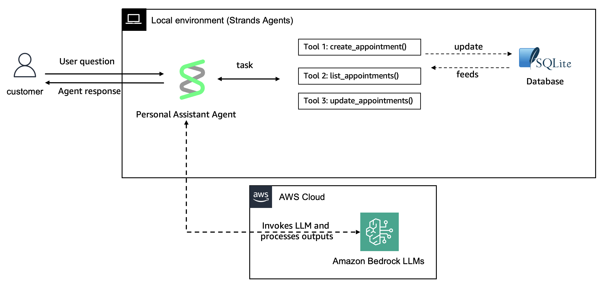
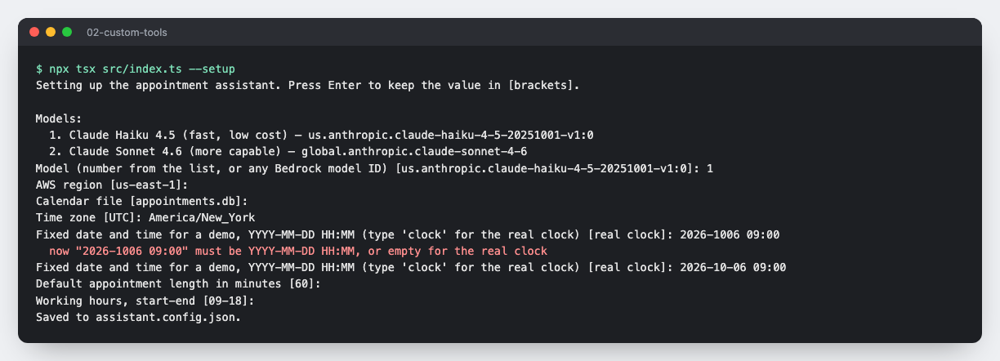
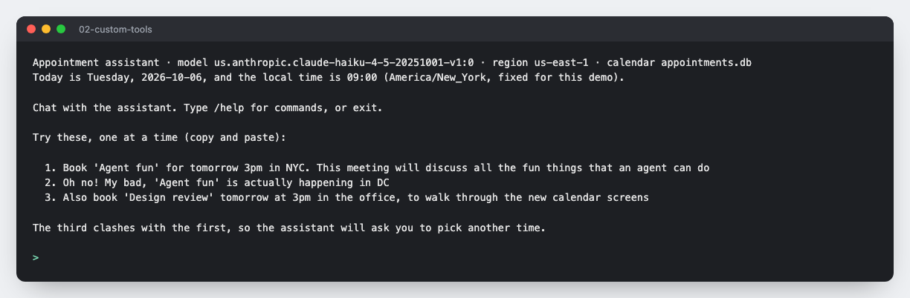
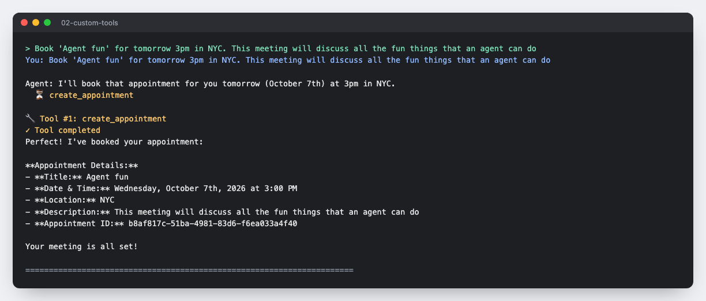
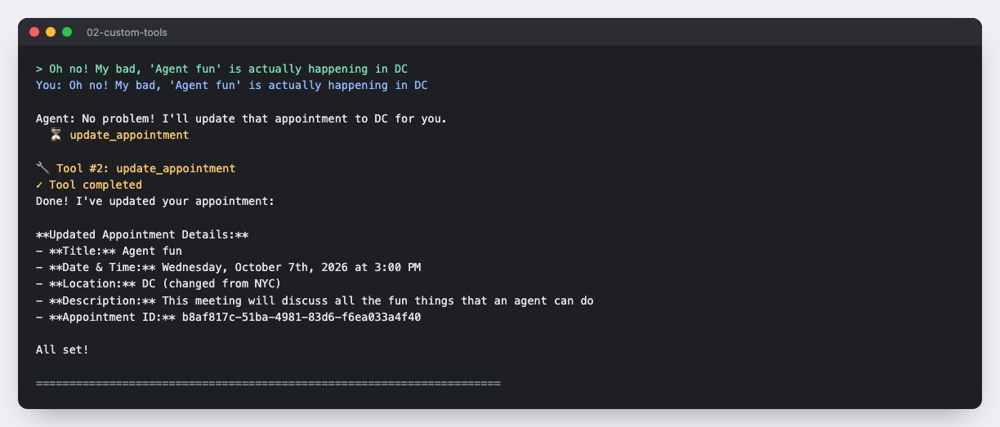
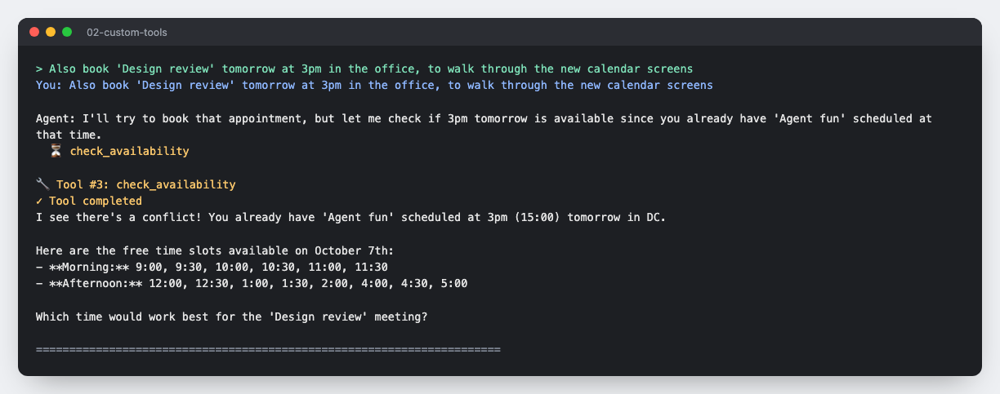
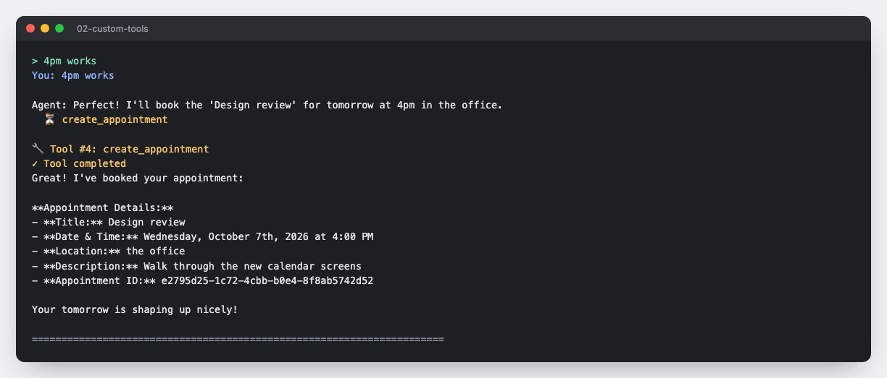
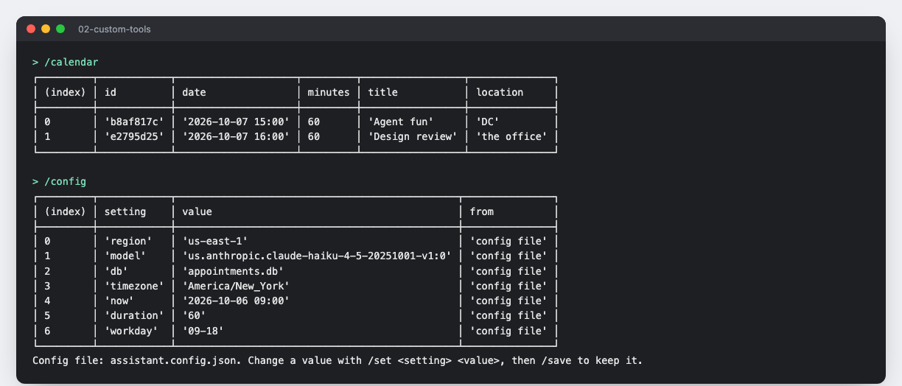

# Adding custom tools to your Strands Agents

## Overview

In this example we will guide you through creating custom tools using the Strands Agents `tool()` function. We will build a personal assistant that connects with a local SQLite database to manage appointments, turn by turn in your terminal.



| Feature | Description |
|---------|-------------|
| Custom tools created | create_appointment, list_appointments, update_appointment, delete_appointment, check_availability |
| Agent Structure | Single agent architecture |
| Interaction | Guided demo, then turn-by-turn chat |

## What the assistant does

- **Books, lists, moves and cancels appointments** in plain English: "Book a 30 minute call with Priya on Friday at 11am", "Move Design review to 4pm", "Cancel the gym session".
- **Understands relative dates.** It is told today's date and your local time zone, so "tomorrow at 3pm" resolves correctly.
- **Never double-books.** The tools check for overlapping appointments before saving. When a slot is busy, nothing is saved; the agent tells you what clashes, offers free times from the calendar, and waits for you to choose.
- **Asks before it acts on anything destructive.** Cancelling takes two steps: the agent shows the appointment and asks you to confirm before it deletes anything.
- **Asks for what's missing** instead of inventing it. A title, a time and a location are enough; appointments last 60 minutes unless you say otherwise.

## Walkthrough

A real session on Amazon Bedrock (Claude Haiku 4.5), with the date fixed to Tuesday 6 October 2026 so "tomorrow" is 7 October.

**1. Setup.** `--setup` asks for each setting and shows the current value in brackets. An invalid value is explained and asked again.



**2. Ready.** The header shows the settings in use, and the three sample requests are printed ready to copy.



**3. Book.** The agent books "Agent fun" for tomorrow at 3pm with `create_appointment`.



**4. Move.** It finds the same appointment and changes the location with `update_appointment`.



**5. Clash.** 3pm is taken, so nothing is saved. The agent names the clash, lists times that are actually free, and asks you.



**6. Your answer.** You pick a time, and the agent books it.



**7. Check.** `/calendar` reads the database directly, and `/config` shows each setting and where it came from.



## Prerequisites

- Node.js 22 or later (the version `@strands-agents/sdk` supports)
- AWS credentials with Amazon Bedrock access, and the model enabled in your region
- Basic TypeScript knowledge

## Running the Example

```bash
cd typescript/01-learn/02-custom-tools
npm install
npx tsx src/index.ts
```

This runs the **guided demo**:

1. Books "Agent fun" for tomorrow at 3pm in NYC.
2. Moves it to DC.
3. Tries to book "Design review" tomorrow at 3pm. **The calendar is busy**, so the agent stops, explains the clash, suggests free times, and asks you what to do.
4. **Your turn.** Answer the agent (for example "4pm works"), then keep chatting as long as you like.

### Modes

| Command | What it does |
|---|---|
| `npx tsx src/index.ts` | Guided demo, then you take over |
| `npx tsx src/index.ts --setup` | Choose your settings step by step, save them, then chat |
| `npx tsx src/index.ts --chat` | Chat from the first turn, no scripted requests |
| `npx tsx src/index.ts --auto` | The three scripted requests only, no input (useful for quick checks) |
| `npx tsx src/index.ts --help` | Show every option |

### Settings

Everything shown in the assistant's header can be configured:

```
Appointment assistant · model us.anthropic.claude-haiku-4-5-20251001-v1:0 · region us-east-1 · calendar appointments.db
Today is Tuesday, 2026-10-06, and the local time is 09:00 (America/New_York, fixed for this demo).
```

| Setting | Flag | Environment variable | Default |
|---|---|---|---|
| Bedrock region | `--region` | `AWS_REGION` | `us-east-1` |
| Model ID or inference profile | `--model` | `MODEL_ID` | `us.anthropic.claude-haiku-4-5-20251001-v1:0` |
| Calendar file | `--db` | `APPOINTMENTS_DB` | `appointments.db` |
| Time zone for "today" and "tomorrow" | `--timezone` | `ASSISTANT_TIMEZONE` | your system time zone |
| Fixed date and time, `YYYY-MM-DD HH:MM`, for rehearsing a demo | `--now` | `ASSISTANT_NOW` | the real clock |
| Default appointment length, minutes | `--duration` | `ASSISTANT_DURATION` | `60` |
| Working hours for free-slot suggestions | `--workday` | `ASSISTANT_WORKDAY` | `09-18` |

Each value comes from, in order of priority: a flag, then an environment variable, then the config file (`assistant.config.json`, or `--config <path>`), then the default. Invalid values are rejected with a clear message before the assistant starts.

`--setup` asks for each setting, shows the current value in brackets (press Enter to keep it), re-asks if a value is invalid, and saves the result to the config file, which is git-ignored because it holds personal settings. For example:

```bash
npx tsx src/index.ts --chat --region us-west-2 --model global.anthropic.claude-sonnet-4-6 \
  --timezone America/New_York --now "2026-12-24 09:00" --duration 30 --workday 08-17
```

### In the chat

With `--setup` or `--chat`, the assistant starts by printing the three sample requests from the guided demo, ready to copy and paste. `/help` shows them again.

| Type | To |
|---|---|
| Any request in plain English | Talk to the assistant |
| `/calendar` | Print the saved appointments straight from the database |
| `/config` | Show every setting and where its value came from (flag, env, config file or default) |
| `/set <setting> <value>` | Change a setting mid-conversation, e.g. `/set model global.anthropic.claude-sonnet-4-6` or `/set now clock`. The conversation carries on with the new setting. |
| `/save` | Save the current settings to the config file |
| `/help` | Show example requests and commands |
| `exit` | Quit and print the final calendar |

Delete `appointments.db` to start again with an empty calendar.

## Project Structure

```
src/
├── database/
│   └── AppointmentDatabase.ts    # SQLite data access, overlap checks, free slots
├── tools/
│   └── AppointmentTools.ts       # Tool definitions factory
├── config.ts                     # Settings: flags, environment, config file, validation
└── index.ts                      # Entry point: setup, guided demo, chat loop
```

## Key Concepts

### Class-Based Tool Organization

Tools are organized using a factory class pattern that encapsulates tool creation and database dependencies:

```typescript
export class AppointmentTools {
  constructor(private database: AppointmentDatabase) { }

  getCreateAppointmentTool() {
    return tool({
      name: "create_appointment",
      description: "Create a new personal appointment. Checks the calendar first...",
      inputSchema: z.object({ date, duration_minutes, location, title, description }),
      callback: (input) => {
        const conflict = this.conflictResult(input.date, duration);
        if (conflict) return conflict; // nothing saved; the agent asks the user
        const id = this.database.createAppointment(...);
        return `Appointment created successfully with ID: ${id}`;
      }
    });
  }

  getAllTools() {
    return [
      this.getCreateAppointmentTool(),
      this.getListAppointmentsTool(),
      this.getUpdateAppointmentTool(),
      this.getDeleteAppointmentTool(),
      this.getCheckAvailabilityTool(),
    ];
  }
}
```

### Tools that return decisions, not just data

A tool result can tell the agent that it needs the user. When a slot is taken, `create_appointment` and `update_appointment` return:

```json
{
  "status": "conflict",
  "message": "The calendar is busy at that time. Nothing was saved. Offer the user the suggested_start_times and ask how to proceed.",
  "conflicts": [{ "title": "Agent fun", "date": "2026-10-01 15:00", "duration_minutes": 60 }],
  "suggested_start_times": ["13:30", "14:00", "16:00"]
}
```

The rule lives in the tool, so the agent cannot double-book even if it tries. `delete_appointment` works the same way: without `confirmed: true` it returns `needs_confirmation` and deletes nothing.

### Database Integration

The `AppointmentDatabase` class uses `better-sqlite3` to store appointment information. Existing databases from earlier versions of this sample are upgraded automatically.

```typescript
export class AppointmentDatabase {
  createAppointment(date, location, title, description, durationMinutes?): string
  listAppointments(): Appointment[]
  updateAppointment(id, updates): number
  deleteAppointment(id): number
  findConflicts(date, durationMinutes, ignoreId?): Appointment[]
  freeSlots(day, durationMinutes?): string[]
}
```

### Agent Configuration

```typescript
const agent = new Agent({
  model: new BedrockModel({ modelId: settings.model, region: settings.region }),
  systemPrompt, // includes today's date and time zone, default length, working hours and clash rules
  tools,
});
```

The agent streams its replies, and the tools it calls, to the terminal as they happen.

## Additional Resources

- [Strands Agents Documentation](https://strandsagents.com/latest/)
