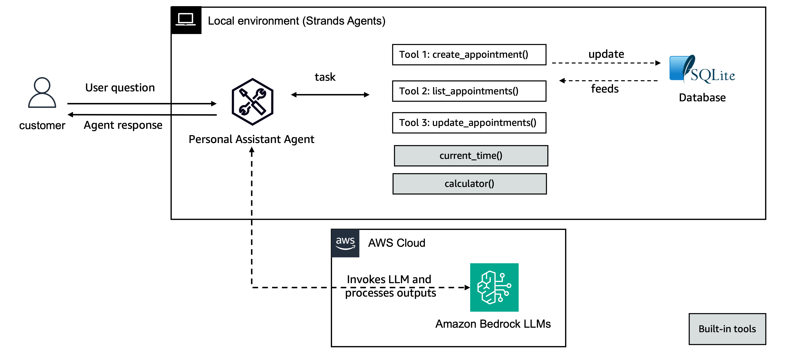

# Adding custom tools to your Strands Agents

## Overview

In this example we will guide you through creating custom tools using the Strands Agents `tool()` function. We will build a personal assistant that connects with a local SQLite database to manage appointments.



| Feature | Description |
|---------|-------------|
| Custom tools created | create_appointment, list_appointments, update_appointment |
| Agent Structure | Single agent architecture |

## Prerequisites

- Node.js 18.x or later
- AWS account with Amazon Bedrock access
- Basic TypeScript knowledge

## Running the Example

```bash
cd typescript/01-tutorials/01-fundamentals/02-custom-tools
npm install
npx tsx src/index.ts
```

## Key Concepts

### Custom Tools

Custom tools are defined using the `tool()` function with a name, description, input schema, and callback:

```typescript
const createAppointment = tool({
  name: "create_appointment",
  description: "Create a new personal appointment in the database...",
  inputSchema: z.object({
    date: z.string(),
    location: z.string(),
    title: z.string(),
    description: z.string()
  }),
  callback: (input) => {
    const id = randomUUID();
    // Insert into database...
    return `Appointment created successfully with ID: ${id}`;
  }
});
```

### Database Integration

The example uses `better-sqlite3` for:
- Synchronous SQLite operations
- Simple table creation and queries
- Persistent appointment storage

### Agent Configuration

```typescript
const agent = new Agent({
  model: new BedrockModel({
    modelId: "us.anthropic.claude-3-5-haiku-20241022-v1:0",
  }),
  systemPrompt: "You are a helpful personal assistant...",
  tools: [createAppointment, listAppointments, updateAppointment]
});
```

## Additional Resources

- [Strands Agents Documentation](https://strandsagents.com/latest/)
