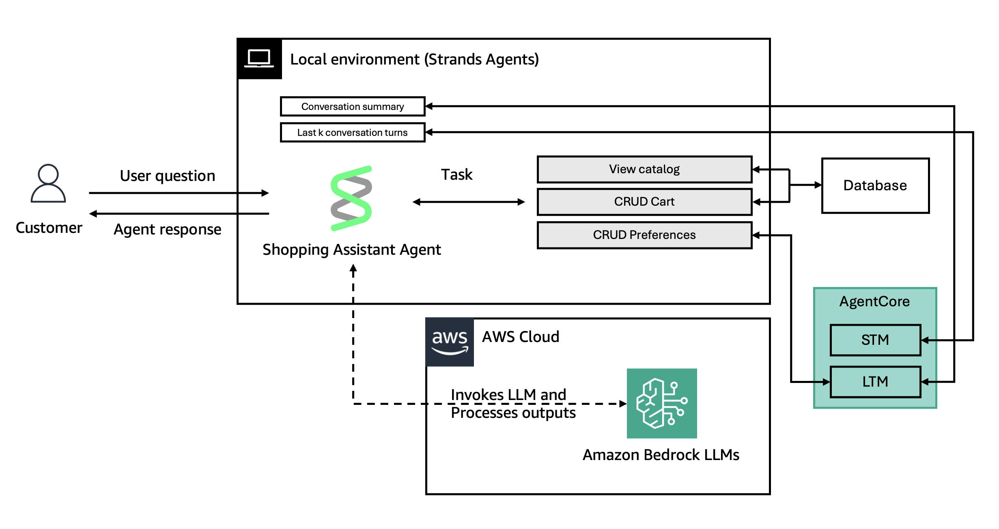

# State Management in Strands Agents with AWS Bedrock AgentCore Memory

This sample demonstrates how to integrate AWS Bedrock AgentCore memory with Strands Agents to build stateful agents with short-term and long-term memory.

## Key Concepts

- **Short-Term Memory (STM)**: Last K conversation turns loaded from agentcore events
- **Long-Term Memory (LTM)**: Conversation summaries and user preferences retrieved from agentcore
- **Agent State**: Runtime state hidden from the model, accessible to tools
- **Hooks**: Track and respond to agent lifecycle events, sync messages to agentcore

## What This Demo Does



Creates a shopping assistant that:
- Loads last 3 conversation turns from agentcore (STM)
- Retrieves conversation summary from LTM and adds to system prompt
- Queries user preferences from LTM on-demand via tool
- Tracks items in a user's cart (local storage)
- Auto-syncs all messages to agentcore via hooks

## Project Structure

```
src/
├── index.ts      # CLI entry point, conversation loop
├── agent.ts      # Agent configuration, tools, hooks
├── memory.ts     # AgentCore memory integration (STM/LTM)
└── database.ts   # Local cart storage
```

## Getting Started

### Prerequisites

- Node.js 20+
- AWS Bedrock AgentCore access

### Create a memory resource on Amazon Bedrock AgentCore

Follow these steps to create your AgentCore Memory resource

1. Visit the [Amazon Bedrock AgentCore memory creation page](https://console.aws.amazon.com/bedrock-agentcore/memory/create)
2. Enable Built in Summarization Strategy
3. Enable Built-in User Preferences Strategy
4. Click on `Create memory`
5. Copy memory id, and ids of the 2 created strategies

### Installation

```bash
npm install
```

### Configuration

Set environment variables:

```bash
export AWS_REGION=eu-central-1
export AWS_ACCESS_KEY_ID=your_access_key
export AWS_SECRET_ACCESS_KEY=your_secret_key

# AgentCore Memory Configuration
export MEMORY_ID=strands_js_memory-XXXXXXXXXX
export PREFERENCE_STRATEGY_ID=preference_builtin_eayb2-XXXXXXXXXX
export SUMMARY_STRATEGY_ID=summary_builtin_eayb2-XXXXXXXXXX
export STM_TURNS=3  # Number of conversation turns to load (default: 3)
```

### Build

```bash
npm run build
```

### Run

Start a new session:
```bash
npm start USER_123
```

Continue an existing session:
```bash
npm start USER_123 SESSION_12345
```

## Memory Architecture

### Short-Term Memory (STM)
- **Source**: AgentCore events via `ListEventsCommand`
- **Scope**: Last K turns (configurable via `STM_TURNS`)
- **Purpose**: Recent conversation context for the model

### Long-Term Memory (LTM)

#### Conversation Summary
- **Strategy**: `summary_builtin`
- **Namespace**: `/strategies/{summaryStrategyId}/actors/{actorId}/sessions/{sessionId}`
- **Purpose**: Injected into system prompt for context
- **Retrieval**: Top 5 summary records joined together

#### User Preferences
- **Strategy**: `preference_builtin`
- **Namespace**: `/strategies/{preferenceStrategyId}/actors/{actorId}`
- **Purpose**: Retrieved on-demand via `userPreferenceTool`
- **Retrieval**: Top 5 relevant preferences

## Testing Journey

1. **Start conversation**: `npm start USER_123 SESSION_001`
2. **Introduce yourself**: "My name is Alex"
3. **Browse products**: "Show me laptop prices"
4. **Add items**: "Add a laptop to my cart"
5. **Exit**: Type "exit"
6. **Restart same session**: `npm start USER_123 SESSION_001`
7. **Verify memory**: Agent remembers last 3 turns + has conversation summary in context
8. **New session**: `npm start USER_123 SESSION_002`
9. **Check preferences**: "What are my preferences?" (agent uses `userPreferenceTool` to query LTM)

## Key Takeaways

- **STM**: Sliding window of recent messages from agentcore events
- **LTM Summary**: Retrieved and injected into system prompt automatically
- **LTM Preferences**: Queried on-demand via tool when needed
- **Auto-sync**: All messages (user + assistant) automatically synced to agentcore via `MessageAddedEvent` hook
- **Cart**: Persists locally across sessions for the same user
